没错，万能的Postman除了可以测HTTP的接口，也可以测Grpc的接口啦！

我们首先可以先创建一个APIs，然后把`proto`文件导入进来：

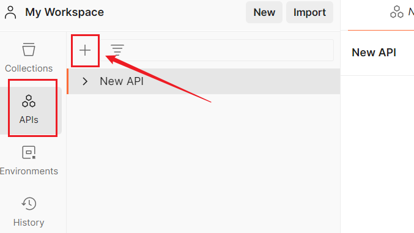

点击这个加号，即可创建APIs，Postman规定最多创建3个，我们也可以使用默认的这个`New API`

点击这个地方可以给它改名：

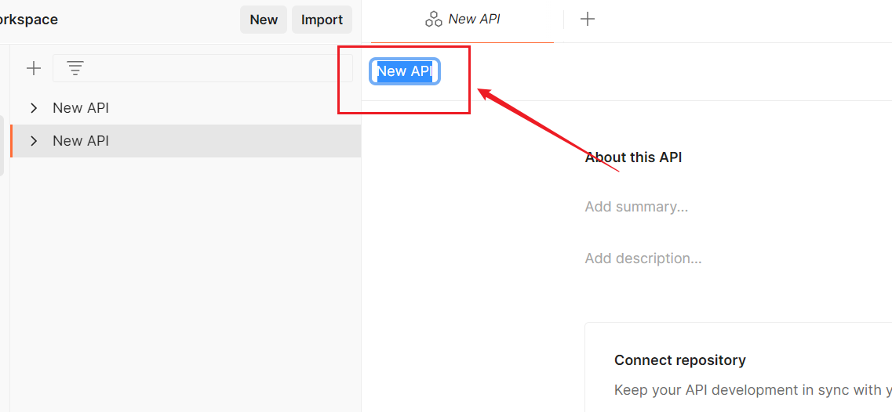

点击`import`

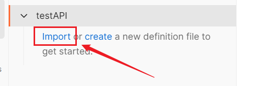

点击files或者folders，这里我点击files，引入一个proto文件	

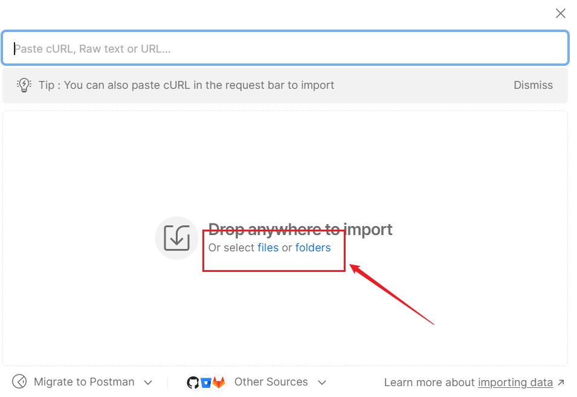

这里我们就把这个proto文件引入进来了，右边还能看到它的代码。

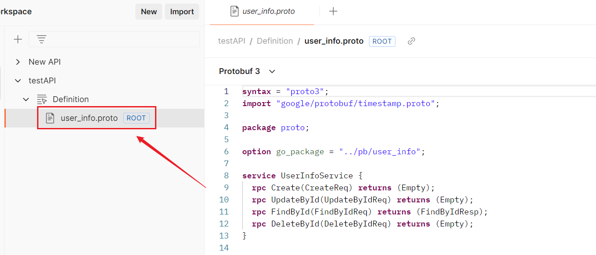

这里有个问题需要解决啊，就是我们发现这个APIs只能包含三个API，每个API只能导入一个proto文件，再新建就得自己复制proto文件代码进去了：

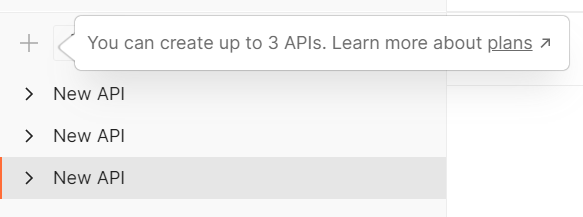

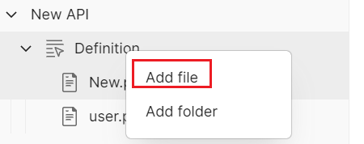

我们点击那个“plans”，发现原来是需要花钱了，哈哈哈！！

继续上面步骤，点击这个新建按钮，也可以使用快捷键`Ctrl + N`（Windows）

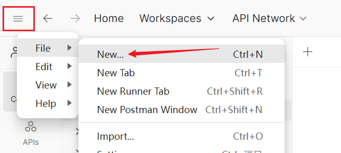

选择 Grpc

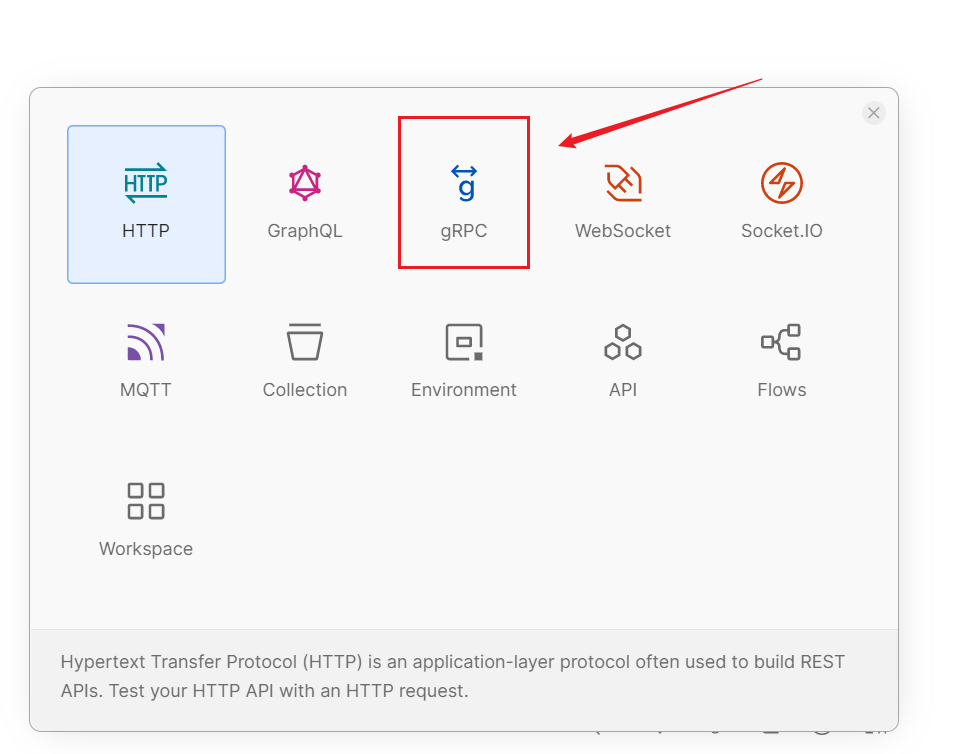

选中这个我们刚创建的APIs

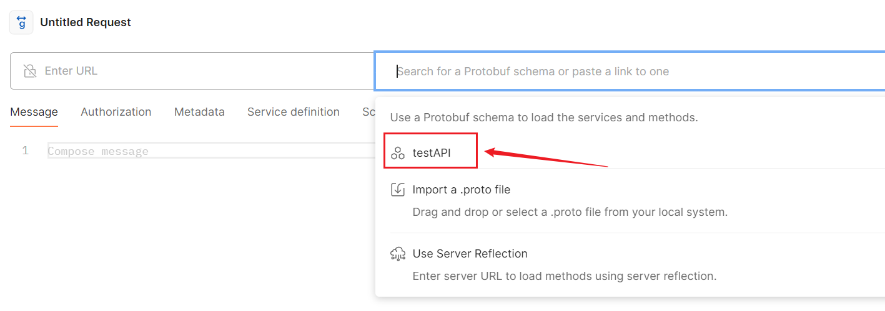

它的方法都展示出来了

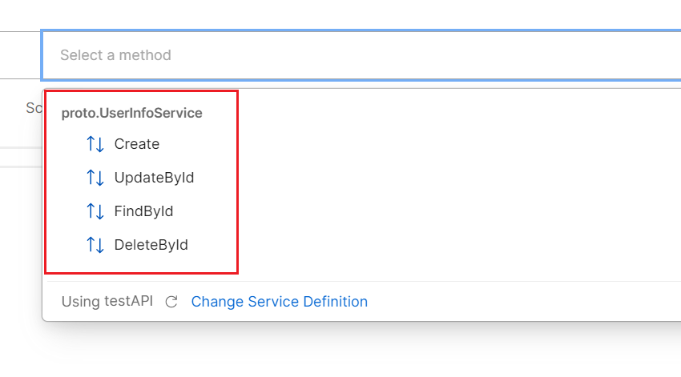

选中一个方法，输入访问地址信息，生成请求示例

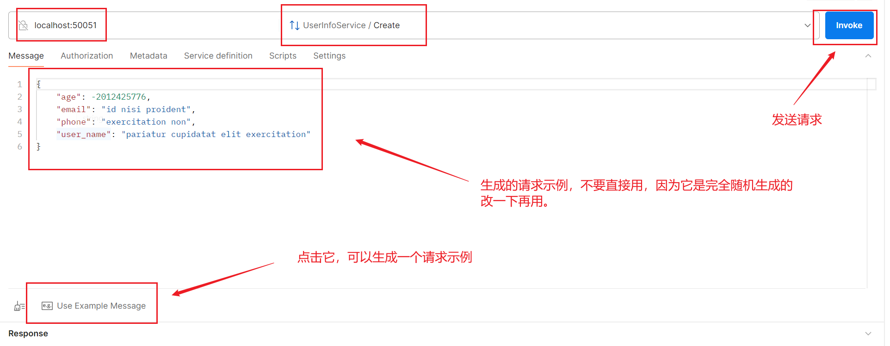

例如我们再访问个查询接口：

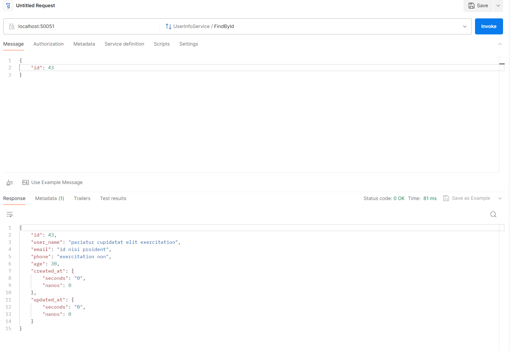

如果我们请求接口需要放置metadata，要在这里放置：

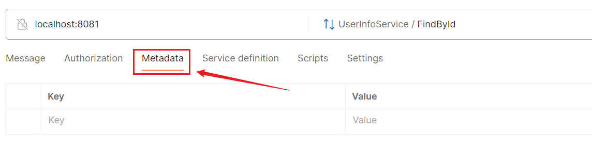

它不同于BloomRPC的格式JSON，我们直接放置Key和Value即可，例如这样：

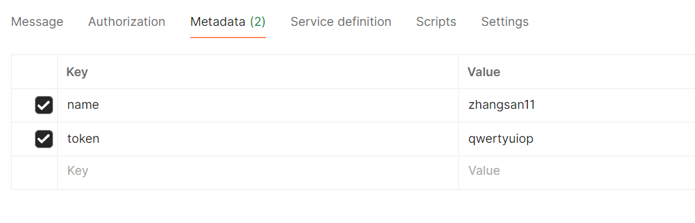

非常好用，其实比BloomRPC好用多了，爆赞！除了免费版会限制功能外，整体比BloomRPC好一些。