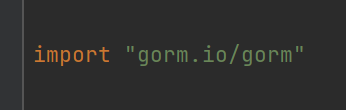
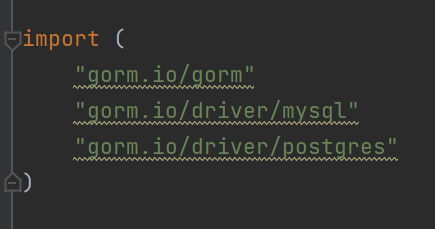

Gorm和Gin框架一样，都是使用命令去下载即可，但是Gorm需要注意一点

```go
go get -u github.com/jinzhu/gorm
```

上面这个版本是老版本v1，现在已经不建议使用，需要使用下面这个命令安装：

```bash
go get -u gorm.io/gorm
```

这个版本的Gorm已经迁移到`github.com/go-gorm/gorm`仓库下。



导包成功，代表安装成功。

然后我们还需要下载数据库的驱动，这里我们下载MySQL和pgsql的：

```bash
go get -u gorm.io/driver/mysql
go get -u gorm.io/driver/postgres
```



下载并导入成功。

其他内容也都是`gorm.io`包下的内容，之后用到再做补充。