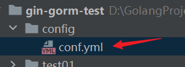
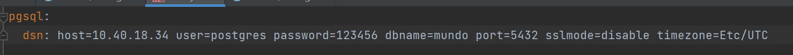
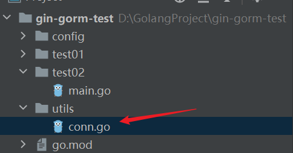
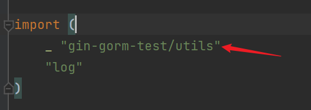

上一节的内容，简单讲了Gorm框架如何连接数据库，并向数据库发送SQL，得到返回结果的过程。

下面我对其进行拆分处理，先把代码拿过来

```go
func main() {
	dsn := "host=10.40.18.34 user=postgres password=123456 dbname=mundo port=5432 sslmode=disable timezone=Etc/UTC"
	db, err := gorm.Open(postgres.Open(dsn), &gorm.Config{})
	if err != nil {
		log.Fatal(err)
	}
	var version string
	result := db.Raw("SELECT version()").Scan(&version)
	if result.Error != nil {
		log.Fatal(result.Error)
	}
	log.Println("PostgreSQL Version:", version)
}
```

就能看出有两个问题：

1. dsn被写到了代码里，正常应该写在配置文件
2. db对象被创建到了main里，这样外部的方法无法使用这个db对象

先解决第一个问题，创建一个yml配置文件，路径如下：





上面文件创建好后，需要再创建一个专门放这种操作对象的包，如下：



我们要使用`github.com/spf13/viper`这个包去读取配置文件，首先下载

```bash
go get -u github.com/spf13/viper
```
函数这样写
```go
func initConfig()  {
	viper.SetConfigName("app")
	viper.AddConfigPath("config")
	err := viper.ReadInConfig()
	if err != nil {
		log.Fatal("error: " + err.Error())
	}
}
```

这几句代码，设置了文件名为app，搜索路径为config（这里为相对于当前工作目录的相对路径），并尝试从配置文件中读取配置。这个函数应该在当前的init函数中调用执行。

创建一个全局变量

```go
var (
	DB *gorm.DB
)
```

再写一个初始化pgsql的db对象的函数

```go
func initPgsql() {
	db, err := gorm.Open(postgres.Open(viper.GetString("pgsql.dsn")), &gorm.Config{})
	if err != nil {
		log.Fatal("error: " + err.Error())
	}
	DB = db
}
```

这里我们想让它打印SQL语句的日志出来，需要额外添加一个设置：

```go
func initPgsql() {
	newLogger := logger.New(
		log.New(os.Stdout, "\r\n", log.LstdFlags),
		logger.Config{
			SlowThreshold: time.Second, //慢SQL阈值
			LogLevel:      logger.Info, //级别
			Colorful:      true,        //彩色
		},
	)
	db, err := gorm.Open(postgres.Open(viper.GetString("pgsql.dsn")), &gorm.Config{
		Logger: newLogger,
	})
	if err != nil {
		log.Fatal("error: " + err.Error())
	}
	DB = db
}
```

写在init函数里

```go
func init() {
	initConfig()
	initPgsql()
}
```

回到main函数，通过`utils.DB`获取db对象。

```go
func main() {
	var version string
	result := utils.DB.Raw("SELECT version()").Scan(&version)
	if result.Error != nil {
		log.Fatal(result.Error)
	}
	log.Println("PostgreSQL Version:", version)
}
```

可以得到同样的输出。

如果在main函数所在文件没有使用这个db对象，也需要把`gin-gorm-test/utils`导进去，但不使用，保证init函数的执行。



这个utils包，以后还可以写例如Redis等连接。

这样写，在项目中的每个地方，想用到这个db对象时，都可以用过`utils.DB`获取它。