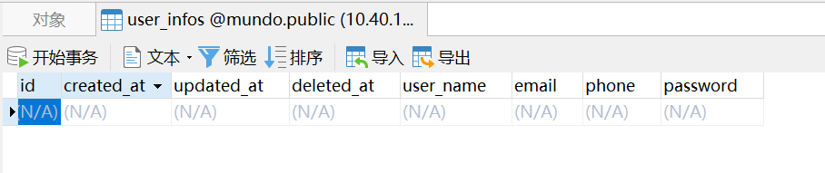
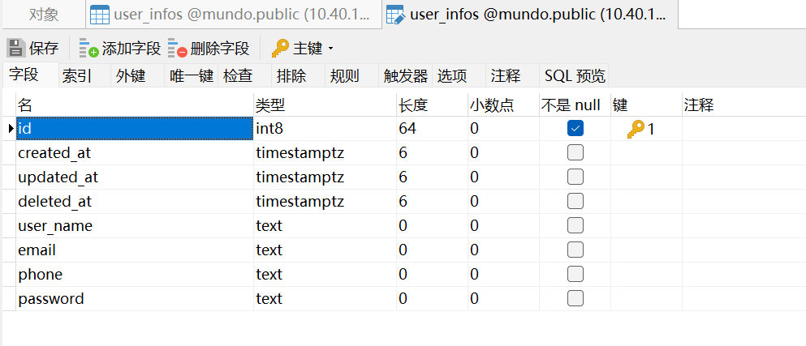
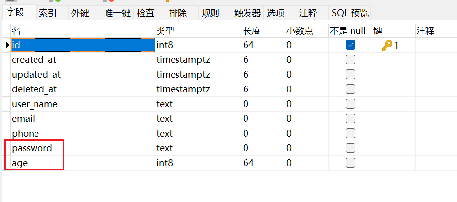

前面详细讲了如何获取Gorm的db对象，下面讲一下如何写Gorm的实体类。

gorm本身只提供了一种灵活的方式，就是先写实体类，后生成表。

我们讲一下，用实体类生成表。例如我们写这样一个实体类。

这里注意，不要给实体类取名为`User`，因为它映射到数据库的表名为user，与数据库内嵌表冲突。

```go
type UserInfo struct {
	gorm.Model
	UserName string `gorm:"uniqueIndex"` // 添加唯一索引
	Email    string
	Password string
	Phone    string
}
```

其中`gorm.Model` 是 Gorm 框架内置的一个结构体，用于简化数据库模型的定义。

```go
type Model struct {
	ID        uint `gorm:"primarykey"`
	CreatedAt time.Time
	UpdatedAt time.Time
	DeletedAt DeletedAt `gorm:"index"`
}
```

这里的ID字段是自增`int8`类型，`DeletedAt`字段是软删除标记。当然`gorm.Model`不是必须添加的。

字段名为"ID"，类型为uint，符合GORM的默认主键规则，无需添加额外的标签，Gorm就默认视其为主键。

然后在main函数里执行这段代码即可

```go
err := utils.DB.AutoMigrate(&dao.UserInfo{})
if err != nil {
	log.Fatal(err.Error())
}
```

这里`utils.DB`是上节创建好的db对象，`dao.UserInfo`是实体类所在位置。

这样，就在指定的数据库中创建好了一张表。



它们的数据类型：



这里我们注意到实体类的名字为`UserInfo`，而数据库表名为`user_infos`，因为Gorm框架会默认将结构体的复数形式作为数据库表的名字，但实体类名如果本身就是复数，表名就和实体类名一致了。

可以设置一个配置，让表名不为复数形式，就是修改下db的配置，在上节的`initPgsql`函数中：

```go
func initPgsql() {
	newLogger := logger.New(
		log.New(os.Stdout, "\r\n", log.LstdFlags),
		logger.Config{
			SlowThreshold: time.Second, //慢SQL阈值
			LogLevel:      logger.Info, //级别
			Colorful:      true,        //彩色
		},
	)
	db, err := gorm.Open(postgres.Open(viper.GetString("pgsql.dsn")), &gorm.Config{
		Logger: newLogger,
		NamingStrategy: schema.NamingStrategy {
			SingularTable: true, // 使用表名单数形式
		},
	})
	if err != nil {
		log.Fatal("error: " + err.Error())
	}
	DB = db
}
```

这样生成的表名就不是复数形式了。

如果结构体名为驼峰类型，例如`AddressInfo`，那么它生成的表名为`address_info`，字段名同理。

如果表名重复，gorm会进行灵活处理。

例如我给`UserInfo`实体新增了一个`Age`字段，删除了一个`Password`字段：

```go
type UserInfo struct {
	gorm.Model
	UserName string `gorm:"uniqueIndex"` // 添加唯一索引
	Email string
	Age int32
	Phone string
}
```

现在的表结构是这样的：



password字段仍然保留，age字段添加到了表的末尾。

如果表内有数据，Gorm不会动表内的所有数据，它只进行新增列，并给列赋默认值的操作。

所以，这种情况涉及到多表时，也可以把`AutoMigrate`函数操作移到其他包，主函数调用，进行统一操作。

如果想删除数据库某一列，还是要去Navicat删或者写SQL执行删除。

如果实体类名和表名不符合这种对照关系，我们也可以使用一个方法，强制关联实体类和表名，例如：

```go
func (UserInfo) TableName() string {
    return "users"
}
```

这样，这个`UserInfo`实体，关联的就是数据库的`users`表了。

