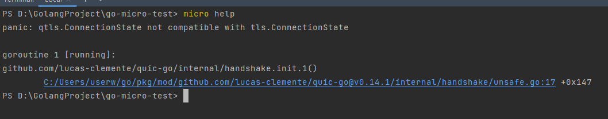
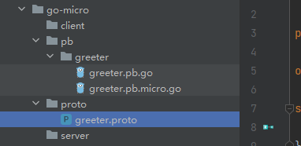

Go-Micro 是一个基于 Go 语言的微服务框架，旨在简化和加速微服务的开发。它提供了一组工具和库，帮助开发者构建可扩展、分布式、容错性强的微服务应用。

下面讲解安装Go-micro的具体步骤

首先我们安装Go-micro和它的工具集：

```bash
go get -u github.com/micro/go-micro/v2
go get -u github.com/micro/micro/v2
```

我们还需要安装这个micro工具集的可执行文件：

```bash
go install github.com/micro/micro/v2@latest
```

执行`micro help`，发现报了这样一个问题：



这个问题是一个版本兼容性问题，具体是因为Go的版本太高，而go-micro的版本太低，或者说是quic-go版本太低。上网查了很多资料，除了降级Go版本，还没有其他行之有效的方案。

Go-micro框架的v2版本很久之前就不维护了，落伍了，大家都不建议使用，我这里也不再使用了。

然后安装protobuf（之前学Grpc时已经安装过，这里就不需要安装了）：

```bash
go get google.golang.org/protobuf/cmd/protoc-gen-go@v1.28
go install google.golang.org/protobuf/cmd/protoc-gen-go@v1.28
```

安装生成micro代码的工具集，并编译安装可执行文件：

```bash
go get -u github.com/micro/micro/v2/cmd/protoc-gen-micro
go install github.com/micro/micro/v2/cmd/protoc-gen-micro
```

安装完这些必备的库后，下面讲一下如何使用这些库开发微服务。

记得我们之前学过Grpc吗？其实它们的开发步骤是相似的。先回顾下开发Grpc的三个步骤：

1. 写proto文件，定义服务和消息
2. 使用protoc工具生成`pb.go`和`grpc.pb.go`文件
3. 编写server业务逻辑代码，并编写client去调用server

开发Go-micro微服务的逻辑和上面一样，区别就是使用protoc的命令不同，生成的文件也不同。

首先我们创建一个模块，目录结构差不多就是这样：


然后在proto文件夹定义一个文件，例如给他取名为`greeter.proto`，这里proto的语法和在Grpc里的是一样的。

```protobuf
syntax = "proto3";

package proto;

option go_package ="../pb/greeter";

service Greeter {
  rpc Hello(HelloRequest) returns (HelloResponse);
}

message HelloRequest {
  string name = 1;
}

message HelloResponse {
  string greeting = 1;
}
```

然后切换到这个proto文件的上级目录，执行下面命令：

```bash
protoc --proto_path=. --micro_out=. --go_out=. greeter.proto
```

注意这里使用到的是`--micro_out=.`，而Grpc里使用的是`--go-grpc_out=.`

执行完这条命令，就能发现生成的文件了，文件目录结构如下图所示：



生成了两个文件，一个就是和Grpc一样的`pb.go`，一个是`pb.micro.go`

这样就是Go-micro开发的安装和准备工作了。


注意：v2版本不建议再使用了！！

之前了解过的Go-micro框架，是一个较为轻量级的微服务框架，它开源于2015年，在当时的市面上开源微服务框架较少的时代，它是为数不多的选择。但是它的缺点实在太多了！

1. v2版本的已经停止维护了，而且支持的grpc和go的版本都很旧，如果用新版本就会有兼容性问题。降低grpc版本后，grpc生成的文件又会因为版本过低而报错。
2. v3版本相对v2版本变化很大，有很多隐藏的坑，而且v3直接变为M3O，是一个平台了，商业性质的，更多功能需要付费才能享用。如果在生产平台上用这个版本，会非常不靠谱。
3. 这个框架的作者转去做云服务了，框架已经没什么更新了，社区维护力度也较弱。