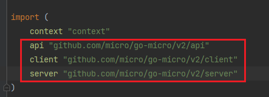
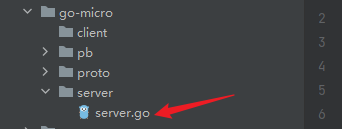
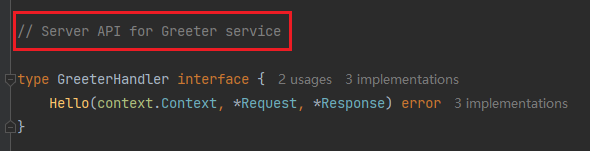
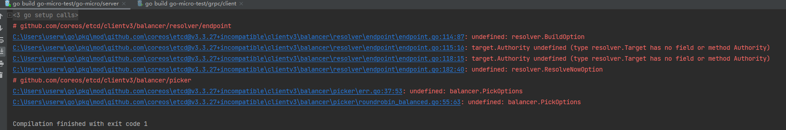
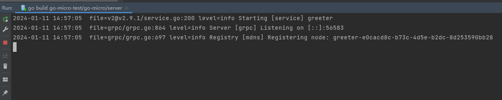

上一节我们使用命令生成了两个文件`pb.go`和`pb.micro.go`，其中`pb.go`的内容在Grpc章节有讲过，这里我们讲一下`pb.micro.go`的内容。

这个文件主要结构和`grpc.pb.go`类似，不同的地方就是server和client进行注册的方式不同，我们看这个文件里导入的外部包：




首先我们编写服务端的逻辑，我们创建一个server文件夹，在下面创建server.go文件，它是一个main文件：



和Grpc的逻辑一样，都是定义结构体，实现`pb.micro.go`的`GreeterHandler`接口：



```go
import (
	"context"
    "github.com/micro/go-micro/v2"
	"go-micro-test/go-micro/pb/greeter"
)

type Greeter struct{}

func (g *Greeter) Hello(ctx context.Context, req *greeter.HelloRequest, resp *greeter.HelloResponse) error {
	resp.Greeting = "Hello " + req.Name
	return nil
}
```

这里的实现方法看起来很诡异，它的resp并没有作为返回值，而是作为方法的参数。

我们先不去管它，先把服务定义出去。在`server.go`文件写以下代码（未处理error）：

```go
func main() {
	// 定义服务，并为其命名
	service := micro.NewService(micro.Name("greeter.server"))

	// 服务初始化
	service.Init()

	// 注册Handler
	greeter.RegisterGreeterHandler(service.Server(), new(Greeter))

	// 启动服务
	service.Run()
}
```

这样服务端就编写好了。

启动main方法，可能会遇到如下报错：



这个报错是由于第三方库兼容导致的，在`go.mod`文件中加入如下两行：

```go
replace google.golang.org/grpc => google.golang.org/grpc v1.26.0
replace github.com/lucas-clemente/quic-go => github.com/lucas-clemente/quic-go v0.14.1
```

然后再执行一下`go mod tidy`，重新启动main方法就好了。



启动成功。