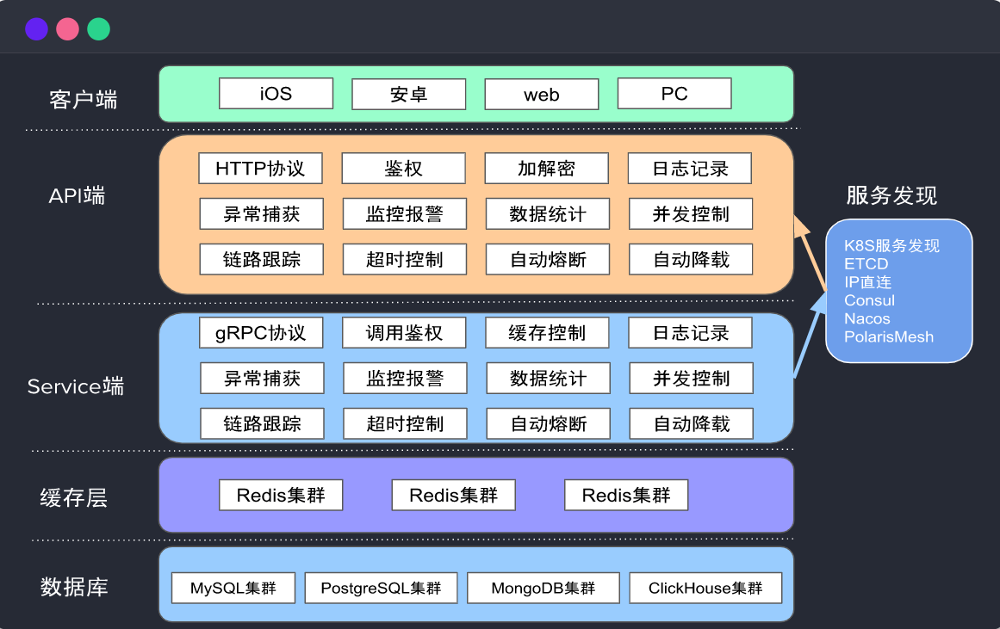
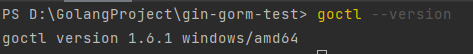

Go-zero框架是2020年开源的一套国内框架，是目前star数最高的Go的微服务框架。它相比于Go-Micro稍微重量级一些，在国内生态建设和维护上，完美适配国内开源的现状。

Go-zero的架构图如下所示：



安装Go-Zero库：

```bash
go get -u github.com/zeromicro/go-zero@latest
```

安装Go-Zero工具包 goctl：

```bash
go install github.com/zeromicro/go-zero/tools/goctl@latest
```

检查是否安装成功，使用`goctl --version`命令：



`goctl` 是 Go-Zero 框架中的一个命令行工具，用于生成和管理项目中的代码。