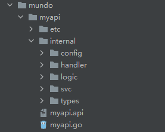
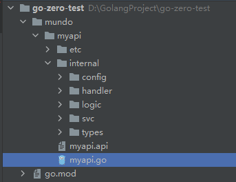
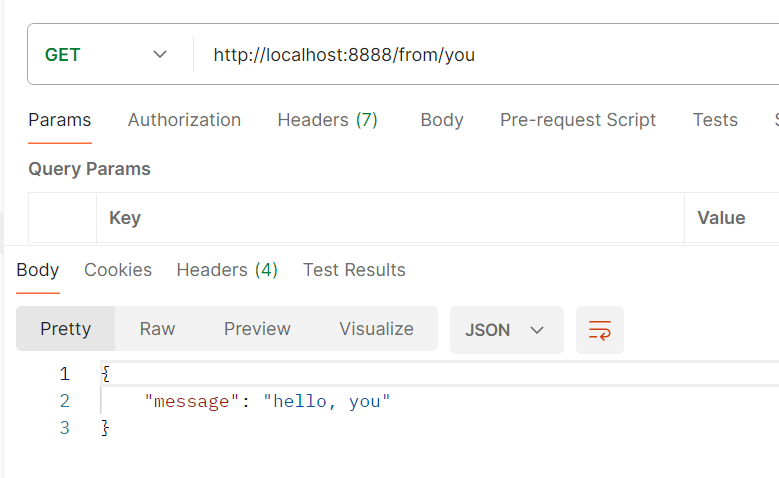

在上一节中，我们安装好了goctl，这是一个代码生成的工具，可以显著提升开发效率。

这里我们先讲一下api服务生成的内容，api服务就类似于单体项目。

我们首先创建一个目录，然后在终端切换到该目录下，使用下面的命令初始化项目：

```sh
cd mundo
goctl api new myapi
```

执行完上面的代码后，整体的目录结构大概是这样的：



我们会发现很多文件的导入部分都有爆红，我们使用`go mod tidy`来解决。

如果执行完后依然爆红，重启Goland即可。

然后我们重点关注`myapi.api`这个文件，这个文件是API描述文件，用于定义 API 接口的结构和方法。

通常，`.api` 文件使用类 Protobuf 语法来定义 API 接口。

在上面生成的`myapi.api`这个文件中，给的示例内容是这样的：

```protobuf
syntax = "v1"

type Request {
	Name string `path:"name,options=you|me"`
}

type Response {
	Message string `json:"message"`
}

service myapi-api {
	@handler MyapiHandler
	get /from/:name (Request) returns (Response)
}
```

我们先运行一下`myapi.go`文件，这里有一个错误：

```
2024/02/20 10:58:32 error: config file etc/myapi-api.yaml, open etc/myapi-api.yaml: The system cannot find the path specified.
```

我们看代码，看到指定配置文件路径的代码是这么写的：

```go
var configFile = flag.String("f", "etc/myapi-api.yaml", "the config file")
```

而我们整体的项目文件结构是这样：



我们需要注意，在Go程序里，相对路径并不是相对于文件所在目录的路径，而是相对于项目的根路径。

所以我们需要改一下给我们生成的代码的路径部分，改成下面这样：

```go
var configFile = flag.String("f", "mundo/myapi/etc/myapi-api.yaml", "the config file")
```

这样再重新启动main文件，就可以启动项目了。

我们实现一下logic包下的`myapilogic.go`的`Myapi`方法的逻辑，这就是调用接口的具体业务逻辑了。

然后我们按照`myapi.api`文件指定的接口路径，使用Postman调用接口：



这样就OK了。