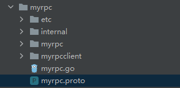
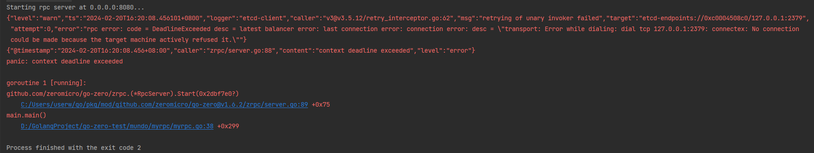
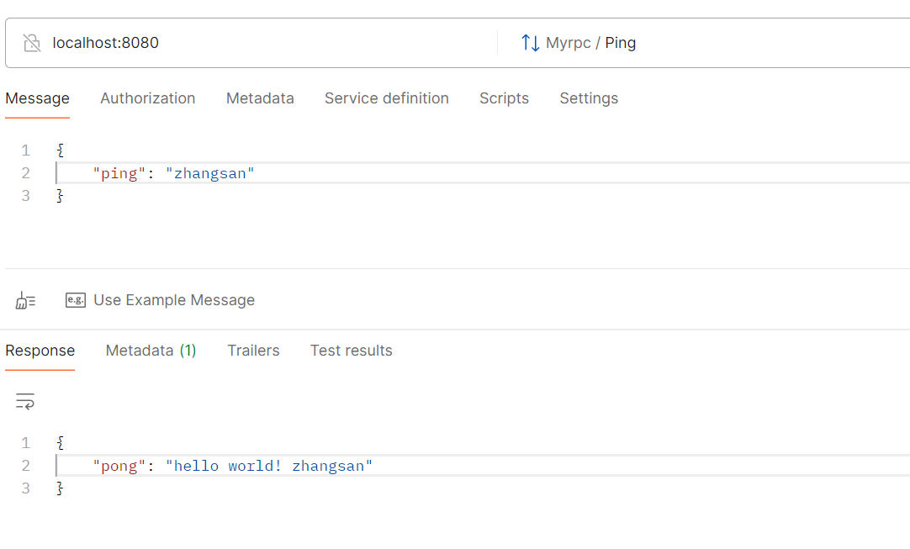

上一节中我们讲了使用goctl生成api服务，其实这个命令也可以生成rpc服务，也就是微服务。

我们在对应目录下使用以下命令：

```sh
go rpc new myrpc
```

生成出来的代码的文件结构如下所示：



代码生成了，我们跑起来试一下，发现报错了。



这个报错是由于连接到 etcd（分布式键值存储系统）时发生了超时错误。是因为我们未启动etcd服务。

为什么是etcd不是Redis？只需要记住，etcd的数据可靠性更强。

我们这里使用docker安装。具体的安装步骤放到docker的专节里面，可供参考。

这里我们安装好了etcd，把etcd的地址放到etc目录下的`myrpc.yaml`配置文件里：

```yaml
Name: myrpc.rpc
ListenOn: 0.0.0.0:8080
Etcd:
  Hosts:
  - 10.40.18.40:2379
  Key: myrpc.rpc
```

这个地方设置的etcd的key类似于Redis的key，是可以自己定义的。

先实现一下`internal/logic`目录下的文件的具体接口实现逻辑，然后启动项目。

启动项目后可能会出如下的警告日志信息：

```
{"level":"warn","ts":"2024-02-21T10:50:26.421631+0800","logger":"etcd-client","caller":"v3@v3.5.12/retry_interceptor.go:62","msg":"retrying of unary invoker failed","target":"etcd-endpoints://0xc0002a36c0/10.40.18.40:2379","attempt":0,"error":"rpc error: code = DeadlineExceeded desc = latest balancer error: last connection error: connection error: desc = \"transport: Error while dialing: dial tcp: lookup etcd: no such host\""}
{"level":"info","ts":"2024-02-21T10:50:26.421631+0800","logger":"etcd-client","caller":"v3@v3.5.12/client.go:210","msg":"Auto sync endpoints failed.","error":"context deadline exceeded"}
```

这个地方的警告信息表明 etcd 客户端无法解析 `etcd` 主机名，导致连接失败，可能是由于 DNS 解析问题或主机名配置不正确引起的。现在不影响调用接口操作，以后再进行解决。

我们使用Postman调用这个Grpc接口，调用成功！



