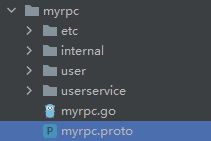
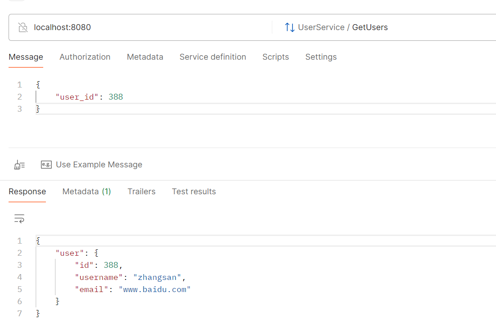

和自定义api服务一样，自定义rpc服务也是修改proto文件，然后用goctl命令生成那些代码。

这个proto文件的语法和我们之前在grpc学习的是一样的，参考那里的就好。

我们修改一下`myrpc.proto`这个文件，修改成下面这个样子：

```protobuf
syntax = "proto3";

package proto;

option go_package = "./user";

message User {
  int32 id = 1;
  string username = 2;
  string email = 3;
}

service UserService {
  rpc GetUsers (UserRequest) returns (UserResponse);
}

message UserRequest {
  int32 user_id = 1;
}

message UserResponse {
  User user = 1;
}
```

然后删除除了这个`myrpc.proto`文件外的所有

然后将终端切换到这个proto所在的目录下，使用下面的命令：

```sh
goctl rpc protoc myrpc.proto --go_out=. --go-grpc_out=. --zrpc_out=.
```

生成了一些代码，目录结构如下图所示：



这个命令中，`--go_out`和`--go-grpc_out`和在grpc里的一样，是指定`myrpc.pb.go`和`myrpc_grpc.pb.go`两个文件输出位置的指令。

`--zrpc_out`是指定ZeroRPC框架生成的代码（也就是除去user目录的剩余部分）的生成位置的。

在这里还是一样，我们实现`internal/logic`里面的文件的代码逻辑，就是实现了这个rpc接口。

```go
func (l *GetUsersLogic) GetUsers(in *user.UserRequest) (*user.UserResponse, error) {
	return &user.UserResponse{
		User: &user.User{
			Id:       in.UserId,
			Username: "zhangsan",
			Email:    "www.baidu.com",
		},
	}, nil
}
```

然后需要改两个地方，一个是`myrpc.go`文件，改一下yaml配置文件的位置：

```go
var configFile = flag.String("f", "mundo/myrpc/etc/myrpc.yaml", "the config file")
```

另一个是上面提到的这个配置文件，改一下etcd的位置信息。

然后把模块跑起来，使用Postman进行调用即可。



调用成功了！！