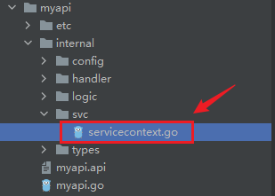
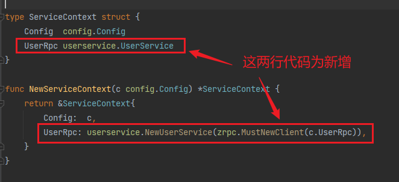
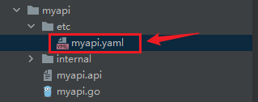
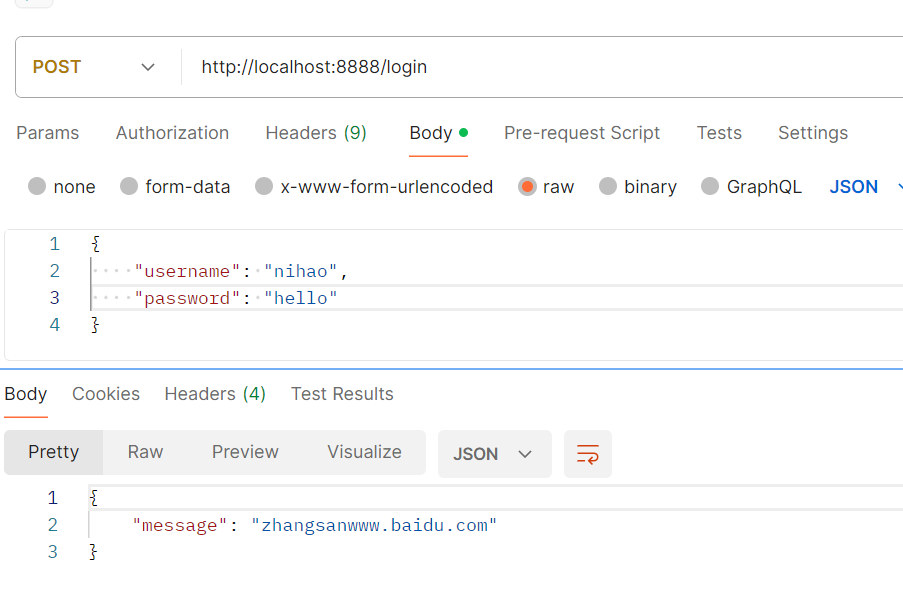
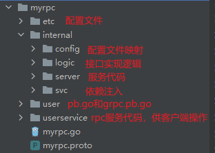
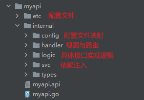

上面我们用goctl这个工具，创建了api服务（单体）和rpc服务（微服务），现在我们要像之前做过的Gin调用Grpc一样，来操作一下api服务调用rpc服务。

首先，rpc服务已经写好逻辑，并且我们已经把rpc服务的服务地址信息暴露给etcd，那么我们就需要让api服务可以拿到rpc服务的服务地址，并调用rpc服务的接口即可。


改这个文件的代码，添加user rpc配置：

```go
type Config struct {
   rest.RestConf
   UserRpc zrpc.RpcClientConf
}
```



然后改这个文件的代码，完善服务依赖注入：



```go
type ServiceContext struct {
	Config  config.Config
	UserRpc userservice.UserService
}

func NewServiceContext(c config.Config) *ServiceContext {
	return &ServiceContext{
		Config:  c,
		UserRpc: userservice.NewUserService(zrpc.MustNewClient(c.UserRpc)),
	}
}
```

然后改一下配置文件：



```yaml
Name: myapi
Host: 0.0.0.0
Port: 8888
UserRpc:
  Etcd:
    Hosts:
      - 10.40.18.40:2379
    Key: myrpc.rpc
```

这里的key，需要与rpc服务暴露出去的key一样。

调用rpc接口的逻辑，应该写到api接口的实现逻辑里，实现逻辑如下：

```go
func (l *LoginLogic) Login(req *types.LoginRequest) (resp *types.LoginResponse, err error) {
	users, err := l.svcCtx.UserRpc.GetUsers(l.ctx, &user.UserRequest{
		UserId: 300,
	})
	resp = &types.LoginResponse{
		Message: users.User.Username + users.User.Email,
	}
	return
}
```

重点关注一下是如何调用rpc服务的接口的。

然后使用Postman调用这个api接口：



调用成功了！！

这里我们再详细总结一下使用go-zero的goctl生成代码的内容，生成的目录作用如下：





这一方面可以大大简化我们代码的开发工作，另一方面也形成了一种统一的代码规范。