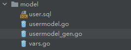
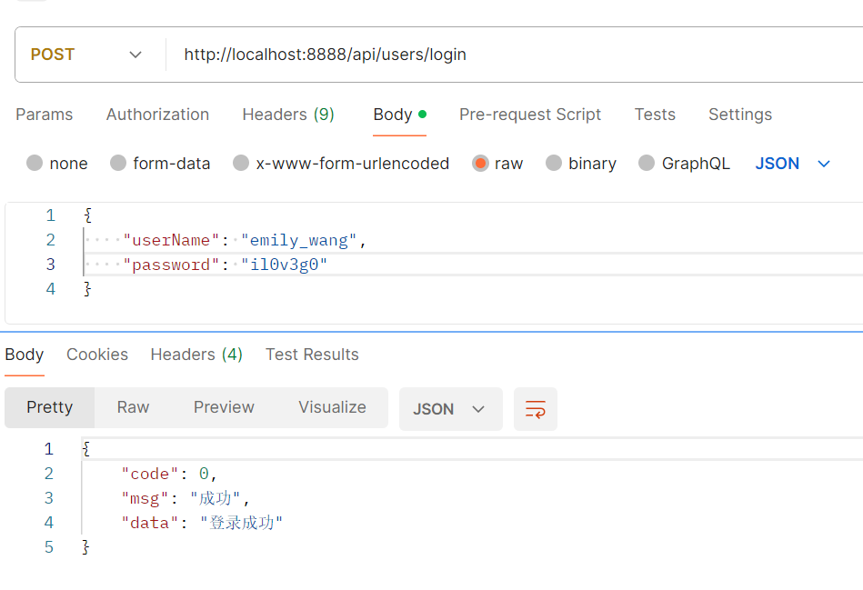

前面我们讲了Go-zero生成api服务与rpc服务，但这都只是对外暴露了接口，没有对数据库的操作。

这一节我们讲一下Go-zero原生操作MySQL。

首先我们新建一个model目录，创建一个user.sql文件，写一个建表DDL语句：

```mysql
CREATE TABLE user
(
    id        bigint AUTO_INCREMENT,
    username  varchar(36) NOT NULL,
    password  varchar(64) default '',
    UNIQUE name_index (username),
    PRIMARY KEY (id)
) ENGINE = InnoDB COLLATE utf8mb4_general_ci;
```

这个建表DDL也要在指定的MySQL数据库执行一下，创建这张表。

然后把终端切换到这个目录下面，使用以下命令：

```sh
goctl model mysql ddl --src user.sql --dir .
```

这样，就在这个目录下生成了三个文件：



其中，`usermodel_gen.go`这个文件给我们提供了很多基础增删改查的操作，我们也可以自己做额外的补充。

生成这些增删改查的方法后，我们就可以在接口中使用了。

还是像之前一样，创建一个简单的`user.api`文件，写一个登录接口：

```protobuf
syntax = "v1"

type LoginRequest {
	UserName string `json:"userName"`
	Password string `json:"password"`
}

service users {
	@handler login
	post /api/users/login (LoginRequest) returns (string)
}
```

然后使用下面的命令对这个api文件进行操作：

```sh
goctl api go -api user.api -dir .
```

在生成的文件中，在`config.go`文件里加上MySQL的配置：

```go
type Config struct {
	rest.RestConf
	Mysql struct {
		DataSource string
	}
}
```

再去yaml配置文件里，配置MySQL的具体配置信息：

```yaml
Name: users
Host: 0.0.0.0
Port: 8888
Mysql:
  DataSource: root:123456@tcp(10.40.18.40:3306)/mundo?charset=utf8mb4&parseTime=True&loc=Local
```

这里要把MySQL的配置信息改为自己的，前面的`root:123456`为用户名和密码。

然后再去`servicecontext.go`文件里，在依赖注入的地方创建DB连接：

```go
type ServiceContext struct {
	Config    config.Config
	UserModel model.UserModel
}

func NewServiceContext(c config.Config) *ServiceContext {
	mysqlConn := sqlx.NewMysql(c.Mysql.DataSource)
	return &ServiceContext{
		Config:    c,
		UserModel: model.NewUserModel(mysqlConn),
	}
}
```

然后我们再写具体的接口实现逻辑，这里我们就写一份最简单的：

```go
func (l *LoginLogic) Login(req *types.LoginRequest) (resp string, err error) {
	user, err := l.svcCtx.UserModel.FindOneByUsername(l.ctx, req.UserName)
	if err != nil {
		return "未知错误", err
	}
	if user.Password != req.Password {
		return "密码错误，请重新输入！", err
	}
	return "登录成功", nil
}
```

使用Postman调用这个接口，完成登录操作：



这就是原生操作MySQL的方法，可以完成接口与数据库的交互。

我们也可以自己在`usermodel_gen.go`这个文件里定义一个方法，例如`FindOneByUsernameAndPassword`，这里直接加在这个文件里，然后在接口实现处调用即可，就不做展示了。