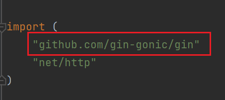

我们使用`go get`命令下载`Gin`的第三方库：

```bash
go get github.com/gin-gonic/gin
```

新建`main.go`文件，在主方法里创建一个简单的`Gin`接口：

```go
func main() {
	r := gin.Default()
	r.GET("/hello", func(c *gin.Context) {
		c.JSON(http.StatusOK, gin.H{
			"message": "hello world!",
		})
	})
	r.Run()
}
```

下面这一条`import`正常导入不爆红，表示下载成功：



这里讲一下这个`r.Run()`方法，它的方法签名是这样的：

```go
func (engine *Engine) Run(addr ...string) (err error)
```

`r.Run()`用于启动`HTTP`服务，使应用可以监听指定端口并处理客户端请求。如果未指定任何参数，它默认监听`:8080`。`r.Run()`代码会阻塞，直到服务停止运行或发生严重错误。在实际生产环境中，应对`r.Run()`返回的`err`进行判断，以便处理可能的错误：

```go
err := r.Run(":8081")
if err != nil {
	wlog.Error("call r.Run failed").Err(err).Field("port", 8081).Log()
	return
}
```

当服务地址配置为`:8081`时，系统会自动补全为`0.0.0.0:8081`。`0.0.0.0`并不是一个可对外直接访问的具体`IP`，而是一个具有绑定语义的通配地址。其实际含义是：只要请求通过本机任意已启用的网络接口进入，且目标端口为`8081`，该服务即可接收并处理请求。因此，在网络连通性及防火墙规则允许的前提下，同一服务既可以通过内网`IP`访问，也可以通过外网`IP`访问。如果只希望服务仅在本机内部访问，通常会显式绑定为`127.0.0.1:8081`，以确保服务只监听本地回环接口，从而避免被外部网络直接访问。

在`Gin`框架中进行监听时，通常不需要指定具体的`IP`，因为在微服务环境下，服务实例往往会被分配动态的`IP`地址。仅指定端口进行监听，可以避免对`IP`地址进行硬编码，从而提升服务的可迁移性和运维灵活性。服务启动后，其实际的`IP:Port`信息会被注册到注册中心（例如`Nacos`），调用方通过服务名从注册中心获取对应的`IP:Port`列表，即可完成对该`Gin`服务的访问与调用。