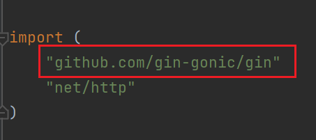

我们使用`go get`命令下载`Gin`的第三方库：

```bash
go get github.com/gin-gonic/gin
```

新建`main.go`文件，在主方法里创建一个简单的`Gin`接口：

```go
func main() {
	r := gin.Default()
	r.GET("/hello", func(c *gin.Context) {
		c.JSON(http.StatusOK, gin.H{
			"message": "hello world!",
		})
	})
	r.Run()
}
```

下面这一条`import`正常导入不爆红，表示下载成功：



这里讲一下这个`r.Run()`方法，它的方法签名是这样的：

```go
func (engine *Engine) Run(addr ...string) (err error)
```

`r.Run()`用于启动`HTTP`服务，使应用可以监听指定端口并处理客户端请求。如果未指定任何参数，它默认监听`:8080`。`r.Run()`代码会阻塞，直到服务停止运行或发生严重错误。在实际生产环境中，应对`r.Run()`返回的`err`进行判断，以便处理可能的错误：

```go
err := r.Run(":8081")
if err != nil {
	wlog.Error("call r.Run failed").Err(err).Field("port", 8081).Log()
	return
}
```

当服务地址配置为`:8081`时，系统通常会将其解释为`0.0.0.0:8081`。要理解`0.0.0.0`的含义，需要先了解服务器的网卡、网络接口以及私网`IP`地址之间的关系。一台机器可以拥有多个网卡。网卡是负责实际收发网络数据的硬件设备，而操作系统会为网卡提供对应的网络接口，例如`eth0`、`eth1`等。此外，操作系统还会提供不依赖物理网卡的虚拟网络接口，例如回环接口`lo`。

例如，一台服务器可能存在如下网络结构：

```scss
服务器
├── 网卡1
│   └── 网络接口eth0 → 192.168.1.10
├── 网卡2
│   └── 网络接口eth1 → 10.0.0.10
├── 网卡3
│   └── 网络接口eth2 → 172.16.0.10
└── 虚拟网络接口（回环接口）lo → 127.0.0.1
```

这台服务器同时拥有多个私网`IP`地址，这些`IP`地址分别绑定在不同的网络接口上。外部客户端可以通过对应的`IP`地址访问服务器上的服务。例如，访问`192.168.1.10:8081`或`10.0.0.10:8081`，最终都可以到达同一个服务进程。

当服务监听`0.0.0.0:8081`时，`0.0.0.0`并不是服务器上某个真实存在的私网`IP`地址，而是一个特殊的通配地址。对于服务端监听而言，它表示不限定某一个具体的本地`IP`地址，而是在本机所有可用的本地`IP`地址上监听`8081`端口。

对于上述服务器，服务监听`0.0.0.0:8081`时，那么客户端通过`192.168.1.10:8081`、`10.0.0.10:8081`或`172.16.0.10:8081`建立的连接都可以由该服务接收。同时，回环接口`lo`通常拥有`127.0.0.1`这样的回环地址，因此本机通过`127.0.0.1:8081`访问时，同样可以由监听在`0.0.0.0:8081`上的服务接收。

不过，`0.0.0.0`通配地址只决定服务端的监听范围，并不意味着所有网络来源都一定能够访问该服务。实际能否建立连接，还需要同时满足网络拓扑、路由规则、防火墙、安全组等网络条件。

在微服务环境中，`Gin`服务通常监听`0.0.0.0:8081`，而不是绑定某个固定`IP`。由于服务实例的`IP`可能由操作系统、云平台或容器网络动态分配，直接指定`IP`会降低服务的可迁移性。因此，服务通常只指定端口进行监听，启动后，通过注册中心客户端（例如`Nacos SDK`）将自身的`serviceName`和实际`IP:Port`注册到注册中心，调用方通过服务名获取服务地址完成调用。

`r.Run()`是一种便捷但缺乏可控性的启动封装方式。其内部会创建`http.Server`实例，并调用`ListenAndServe`阻塞启动服务。调用方无法获取`server`实例，从而不能显式调用`server.Shutdown`或`server.Close`实现受控关闭。

这种模式下，调用方无法优雅地处理`SIGINT`、`SIGTERM`等退出信号。一旦进程被强制终止，`HTTP`连接将被立即中断，操作系统直接回收进程资源，正在处理中的请求会被硬性终止，无法保证请求处理的完整性与一致性。

因此，我们可以将`Gin`服务的启动方式调整为如下代码所示：

```go
server := &http.Server{
	Addr:    ":8081",
	Handler: r,
}
go func() {
	err := server.ListenAndServe()
	if err != nil && !errors.Is(err, http.ErrServerClosed) {
		wlog.Error("call server.ListenAndServe failed").Err(err).Field("port", 8081).Log()
        return
	}
}()
quit := make(chan os.Signal, 1)
signal.Notify(quit, syscall.SIGINT, syscall.SIGTERM)
<-quit
ctx, cancel := context.WithTimeout(context.Background(), 10*time.Second)
defer cancel()
err := server.Shutdown(ctx)
if err != nil {
	wlog.Error("call server.Shutdown failed").Err(err).Field("port", 8081).Log()
    _ = server.Close()
    return
}
```

首先，我们显式创建一个`http.Server`实例，此处将`Gin`的`Engine`视为一个普通的`http.Handler`对象，并交由`http.Server`统一管理。随后创建一个`Goroutine`执行`ListenAndServe`，因为该方法属于阻塞调用，在成功监听端口后会持续阻塞直至服务关闭；如果不放入`Goroutine`中执行，主流程将被阻塞，导致后续的信号监听逻辑无法执行。

这里之所以判断`http.ErrServerClosed`，是因为在后续调用`server.Shutdown`或`server.Close`时，`ListenAndServe`必然会返回错误，错误值是`http.ErrServerClosed`。该错误表示服务处于正常关闭流程，并非异常情况，因此无需进入错误处理分支。

随后，创建信号通道并监听系统退出信号。其中监听两类常见的退出信号：`syscall.SIGINT`表示`Ctrl+C`，即在本地手动终止进程；`syscall.SIGTERM`通常表示容器被停止、`Kubernetes`删除`Pod`，或通过`kill -15`结束进程。最后，通过`<-quit`使主`Goroutine`在此处阻塞，直到接收到退出信号为止。

随后进入优雅关闭阶段。此时创建一个带超时控制的`context`，用于设定明确的退出上限，最长等待`10`秒，以便正在处理中的请求能够自然完成，避免因请求阻塞导致服务无法正常退出。`Shutdown(ctx)`的大致执行流程如下：首先停止接收新的连接，其次保留并维护已有连接，等待当前正在处理的请求执行完成，同时持续监听`ctx.Done()`信号。

最终仅有两种结果：若所有请求在`10`秒内完成，方法返回`nil`；若等待过程中发生超时或其他异常情况，则返回`error`。如果优雅关闭失败，例如发生超时，则不再继续等待，直接调用`server.Close()`，强制关闭所有连接。

这里仅对`Gin`服务的优雅启停进行讲解，在正式项目开发中应采用这种方式。而在后续关于`Gin`框架的讲解中，为了简化示例，仍然使用`r.Run`这种更为简便的方式。