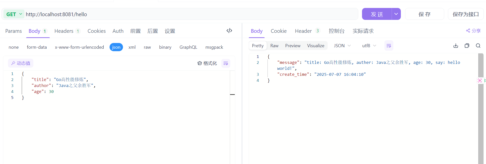

对于`SpringBoot`项目，我们可以使用`RO`、`VO`类来定义请求参数和响应参数的数据结构，并直接直观地将其写在接口的方法签名上。然而，在`Gin`框架中，接口的函数签名是固定的，我们无法直观从函数签名中看到请求参数和响应参数的结构。

那么，`Gin`接口的入参和出参结构应该如何定义？如何获取入参并返回出参？

我们创建一个`models`目录，将所有接口的入参和出参结构体定义放在这里。建议命名为接口名后面加上`Req`和`Resp`，如下：

```go
type HelloReq struct {
	Title  string `json:"title"`
	Author string `json:"author"`
	Age    int    `json:"age"`
}

type HelloResp struct {
	Message    string `json:"message"`
	CreateTime string `json:"create_time"`
}
```


接口的具体实现函数放在`api`目录下，新建一个`hello.go`文件，`Hello`函数的代码编写如下：

```go
func Hello(c *gin.Context) {
	req := &models.HelloReq{}
	err := c.ShouldBindJSON(req)
	if err != nil {
        wlog.Fatal("HelloService error").Err(err).Log()
	}
	message := fmt.Sprintf("title: %s, auther: %s, age: %d, say: hello world!", req.Title, req.Author, req.Age)
	createTime := time.Now().Format("2006-01-02 15:04:05")
	resp := &models.HelloResp{
		Message:    message,
		CreateTime: createTime,
	}
	c.JSON(http.StatusOK, resp)
}
```

这里的`c.ShouldBindJSON`用于将请求体中的`JSON`数据绑定到指定的结构体对象`req`上，具体细节会在后续讲解。

新建一个`router`目录，并在其中创建文件`router.go`，绑定接口`Hello`和路径`/hello`：

```go
func SetRouter() *gin.Engine {
	r := gin.Default()
	r.GET("/hello", api.Hello)
	return r
}
```

在主函数中启动`HTTP`服务，监听对应端口：

```go
func main() {
	r := SetRouter()
	err := r.Run(":8081")
	if err != nil {
		wlog.Error("call r.Run failed").Err(err).Field("port", 8081).Log()
		return
	}
}
```

使用`Postman`或`Apifox`调用接口时，`Body`内的入参定义如下所示：

```json
{
    "title": "Go高性能修炼",
    "author": "Java之父余胜军",
    "age": 30
}
```

发送请求后，得到了对应的返回结果，如下所示：



这就是定义`Gin`接口入参出参，并在接口函数中进行使用的方式。

在接口设计中，可以采用如下结构体命名规则：

- `Gin`接口的请求参数结构体命名为`RO`（`Request Object`），响应参数结构体命名为`VO`（`View Object`）。
- 如果项目中采用了分层结构，例如`Handler`（或称`Controller`）和`Service`，则无论是`Handler`调用`Service`，还是`Service`之间的相互调用，其入参出参的结构体一律命名为`DTO`（`Data Transfer Object`）。

这种命名方式有助于明确结构体的用途，提高代码的可读性与可维护性。

> 补充：由于`DTO`的语义较为泛化，如果在`Handler`到`Service`、`Service`到`Service`，甚至`Service`到`RPC`的调用中都统一使用`DTO`，容易导致结构体的职责边界变得模糊。为提升语义清晰度，建议使用更具表达力的命名方式，例如以`Input`和`Output`，或者`Req`和`Resp`来替代`DTO`，以明确结构体在特定上下文中的用途和方向。
