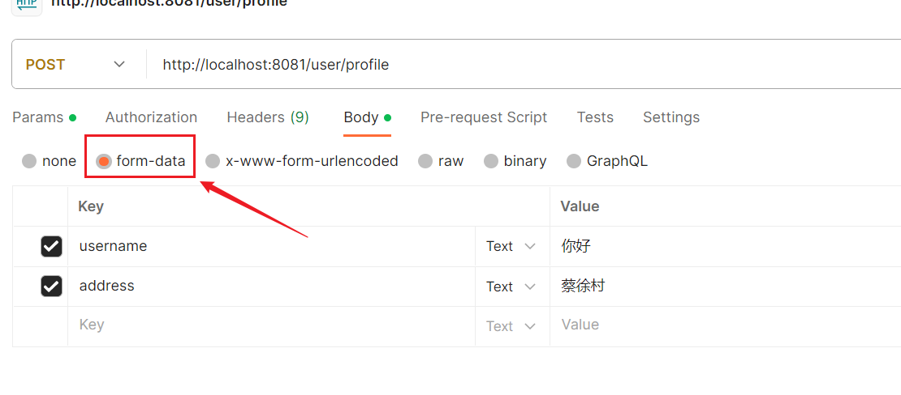
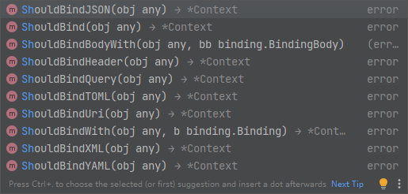

在`Gin`框架中，获取参数是通过函数参数`c *gin.Context`的方法显式地进行的。

### 1. 获取`Query`参数

`Query`参数指的是`HTTP`请求的`URL`中`?`后面携带的参数。例如：

```http
/user/profile?userId=12345&username=johndoe&status=active
```

需要注意的是，`Query`参数并不仅限于`GET`请求，`POST`等其他请求方式同样也可以携带`Query`参数。

在`Gin`框架中，如何在接口实现函数中获取`Query`参数呢？以下是几种常见的方法：

1. 使用`c.Query`方法获取单个参数值（如果参数不存在，返回空字符串）：

```go
userId := c.Query("userId")
```

2. 获取指定键的参数值，如果参数不存在，返回指定的默认值：

```go
userId := c.DefaultQuery("userId", "defaultUserId")
```

3. 如果查询字符串参数被传递了多次，例如下面这样：

```http
/user/profile?lang=go&lang=java&lang=python
```

可以使用`QueryArray`方法获取这个参数，并将其存储在一个字符串切片中：

```go
langs := c.QueryArray("lang")
```

这样，`langs`将包含所有传递的`lang`参数的值，即`["go", "java", "python"]`。

4. 如果查询字符串参数以键值对的形式被传递，例如下面这样：

```
/user/profile?lang=go:goland&lang=java:idea&lang=python:pycharm
```

可以使用`QueryMap`方法获取这个参数，并将其存储在一个字符串映射（`map[string]string`）中：

```go
langDicts := c.QueryMap("lang")
```

这样，`langDicts`将包含所有传递的`lang`参数的键值对，格式如下：

```go
map[string]string{
    "go": "goland",
    "java": "idea",
    "python": "pycharm",
}
```

5. 获取查询参数的`url.Values`对象，其中`url.Values`的定义如下：

```go
type Values map[string][]string
```

具体操作如下：

```go
params := c.Request.URL.Query()
```

此方法将返回`URL`中所有的查询参数，并将其封装在`url.Values`对象中。

6. 使用`c.ShouldBindQuery`方法，可以将`query`参数直接绑定到结构体对象上。具体使用方式见下方第五大标题。

### 2. 获取表单参数

表单参数通常用于`POST`请求中，请求以表单的格式放到请求体。在`Postman`中可以直观地看出它的类型：



可以使用`PostForm`方法获取表单的参数：

```go
username := c.PostForm("username")
```

使用`c.DefaultPostForm("username", "default_username")`可以对参数不存在情况赋默认值，使用`c.PostFormArray("username")`和`c.PostFormMap("username")`可以获取切片或映射。

使用另一个方法`FormValue`也可以获取表单参数：

```go
c.Request.FormValue("username")
```

这个方法可以处理`GET`或`POST`请求，读取`URL`中的查询参数或请求体中的表单参数。如果使用`POST`请求，并且`URL`查询参数和请求体表单参数中有同名参数，它会优先读取`URL`查询参数的值。

### 3. 获取`Path`参数

在这种情况下，请求路径应如下所示，参数名前带有冒号：

```
/user/search/:username/:address
```

传参方式如下：

```
/user/profile/zhangsan/xinhua
```

在代码中使用`c.Param`方法获取参数值：

```go
username := c.Param("username")
address := c.Param("address")
```

需要注意的是，`Path`参数并不仅限于`GET`请求，`POST`等其他请求方式同样也可以携带`Path`参数。

### 4. 获取请求头参数

获取请求头参数有两种方式。第一种是直接指定请求头的名称，获取对应的值，如下所示：

```go
token := c.GetHeader("Authorization")
```

第二种方式是获取所有的请求头，代码如下：

```go
headers := c.Request.Header
```

获取到的`headers`为`http.Header`类型，其中`type Header map[string][]string`，可以将其转换为`map[string]string`格式。

`c.Query()`、`c.PostForm()`、`c.Param()`和`c.GetHeader()`获取到的都是字符串类型`string`。

### 5. 使用`c.ShouldBind()`系列方法

`c.ShouldBind()`系列方法非常灵活，可以将`HTTP`请求的数据绑定到`Go`结构体对象（或者`map`对象）上。这些方法支持从不同类型的请求数据（如`query`参数、请求头参数、表单数据、`JSON`数据等）中进行绑定：



> **注意：**传入的`obj`参数必须是结构体对象的指针类型，而不能是值类型，否则无法完成参数绑定。

以`c.ShouldBindJSON`为例，我们来讲解如何将`POST`请求的请求体`JSON`数据绑定到指定对象中：

```go
type Student struct {
	Name string `json:"name"`
	Age  int64  `json:"age"`
}

func main() {
	r := gin.Default()
	r.POST("/hello", func(c *gin.Context) {
		student := &Student{}
		_ = c.ShouldBindJSON(student)
		fmt.Printf("name: %s, age: %d\n", student.Name, student.Age)
	})
	r.Run(":8080")
}
```

使用`c.ShouldBindJSON`时，如果请求体中包含目标结构体未定义的字段，`Gin`会自动忽略这些多余字段，仅绑定与结构体字段匹配的部分。如果结构体中的某些字段在请求体中不存在，`Gin`也不会报错，这些字段会保留其默认值（例如，整型为`0`，字符串为`""`，布尔型为`false`等）。但如果请求体中的字段类型与结构体字段类型不匹配，`Gin`会报错，并返回具体的错误信息。

如果需要获取`query`参数，可以使用`c.ShouldBindQuery`方法。只需将结构体中的`json`标签替换为`form`标签，如下所示：

```go
type Student struct {
	Name string `form:"name"`
	Age  int64  `form:"age"`
}
```

由于`query`参数本身都是`string`类型，这种方式可以避免对非`string`类型字段的额外转换，简化了处理流程。

如果使用`c.ShouldBind`方法绑定请求参数，`Gin`会根据请求的`Content-Type`自动选择适当的绑定方式：当请求为`JSON`时，使用`JSON`绑定；当请求为表单数据时，使用表单绑定。不过，建议尽量使用针对每种请求类型的专用绑定方法。

从`HTTP`规范的角度来看，`GET`方法并不禁止携带请求体，但由于大多数服务器和框架会忽略`GET`请求中的请求体，因此如果需要传递请求体参数，需要注意避免使用`GET`方法。

### 6. 获取请求体字节数组

当无法确定请求体中`JSON`参数的具体数据结构时，如果仅需要获取其原始的`[]byte`数据，可以使用`c.GetRawData()`方法，这比使用`c.ShouldBind()`系列方法将参数绑定到指定对象更为灵活。

`c.GetRawData()`是`Gin`框架中的一个方法，用于读取`HTTP`请求的原始请求体数据。这个方法提供了一种灵活的方式，让你能够获取和处理请求体内容，而不依赖于特定的数据结构。它的方法签名如下所示：

```go
func (c *Context) GetRawData() ([]byte, error)
```

使用方法也非常简单，如下所示：

```go
bodyBytes, _ := c.GetRawData()
```

获取`[]byte`类型的对象后，可以直接使用内置函数`string()`将其转换成`JSON`字符串，或者后续再将其反序列化成对象。

在使用`c.GetRawData()`或`c.ShouldBindJSON`等方法读取请求体内容时，读取操作会消耗掉请求体数据，因此请求体会变为空。如果尝试再次读取请求体内容，就会遇到`EOF`错误。可以使用`io.NopCloser`函数，把数据重新写入请求体：

```go
c.Request.Body = io.NopCloser(bytes.NewBuffer(bodyBytes))
```

这样就会看起来像请求体数据从未被读取过一样，可以在需要的地方再次读取请求体。
