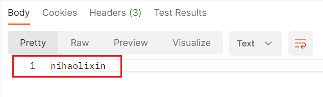
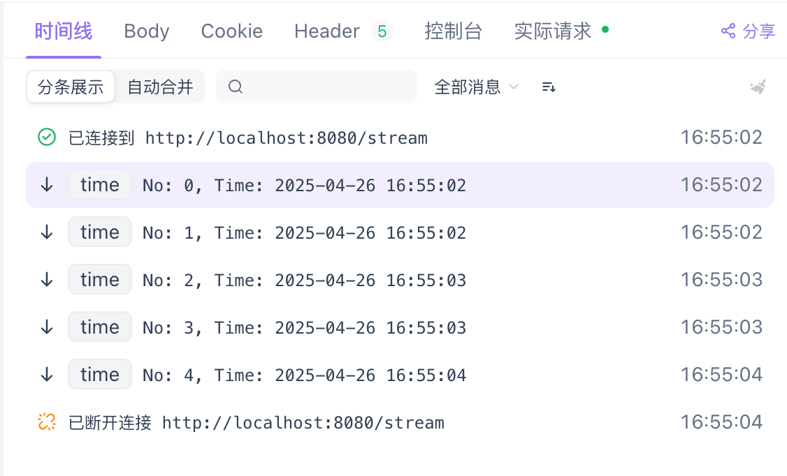
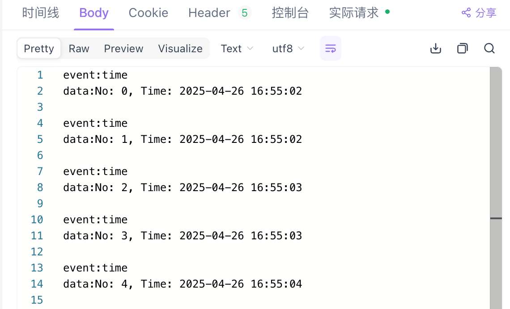
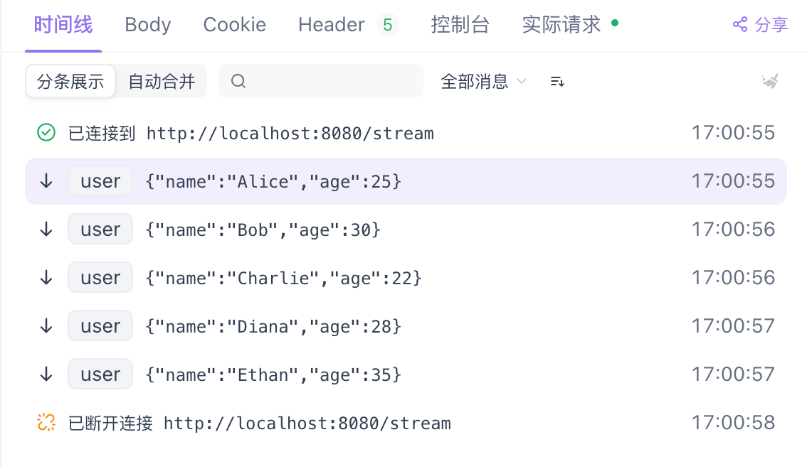
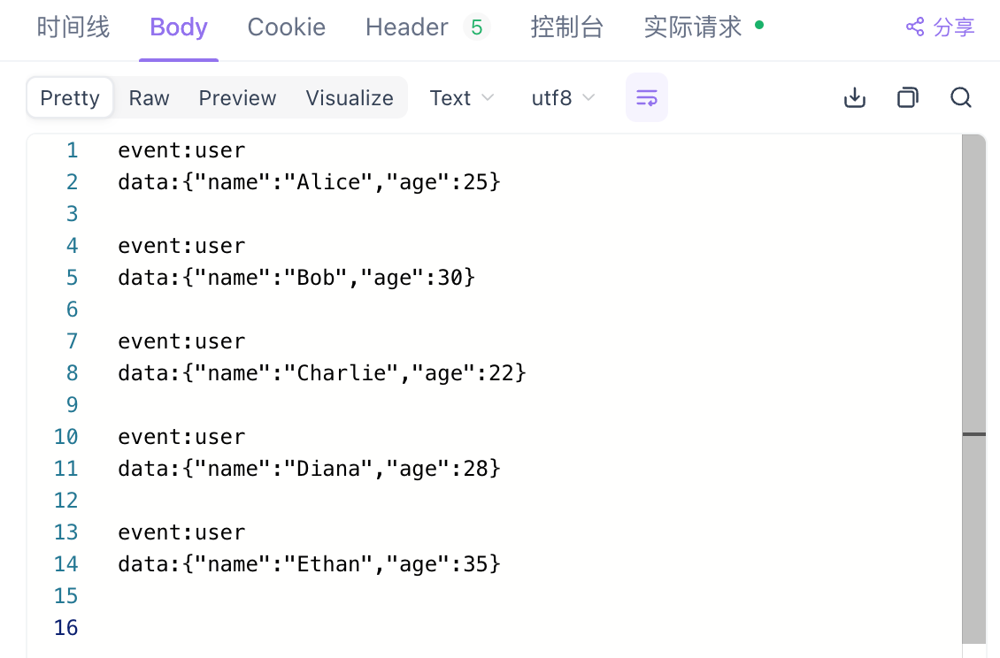

处理完请求后，需要将响应结果返回给前端。在使用`Gin`框架时，可以通过调用`*gin.Context`类型的对象`c`的方法来写入响应数据，并显式调用`return`。如果无需返回数据或`message`，可以仅写入状态码。示例代码如下：

```go
c.Status(http.StatusOK)
```

在`Gin`框架中，如果不设置状态码，直接`return`，默认会写入状态码`200`。建议手动设置状态码以确保明确的响应。

当需要返回响应参数时，最常用的方式是使用`c.JSON`，代码如下：

```go
c.JSON(http.StatusOK, gin.H{"message": "success", "data": data})
```

其中`gin.H`的定义如下：

```go
type H map[string]interface{}
```

返回的格式是这样的（示例）：

```json
{
    "data": {
        "username": "nihao",
        "address": "lixin"
    },
    "message": "success"
}
```

使用`c.JSON`方法，需要传入状态码以及具体想返回的数据信息（通常为结构体对象）。

如果只想返回普通文本，可以使用以下方式：

```go
c.String(http.StatusOK, "nihaolixin")
```

返回的格式如下所示：



除了以上的两种外，还有`c.XML`，传参结构和`c.JSON`一样，只是返回的格式不一样：

```go
c.XML(http.StatusOK, gin.H{"message": "success", "data": data})
```

返回格式如下所示：

```xml
<map>
    <data>
        <Username>nihao</Username>
        <Address>lixin</Address>
    </data>
    <message>success</message>
</map>
```

还有更多方法，这里不再赘述，使用时可查阅相关文档。

在使用`c.JSON`时，会遇到一个问题：返回的`JSON`结构中，`message`字段出现在`data`字段下方，这样的结构显得不够规范。原因在于`gin.H`是一个`map`结构，键的顺序是根据哈希顺序排列的。为了确保返回结果的结构更为规范，并简化返回内容的编写，我们可以预定义一个结构体来表示返回的数据格式：

```go
type Response struct {
	Message string      `json:"message"`
	Data    interface{} `json:"data"`
}
```

可以使用这个`Response`结构体的对象代替`gin.H`的对象：

```go
user := &User{
	Username: username,
	Address:  address,
}
response := &Response{
	Message: "success",
	Data:    user,
}
c.JSON(http.StatusOK, response)
```

这样，返回的`JSON`结构如下所示，看起来更加格式化：

```json
{
	"message": "success",
    "data": {
        "username": "nihao",
        "address": "lixin"
    }
}
```

上述内容仅是对`Gin`接口返回时使用的`API`结构的基础讲解，关于在项目中的进阶应用，请参考我编写的其他相关文章。

我们还可以将数据写入响应头。代码示例如下：

```go
c.Header("Authorization", "f8a20475-0411-42e8-a816-e7d17a0be3c5")
```

上文中的使用`c.JSON`返回响应数据的接口属于一元接口，即客户端发起一次请求，服务端处理后返回一次完整的响应。而流式接口则允许服务端在接收到客户端请求后，持续不断地向客户端推送数据。

与一元接口相比，流式接口更适用于需要实时或分段传输数据的场景，例如实时日志推送或大文件分片下载。其中，`SSE`（`Server-Sent Events`）是一种常见的流式通信方式，服务端可以通过事件流的形式持续向客户端发送数据。相比`WebSocket`，`SSE`更为轻量，尤其适合服务端单向推送的应用场景。

在开始返回流式数据之前，必须设置以下响应头：

```go
c.Header("Content-Type", "text/event-stream")
c.Header("Cache-Control", "no-cache")
c.Header("Connection", "keep-alive")
c.Header("Transfer-Encoding", "chunked")
```

接下来是一个将消息以流式方式分段返回给客户端的示例：

```go
for i := 0; i < 5; i++ {
	c.SSEvent("time", fmt.Sprintf("No: %d, Time: %s", i, time.Now().Format(time.DateTime)))
	c.Writer.Flush() // 强制刷新缓冲区，返回一次数据给客户端
	time.Sleep(500 * time.Millisecond)
}
```

我们通过使用`c.SSEvent`方法，可以返回一条标准的`SSE`流式数据，其中包含`event`和`data`两个属性。

使用`Apifox`调用流式接口时，会以时间线的形式逐行显示出如下内容：



当所有流式数据返回完毕后，可以在响应体中查看完整的响应内容：



`SSE`消息体不支持直接传输非字符串类型，必须以文本格式进行发送。如果需要流式传输二进制内容（如文件或图片），建议先将其进行`Base64`编码后作为字符串输出。如果需要以`JSON`格式传输数据，应先将其转换为`JSON`字符串，再进行发送。

使用`c.SSEvent`方法时，可以直接将结构体对象或者`map`等作为第二个参数传入，不用事先进行序列化：

```go
users := []*User{
	{Name: "Alice", Age: 25},
	{Name: "Bob", Age: 30},
	{Name: "Charlie", Age: 22},
	{Name: "Diana", Age: 28},
	{Name: "Ethan", Age: 35},
}
for _, user := range users {
	c.SSEvent("user", user)
	c.Writer.Flush() // 强制刷新缓冲区，返回一次数据给客户端
	time.Sleep(500 * time.Millisecond)
}
```

时间线展示内容如下所示：



响应体中完整的响应内容如下所示：



标准的`SSE`接口需要遵循以下要求：

1. 服务端只能使用`HTTP`的`GET`请求，客户端必须通过`GET`方法建立连接。
2. 请求中不能携带请求体（`Body`），即不能像普通`POST`请求那样上传`JSON`数据或文件内容。
3. 服务器返回的数据必须设置`Content-Type: text/event-stream`，明确告知客户端这是一个持续推送的流式响应。
