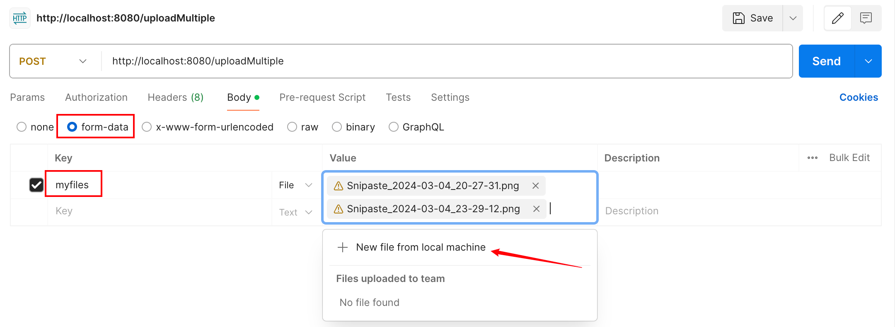

`	Gin`框架的接口通常用于处理文本格式的输入和输出。如果需要实现文件的上传或下载功能，可以按照以下步骤操作：

```go
r := gin.Default()
r.MaxMultipartMemory = 8 << 20 // 8 MiB
```

`MaxMultipartMemory`指定了上传文件的最大大小，单位是字节。如果不设置，默认限制为`32 GiB`（即`32 << 20`字节）。

以下是实现上传文件接口的逻辑说明。以上传单个文件为例，代码流程可以分为以下三个步骤：

1. 从客户端请求中提取上传的文件，同时进行初步验证（如检查文件格式或大小）。
2. 根据业务需求，将文件存储到服务器的指定路径，需确保该路径有效且具有写入权限。
3. 返回上传结果，向客户端告知上传成功或失败，并可附带相关信息（如文件存储路径或错误原因）。

我们把文件保存在`images/`目录下，上传文件的接口代码如下所示：

```go
r.POST("/upload", func(c *gin.Context) {
    file, err := c.FormFile("myFile")
    if err != nil {
        wresp.Fail(c, http.StatusBadRequest, fmt.Sprintf("get file error: %v", err))
        return
    }
    err = c.SaveUploadedFile(file, fmt.Sprintf("images/%s", file.Filename))
    if err != nil {
        wresp.Fail(c, http.StatusInternalServerError, fmt.Sprintf("save file error: %v", err))
        return
    }
    wresp.OK(c, nil)
})
```

> **注意：**在`Go`语言中，相对路径并不是相对于当前代码文件的位置，而是相对于最近的`GoModules`管理目录的路径。换句话说，`Go`编译器从最近的包含`go.mod`文件的目录开始解析这个路径，路径开头没有斜杠。

如果不想使用传入的文件名，可以使用以下函数来提取文件名的后缀：

```go
ext := filepath.Ext(file.Filename) // 输入caixukun.jpg，得到ext的值为.jpg
```

提取后缀后，可以自定义拼接文件名，并将其保存到`images/`目录下，如下所示：

```go
r.POST("/upload", func(c *gin.Context) {
	file, err := c.FormFile("myFile")
	if err != nil {
		wresp.Fail(c, http.StatusBadRequest, fmt.Sprintf("get file error: %v", err))
		return
	}
	ext := filepath.Ext(file.Filename)
	rnd := rand.New(rand.NewSource(time.Now().UnixNano()))
	fileName := fmt.Sprintf("%d%04d%s", time.Now().Unix(), rnd.Int31(), ext)
	filePath := fmt.Sprintf("images/%s", fileName)
	err = c.SaveUploadedFile(file, fmt.Sprintf("images/%s", filePath))
	if err != nil {
		wresp.Fail(c, http.StatusInternalServerError, fmt.Sprintf("save file error: %v", err))
		return
	}
	wresp.OK(c, fileName)
})
```

由于文件名是由我们自定义生成的，因此需要将该文件名返回给调用端，以便后续使用。

上传多个文件的逻辑与单个文件的上传类似，但在代码实现上存在一些差异，具体调整如下：

```go
r.POST("/uploadMultiple", func(c *gin.Context) {
    form, err := c.MultipartForm()
    if err != nil {
        wresp.Fail(c, http.StatusBadRequest, fmt.Sprintf("obtaining form error: %v", err))
        return
    }
    files := form.File["myFiles"]
    if len(files) == 0 {
        wresp.Fail(c, http.StatusBadRequest, "no files uploaded")
        return
    }
    for _, file := range files {
        err = c.SaveUploadedFile(file, fmt.Sprintf("images/%s", file.Filename))
        if err != nil {
            wresp.Fail(c, http.StatusInternalServerError, fmt.Sprintf("save file error: %v", err))
            return
        }
    }
    wresp.OK(c, nil)
})
```

使用`Postman`测试一下上传多个文件的接口，按照以下步骤进行操作：



选择请求体数据类型为`form-data`，填写对应的`key`，将本地上传的文件作为`value`（支持上传多个文件）。

上传文件接口，如果想在获取文件后、保存文件前读取文件内容，可以在接口中加入以下代码：

```go
// 此处代码以上是从请求中获取文件逻辑
src, err := file.Open()
if err != nil {
    wresp.Fail(c, http.StatusInternalServerError, fmt.Sprintf("open file error: %v", err))
	return
}
defer src.Close()
fileBytes, err := io.ReadAll(src)
if err != nil {
    wresp.Fail(c, http.StatusInternalServerError, fmt.Sprintf("read file error: %v", err))
	return
}
// 可以在这里对 fileBytes 进行处理，比如日志记录或其他操作，这里我们只做打印
fmt.Println(string(fileBytes))
// 此处代码以下是保存文件到指定的路径逻辑
```

获取文件接口的核心逻辑是通过指定的路径和传入的文件名验证文件的存在性，并在确认文件存在后将其返回。代码如下：
```go
r.GET("/get_file/:fileName", func(c *gin.Context) {
	fileDir := "images"
	fileName := c.Param("fileName")
	filePath := filepath.Join(fileDir, fileName)
	_, err := os.Stat(filePath)
	if err != nil {
		if os.IsNotExist(err) {
			wresp.Fail(c, http.StatusNotFound, fmt.Sprintf("file %s doesn't exist", fileName))
			return
		}
		wresp.Fail(c, http.StatusBadRequest, fmt.Sprintf("open file %s failed, error: %v", fileName, err))
		return
	}
	c.File(filePath)
})
```

调用获取文件接口，可以使用`Postman`或浏览器进行请求，`URL`示例如下：

```http
http://localhost:8080/get_file/caixukun.jpg
```

如果希望在访问上述接口后直接触发文件下载，需要使浏览器触发下载行为。在调用`c.File`之前，添加以下代码：

```go
c.Header("Content-Type", "application/octet-stream")
c.Header("Content-Disposition", fmt.Sprintf("attachment; fileName=%s", fileName))
```

当然，文件下载的触发过程也可以由前端完成，后端只需返回文件名即可：

```go
c.Header("fileName", fileName)
```

如果添加了文件下载逻辑，那么获取文件的接口的路径应该改为`/download/:fileName`。