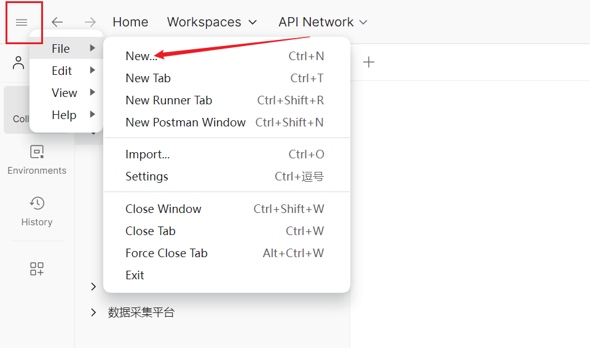
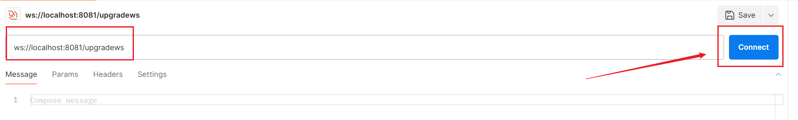
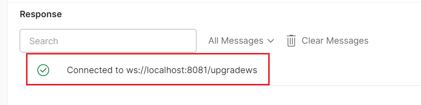
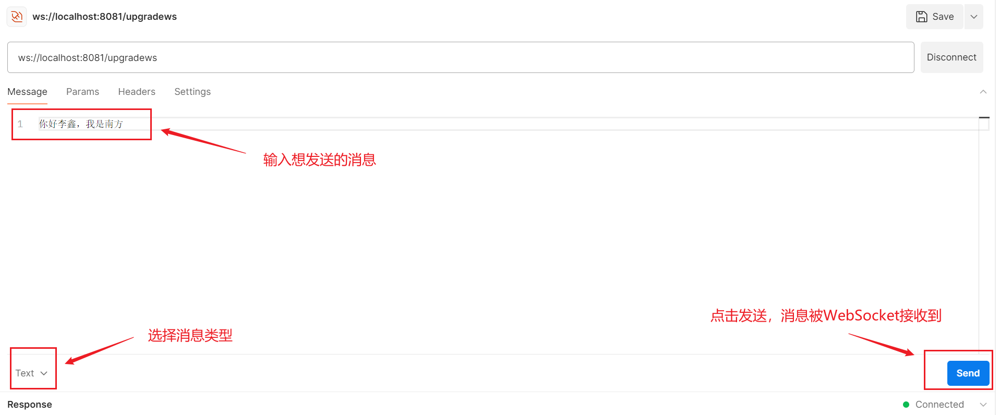
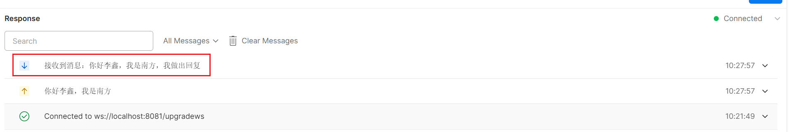

我们可以使用`Postman`对这个接口进行测试。首先，了解如何访问`WebSocket`接口是关键。

例如，要使用`HTTP`访问该接口，请求的`URL`为：

```
http://localhost:8081/upgradews
```

要使用`WebSocket`访问接口，只需将`http`改为`ws`，如下所示：

```
ws://localhost:8081/upgradews
```

在`Postman`中，按照以下步骤创建一个请求：



也可以直接使用快捷键`Ctrl + N`（`Mac`为`Command + N`），出现下图页面，选择`WebSocket`即可：


在网址栏输入对应的请求`URL`，点击`Connect`：



出现以下内容，代表连接成功。这个连接一但建立，除非手动关闭，否则它会持久连接。



我们向这个`WebSocket`连接发送消息，按照下图步骤操作：



发送信息后，接口函数中`WebSocket`连接的`ReadMessage`方法将会读取到这些信息。

然后我们就会收到来自服务端的回复，如下图：



在这里，我们可以打开多个窗口，通过这个请求`URL`建立多个`WebSocket`连接。这些连接是相互独立且隔离的，因为每个请求的`w http.ResponseWriter`和`r *http.Request`参数都是不同的。