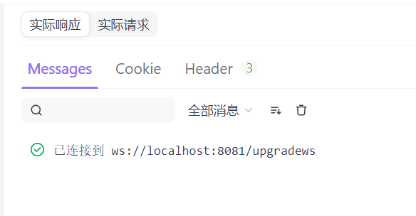
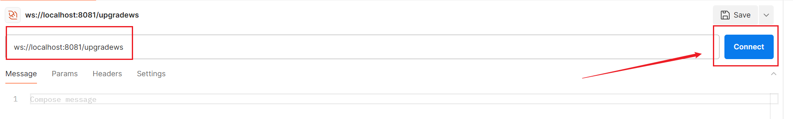

### `Apifox`调用服务

访问`WebSocket`接口需要对接口地址进行改动。例如使用`HTTP`访问该接口，请求的`URL`为：

```http
http://localhost:8081/upgradews
```

要使用`WebSocket`访问接口，只需将`http`协议改为`ws`协议，如下所示：

```http
ws://localhost:8081/upgradews
```

首先我们在合适的目录下，点击“添加`WebSocket`接口”：


在上面输入对应的访问地址，点击“连接”：


出现如下图所示内容，代表建立`WebSocket`连接成功：



我们向这个`WebSocket`连接发送消息，按照下图步骤操作：


发送信息后，接口函数中`WebSocket`连接的`ReadMessage`方法将会读取到这些信息，并进行回复，我们可以在响应栏看到该回复。

在`Apifox`中，发送消息的类型一共可以有以下五种：


如果以二进制格式发送数据，可以选择直接以`Base64`或`Hexadecimal`（十六进制）格式进行发送：


访问`WebSocket`接口时，支持传入`Query`参数与`Header`参数：


`WebSocket`连接一但建立，除非手动关闭，否则它会持久连接。我们可以点击“断开”按钮进行连接的关闭。

我们可以在这里打开多个窗口，并通过该请求`URL`请求建立多个`WebSocket`连接。由于每次请求传入`upgrader.Upgrade`方法的`http.ResponseWriter`和`*http.Request`参数都来自不同的上下文，因此这些连接是相互独立且互不干扰的。

### `Postman`调用服务

在`Postman`中，按照以下步骤创建一个请求：


也可以直接使用快捷键`Ctrl + N`（`Mac`为`Command + N`），出现下图页面，选择`WebSocket`即可：


在网址栏输入对应的请求`URL`，点击`Connect`：



出现以下内容，代表连接成功。这个连接一但建立，除非手动关闭，否则它会持久连接：


我们向这个`WebSocket`连接发送消息，按照下图步骤操作：


发送信息后，接口函数中`WebSocket`连接的`ReadMessage`方法将会读取到这些信息。

然后我们就会收到来自服务端的回复，如下图：


