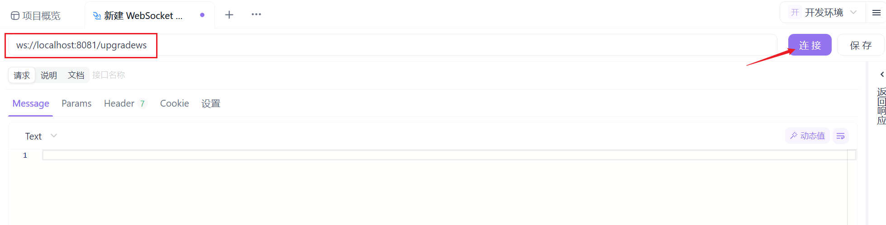
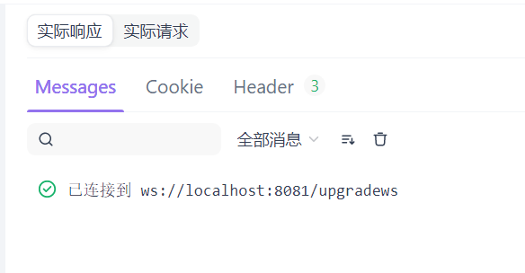
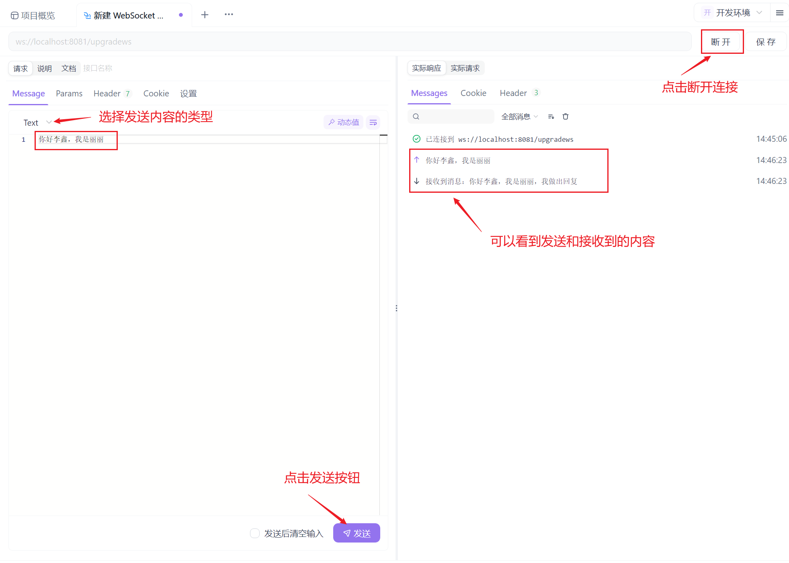

访问`WebSocket`接口需要对接口地址进行改动。例如使用`HTTP`访问该接口，请求的`URL`为：

```http
http://localhost:8081/upgradews
```

要使用`WebSocket`访问接口，只需将`http`改为`ws`，如下所示：

```http
ws://localhost:8081/upgradews
```

首先我们在合适的目录下，点击“添加`WebSocket`接口”：


在上面输入对应的访问地址，点击“连接”：



出现如下图所示内容，代表建立`WebSocket`连接成功：



我们向这个`WebSocket`连接发送消息，按照下图步骤操作：



发送信息后，接口函数中`WebSocket`连接的`ReadMessage`方法将会读取到这些信息，并进行回复，我们就可以在响应栏看到。

`WebSocket`连接一但建立，除非手动关闭，否则它会持久连接。我们可以点击“断开”按钮进行连接的关闭。

在这里，我们可以打开多个窗口，通过这个请求`URL`分别建立多个`WebSocket`连接。由于每次请求的`w http.ResponseWriter`和`r *http.Request`参数都是独立的上下文，因此这些连接彼此独立且互相隔离。
