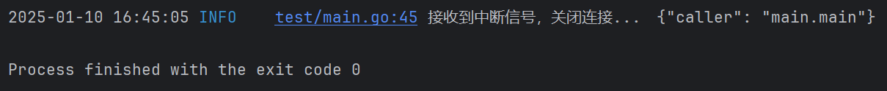

前面我们讲解了如何使用`HTTP`升级`WebSocket`，并使用`Gin`框架将其暴露出去，供前端或者`Postman`调用，这种情况是前端充当`WebSocket`的客户端，还有另一种情况，后端的另一个模块充当其客户端。

我们还是使用下面这个`Go`语言的`WebSocket`库来编写客户端代码：

```sh
go get github.com/gorilla/websocket
```

首先，我们按照上文内容，将`HTTP`升级为`WebSocket`，并使用`Gin`框架暴露出去，也就是要创建好`WebSocket`的服务端。

编写客户端，首先我们指定连接的服务端地址，并连接`WebSocket`服务器，代码如下：

```go
url := "ws://localhost:8081/upgradews"
conn, _, err := websocket.DefaultDialer.Dial(url, nil)
if err != nil {
	wlog.Error("call websocket.DefaultDialer.Dial failed").Err(err).Field("url", url).Log()
	return
}
defer conn.Close()
```

这里我们使用默认的`DefaultDialer`对象，调用`Dial`方法，建立客户端连接。`Dial`方法的方法签名如下：

```go
func (d *Dialer) Dial(urlStr string, requestHeader http.Header) (*Conn, *http.Response, error)
```

参数`urlStr`是我们调用`WebSocket`接口的`URL`，`requestHeader`是一个可选参数，用于设置`HTTP`请求的头部信息。如果不需要设置，可以传入`nil`。第一个返回值是成功建立连接后的连接对象，可以用来发送和接收消息。第二个返回值是`HTTP`响应对象，包含了与建立`WebSocket`连接相关的`HTTP`协议信息，例如状态码等。

我们启动一个`goroutine`来不断接收并读取`WebSocket`服务器发送过来的消息。

```go
go func() {
	for {
		_, message, err := conn.ReadMessage()
		if err != nil {
			wlog.Error("call conn.ReadMessage failed").Err(err).Log()
			return
		}
		fmt.Printf(string(message))
	}
}()
```

这里的`ReadMessage`方法是阻塞的，只有接收到消息，才会结束阻塞。它的方法签名如下：

```go
func (c *Conn) ReadMessage() (messageType int, p []byte, err error)
```

接下来，我们将消息发送到服务器，并定义一个`channel`，在接收到中断信号时对连接对象`conn`进行优雅关闭：

```go
for i := 0; i < 5; i++ {
	message := fmt.Sprintf("Message %d, 到沈阳有好果汁吃", i+1)
	err = conn.WriteMessage(websocket.TextMessage, []byte(message))
	if err != nil {
		wlog.Error("call conn.WriteMessage failed").Err(err).Field("sendMsg", message).Log()
		return
	}
	time.Sleep(1 * time.Second)
}

interrupt := make(chan os.Signal, 1)
signal.Notify(interrupt, os.Interrupt)
select {
case <-interrupt:
	log.Println("接收到中断信号，关闭连接...")
	err = conn.WriteMessage(websocket.CloseMessage, websocket.FormatCloseMessage(websocket.CloseNormalClosure, ""))
	if err != nil {
		wlog.Error("call conn.WriteMessage failed").Err(err).Log()
		return
	}
}
```

这里`WriteMessage`方法的方法签名如下：

```go
func (c *Conn) WriteMessage(messageType int, data []byte) error
```

第一个参数为发送消息的类型，第二个参数为消息内容，为字节数组的数据类型。我们遍历发送五条消息到`WebSocket`，同时在上面读取`WebSocket`消息的`goroutine`中读取到了`WebSocket`返回的内容：


程序将在这里阻塞，直到我们手动停止它。接收到中断信号后，程序会执行对`conn`的优雅关闭操作：

