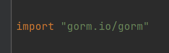

`Gorm`和`Gin`框架一样，都是使用`go get`命令去下载即可，下面的命令会安装过时的`v1`版本，现在已经不建议使用：

```sh
go get github.com/jinzhu/gorm #已过时
```

推荐使用以下命令安装最新版本：

```bash
go get gorm.io/gorm
```

最新版本的`Gorm`源代码已经迁移到`github.com/go-gorm/gorm`仓库。



导包成功，代表安装成功。

接下来我们下载数据库的驱动，这里我们下载`MySQL`和`PostgreSQL`的：

```bash
go get gorm.io/driver/mysql
go get gorm.io/driver/postgres
```

下载完`PostgreSQL`的驱动，我们使用`gorm`连接一下`PostgreSQL`，并打印出`PostgreSQL`的版本号：

```go
func main() {
	dsn := "host=10.40.18.34 user=postgres password=123456 dbname=mundo port=5432 sslmode=disable timezone=Etc/UTC"
	db, err := gorm.Open(postgres.Open(dsn), &gorm.Config{})
	if err != nil {
        wlog.Fatal("call gorm.Open failed").Err(err).Log()
	}
	var version string
	result := db.Raw("SELECT version()").Scan(&version)
	if result.Error != nil {
		wlog.Fatal("call db.Raw failed").Err(result.Error).Log()
	}
	fmt.Printf("PostgreSQL Version: %s", version)
}
```

对上面的连接代码进行讲解：

1. `dsn`（`Data Source Name`）定义了连接`PostgreSQL`数据库的具体信息，包括主机地址、用户名、密码、数据库名等。

2. 通过`gorm.Open()`打开数据库连接。第一个参数是数据库驱动，这里使用`postgres.Open()`进行创建；第二个参数是`Gorm`的其他配置，这里传入一个空的对象即可。获取到的`db`对象就是对该数据库的引用，也就是数据库连接对象。

3. 调用`db.Raw()`表示向指定数据库发起`SQL`语句的请求，并用一个`string`类型的`version`变量接收结果。

4. 最后打印出结果：`PostgreSQL Version: PostgreSQL 13.5 (Debian 13.5-1.pgdg110+1) on x86_64-pc-linux-gnu, compiled by gcc (Debian 10.2.1-6) 10.2.1 20210110, 64-bit`。

连接`PostgreSQL`数据库的`dsn`格式如下：

```sh
host=10.40.18.34 user=postgres password=123456 dbname=mundo port=5432 sslmode=disable timezone=Etc/UTC
```

如果我想改为连接`MySQL`，它的`dsn`有一些格式上的变化，其基础格式是这样的：

```sh
username:password@tcp(host:port)/dbname?charset=utf8mb4&parseTime=True&loc=Local
```

`MySQL`的`dsn`还有许多额外参数，具体使用时可以查阅相关文档。

把上面`PostgreSQL`的`dsn`信息改写成`MySQL`的，就是这样的格式：

```sh
root:123456@tcp(10.40.18.34:3306)/mundo?charset=utf8mb4&parseTime=True&loc=Local
```

在代码里使用时，只需要替换`dsn`字符串即可：

```go
dsn := "root:123456@tcp(10.40.18.34:3306)/mundo?charset=utf8mb4&parseTime=True&loc=Local"
db, err := gorm.Open(mysql.Open(dsn), &gorm.Config{})
```

