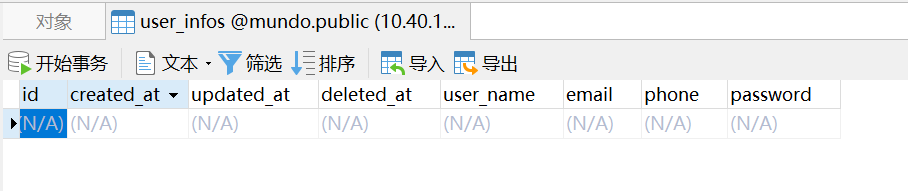
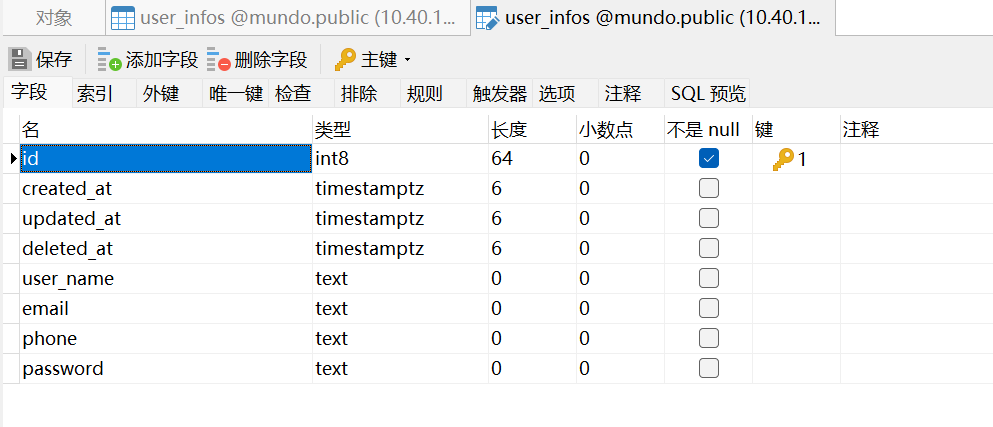
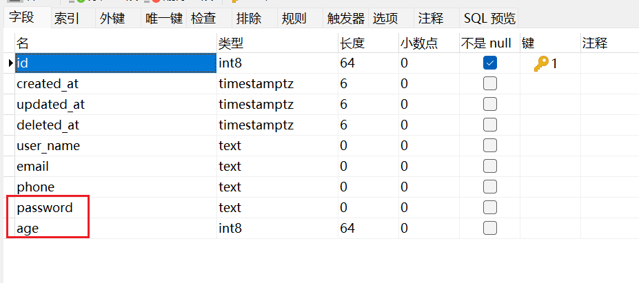

前面详细讲了如何获取`Gorm`的`db`对象，下面讲一下如何写`Gorm`的实体类。

`Gorm`库本身只提供了一种灵活的方式，就是先写实体类，后生成表。

> 当然，先写实体类再生成表这种方式并不符合正常的开发习惯，正常的开发流程应该是先确定表的结构，然后再写实体类、增删改查方法等。后面我会介绍到一个工具`gorm-gen`来根据表结构生成实体类与基础`CRUD`方法。

我们讲一下用实体类生成表的内容，例如我们在`dao`目录下的`user_info.go`文件写下面这样一个实体类。（注意，不要给实体类取名为`User`，因为它映射到数据库的表名为`user`，与数据库内嵌表冲突）

```go
type UserInfo struct {
	gorm.Model
	UserName string
	Email    string
	Password string
	Phone    string
}
```

其中`gorm.Model`是`Gorm`框架内置的一个结构体，用于简化数据库模型的定义。

```go
type Model struct {
	ID        uint `gorm:"primarykey"`
	CreatedAt time.Time
	UpdatedAt time.Time
	DeletedAt DeletedAt `gorm:"index"`
}
```

这里的`ID`字段在数据库中是自增`int8`类型，`DeletedAt`字段是软删除标记。当然`gorm.Model`不是必须添加的。

如果字段名为`ID`，类型为`uint`，符合`Gorm`的默认主键规则，无需添加额外的标签，`Gorm`就默认视其为主键。

然后在`main`函数里执行`AutoMigrate`方法即可：

```go
err := utils.DB.AutoMigrate(&dao.UserInfo{})
if err != nil {
	log.Fatal(err.Error())
}
```

这里`utils.DB`是上节创建好的`db`对象，`dao.UserInfo`是实体类所在位置。

这样，就在指定的数据库中创建好了一张表：



这张表的字段在数据库中的数据类型如下：



> **注意：**实体类的名字为`UserInfo`，而数据库表名为`user_infos`，因为`Gorm`框架会默认将结构体的复数形式作为数据库表的名字，如果实体类名本身就是复数，表名就和实体类名一致了。

可以设置一个配置，让表名不为复数形式，就是在创建`db`对象时，在`&gorm.Config`里新增一个配置，代码如下：

```go
func initPgsql() {
	newLogger := logger.New(
		log.New(os.Stdout, "\r\n", log.LstdFlags),
		logger.Config{
			SlowThreshold: time.Second, //慢SQL阈值
			LogLevel:      logger.Info, //级别
			Colorful:      true,        //彩色
		},
	)
	db, err := gorm.Open(postgres.Open(viper.GetString("pgsql.dsn")), &gorm.Config{
		Logger: newLogger,
		NamingStrategy: schema.NamingStrategy {
			SingularTable: true, // 使用表名单数形式
		},
	})
	if err != nil {
		log.Fatal("error: " + err.Error())
	}
	DB = db
}
```

这样生成的表名就不是复数形式了。

如果结构体名为驼峰类型，例如`AddressInfo`，那么它生成的表名为`address_info`，字段名同理。

如果表名重复，`gorm`会进行灵活处理。例如我给`UserInfo`实体新增了一个`Age`字段，删除了一个`Password`字段：

```go
type UserInfo struct {
	gorm.Model
	UserName string
	Email string
	Age int32
	Phone string
}
```

现在的表结构是这样的：



`password`字段仍然保留，`age`字段添加到了表的末尾。

如果表内有数据，`Gorm`不会删除或修改表内的数据，它只进行新增列，并给已有数据的此列赋默认值的操作。

如果想删除数据库某一列，还是要去`Navicat`手动删除或者写`SQL`执行删除。

如果实体类名和表名不符合这种对照关系，我们也可以添加一个方法，强制关联实体类和表名，例如：

```go
func (*UserInfo) TableName() string {
    return "users"
}
```

这样，这个`UserInfo`实体，关联的就是数据库的`users`表了，我们建议统一加上这个方法。
