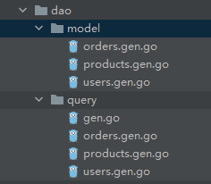

> 参考文章：https://gorm.io/zh_CN/docs/（`gorm`官方手册）、https://gorm.io/zh_CN/gen/index.html（`gen`官方手册）
>参考代码仓库：https://gitee.com/gorm/gen#distinct（`gen`中文仓库）

`gorm-gen`（`Gorm Generator`）是`Go`语言的一个自动化代码生成工具，与`Gorm`库配合使用。它的主要功能如下：

1. 生成数据模型：它会读取数据库的元数据（如表名、字段名、字段类型）并生成相应的`Go`结构体（数据模型）。
2. 生成`CRUD`方法：为每个数据模型自动生成常用的`CRUD`方法，它们基于`Gorm`框架编写，可以简化调用。
3. 动态查询：生成类型安全的查询构造器，如条件筛选、排序、分页等，支持链式调用，避免手写复杂`SQL`语句。

我们使用下面的命令去下载`gorm-gen`工具：

```bash
go get gorm.io/gen
```

> **注意：**上述命令会自动下载适配的`gorm.io/gorm`和`gorm.io/plugin/dbresolver`版本，其中一个兼容的版本组合是`gorm v1.25.9`与`dbresolver v1.5.0`。如果`gorm`的版本过高，可能会导致后续执行出错。因此，执行上述命令后，无需再手动下载`gorm.io/gorm`与`gorm.io/driver/mysql`，但如果之前已下载，且后续执行出错，需手动调整`go.mod`文件中的版本号。

首先我们先在`MySQL`数据库的`mundo`库新建三张表并插入一些数据，它们的`SQL`语句见上篇内容。

我们先创建数据库的连接`db`对象，在`cmd/db`目录下的`config.go`文件，写下面这样一个函数：

```go
func GetDB() *gorm.DB {
    userName := utils.Config.MySQL.UserName
	password := utils.Config.MySQL.Password
	ip := utils.Config.MySQL.IP
	port := utils.Config.MySQL.Port
	dbName := utils.Config.MySQL.DBName
	dsnFmt := "%v:%v@(%v:%v)/%v?charset=utf8mb4&parseTime=True&loc=Local"
	dsn := fmt.Sprintf(dsnFmt, userName, password, ip, port, dbName)
	db, err := gorm.Open(mysql.Open(dsn), &gorm.Config{
		Logger:                                   logger.Default.LogMode(logger.Info),
		NamingStrategy:                           schema.NamingStrategy{SingularTable: true},
		DisableForeignKeyConstraintWhenMigrating: true,
	})
	if err != nil {
		wlog.Fatal("call gorm.Open failed").Err(err).Log()
	}
	return db
}
```

然后，我们在`cmd/ormgen`目录下创建`main.go`，在主函数`main`编写`gen`的代码，完整代码如下：

```go
func main() {
    err := utils.InitConfig()
	if err != nil {
		wlog.Fatal("call utils.InitConfig failed").Err(err).Log()
	}
	g := gen.NewGenerator(gen.Config{
		OutPath: "dao/query",
		Mode:    gen.WithoutContext | gen.WithDefaultQuery | gen.WithQueryInterface,
	})
	g.UseDB(db.GetDB())
	g.ApplyBasic(
		g.GenerateModel("users"),
		g.GenerateModel("products"),
		g.GenerateModel("orders"),
	)
	g.Execute()
}
```

上述两段代码中的配置文件初始化以及配置信息获取的逻辑可根据实际项目情况进行调整，此处参考了“`viper`库”一节的内容。

创建`NewGenerator`指定了两个字段，其中`OutPath`字段指定了代码输出的路径，这里输出到相对`GoModules`目录的`dao/query`目录下；`Mode`字段设置了生成器的模式，它们之间用`|`分隔开：

1. `WithoutContext`：生成的代码不依赖于上下文环境。
2. `WithDefaultQuery`：生成默认的查询代码。
3. `WithQueryInterface`：生成接口形式的查询代码。

`g.UseDB`方法用于把数据库连接对象传递给生成器对象。`g.GenerateModel`方法指定表名，用于生成数据库表所对应的实体类，默认生成在`query`代码所在目录同级的`model`目录里，在这里是生成在`dao/model`目录下。

如果想一步到位，给指定数据库的所有表生成实体类，可以使用`GenerateAllTable`方法，其方法签名如下：

```go
func (g *Generator) GenerateAllTable(opts ...ModelOpt) (tableModels []interface{})
```

由于该方法返回的内容是一个切片，所以我们需要使用`...`将其打散后，再传给`ApplyBasic`方法：

```go
g.ApplyBasic(
	g.GenerateAllTable()...
)
```

如果已经提前写好了实体类，代码也可以这么写：

```go
g.ApplyBasic(
	model.Users{},
	model.Products{},
	model.Orders{},
)
```

`g.ApplyBasic`方法就是用于为对应的数据库表结构生成类型安全的增删改查的`API`，生成的代码在`dao/query`目录下。

在`MySQL`与`Go`之间进行字段类型映射时，`gen`提供了一套默认规则，但这套规则存在一定的局限性。例如，`MySQL`中的`DATETIME`类型默认会被映射为`Go`中的`time.Time`类型，它是结构体的值类型，其零值为`0001-01-01 00:00:00 +0000 UTC`。

在建表时，某个`DATETIME`字段未设置默认值，或默认值为`NULL`，在插入数据时若未显式为该字段赋值，它仍会包含在生成的`INSERT`语句中，并被插入时间零值`0000-00-00 00:00:00`。该值在`MySQL`中属于非法时间，会触发存储错误，导致插入操作失败：

```sh
Error 1292 (22007): Incorrect datetime value: '0000-00-00' for column 'login_time' at row 1
```

因此，在调用`g.ApplyBasic`方法之前，我们可以使用以下代码来自定义映射规则：

```go
customTypeMap := map[string]func(columnType gorm.ColumnType) (dataType string){
    "datetime": func(columnType gorm.ColumnType) string {
        if columnType.Name() != "deleted_at" {
            return "gorm.DeletedAt" // 保留deleted_at软删除字段的映射
        }
        return "sql.NullTime"
    },
}
g.WithDataTypeMap(customTypeMap)
```

其中，`sql.NullTime`类型的结构如下所示：

```go
type NullTime struct {
	Time  time.Time
	Valid bool // Valid is true if Time is not NULL
}
```

这样一来，表中所有`datetime`类型的字段在`Go`中都会对应为`sql.NullTime`类型（除`deleted_at`字段）。然而，这样做的一个缺点是，赋值时会稍显繁琐，需要手动创建`sql.NullTime`对象来进行赋值：

```go
sqlTime := sql.NullTime{Time: time.Now(), Valid: true}
```

我们也可以写一个辅助函数，方便进行赋值：

```go
func NewNullTime(t time.Time) sql.NullTime {
    return sql.NullTime{Time: t, Valid: true}
}
```

虽然这种解决方案并非最优，但它为我们提供了自定义字段类型映射的思路。例如，数据库中的`int`和`tinyint`类型默认映射为`Go`语言的`int32`类型。如果我们希望手动将它们映射为`int`类型，可以采用以下方法：

```go
customTypeMap := map[string]func(columnType gorm.ColumnType) (dataType string){
	"int": func(columnType gorm.ColumnType) string {
		return "int"
	},
	"tinyint": func(columnType gorm.ColumnType) string {
		return "int"
	},
}
g.WithDataTypeMap(customTypeMap)
```

在代码的最后，使用`g.Execute()`执行所有的代码生成操作，并将生成的代码输出到指定的路径。运行`main.go`，就会在对应的目录下，为每张表生成一个`model`文件和一个`query`文件：



> **注意：**如果我们更改了某张表的表名或删除了某张表，执行上述操作后，原表对应的文件并不会自动删除。因此，在实际操作中，我们应该先确认代码中不再引用这些文件，再手动删除`model`和`query`目录下的相关文件。

在实际开发中，常常会遇到多个环境（如开发环境、测试环境）共用同一套数据库的情况。当业务发生变更后，开发人员通常会先在本地更新代码逻辑，并根据需要调整数据库表结构，以便本地测试。然而，此时测试环境的代码可能尚未更新，若直接修改数据库表结构，可能会导致测试环境出现兼容性问题。这种情况下，需要根据具体情况进行区别处理：

1. 添加字段通常是风险较低的操作，但仍需注意以下几点：新字段应设置`DEFAULT`默认值或允许为`NULL`，同时在代码中要确保不存在未显式指定字段名的`INSERT`语句（常见的`ORM`框架在执行`Create`操作时通常会显式指定字段名）。如果新字段需要设置为`NOT NULL`，建议先将其设置为允许`NULL`，手动将该字段的存量数据填充为默认值，再修改字段约束为`NOT NULL`。
1. 删除字段或修改字段名属于高风险操作。如果测试环境的代码仍依赖相关字段，会导致写入等操作失败，因此严禁直接在数据库中直接进行此类操作。对于删除字段，应先在代码层面彻底移除对该字段的所有引用；对于修改字段名，应先在数据库中新增使用新名称的字段，并在代码中将所有引用切换至新字段。部署至测试环境，经过充分测试后，再执行旧字段的删除操作。
1. 字段类型的更新需根据修改的破坏性进行评估。若类型变更具有较强破坏性，比如将字段类型从`INT`改为`VARCHAR`，可能会导致依赖该字段的代码出现崩溃；而如果只是扩大字段长度，例如将`VARCHAR(20)`调整为`VARCHAR(100)`，则变更风险较低。
1. 更新字段的约束条件也需谨慎处理。例如，在添加`NOT NULL`或`UNIQUE`约束时，必须充分考虑旧数据的兼容性，确保现有数据不会违反新增的约束规则。建议在添加约束前先进行数据排查和清洗，必要时可以通过临时脚本修复异常数据。

所以，在条件允许下，建议开发库、测试库、生产库分开部署，以避免表结构更改带来的潜在性问题。

`g.ApplyBasic`只能生成最基础的增删改查代码。如果需要为对应的表生成一些动态的`SQL`命令，可以使用`g.ApplyInterface`方法。关于这一点，我们将在下一篇文章中详细讲解。