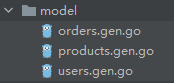
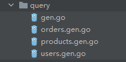

前两节讲解了如何使用`gorm-gen`生成`SQL`的增删改查`API`，下面对于生成的代码，以及它们的使用做出讲解。

### 一、代码文件结构

我们看一下`model`目录下的代码文件：



这一目录下给每张表新建了一个文件，文件内有表对应的实体类，以及`TableName`方法，我们以`users.gen.go`为例作展示：
```go
const TableNameUsers = "users"

// Users 用户表
type Users struct {
	ID        int32     `gorm:"column:id;primaryKey;autoIncrement:true;comment:主键ID" json:"id"`
	Name      string    `gorm:"column:name;not null;comment:用户名" json:"name"`
	Email     string    `gorm:"column:email;not null;comment:电子邮件" json:"email"`
	CreatedAt time.Time `gorm:"column:created_at;not null;default:CURRENT_TIMESTAMP;comment:创建时间" json:"created_at"`
}

// TableName Users's table name
func (*Users) TableName() string {
	return TableNameUsers
}
```

> 我们可以在`model`目录下新建一个`hook.go`文件，用于放置所有的钩子方法，钩子方法的语法在上面章节有讲解。

然后我们再看一下`query`目录下的代码文件：



每张表都有对应的文件，此外，还有一个`gen.go`文件，其中包含一个关键方法`SetDefault`。该方法是一个前置操作，我们需要在使用生成的`API`之前调用它，并将`db`对象传入。这一操作应当在项目的`main`函数中进行：

```go
query.SetDefault(db.GetDB())
```

在使用`gorm-gen`生成代码时，在`g.UseDB`方法中传入`db`对象的主要目的是指定数据库表来生成代码。而在`query.SetDefault`函数中再次传入`db`对象，则是为了明确后续的增删改查操作将作用于哪个数据库。

### 二、全局变量与事务

`query`目录下的`gen.go`文件里有这样几个全局变量，如下所示：

```go
var (
	Q        = new(Query)
	Orders   *orders
	Products *products
	Users    *users
)
```

上面的`query.SetDefault`操作实际上就是对这几个全局变量进行赋值。如果没有执行该操作，在使用这些全局变量时，将会导致空指针异常，报错信息为：

```sh
panic: runtime error: invalid memory address or nil pointer dereference
```

后面的三个变量用于调用`CRUD`接口时指定操作的表对象，每个变量对应一张表。建议命名时采用“表名+`Q`”的形式：

```go
usersQ := query.Users
productsQ := query.Products
ordersQ := query.Orders
```

以下是使用`Users`变量的一个简单示例：

```go
user, _ := usersQ.Where(usersQ.Name.Eq("Bob")).First()
```

如果需要传递上下文对象`ctx`以控制请求超时，调用`WithContext`方法进行传入即可：

```go
user, _ := usersQ.WithContext(ctx).Where(usersQ.Name.Eq("Bob")).First()
```

第一个变量`Q`是用来做事务操作的，它支持两种事务操作方式。第一种方式代码如下：

```go
err := query.Q.Transaction(func(tx *query.Query) error {
	// 如果返回error，代表事务回滚，否则事务提交
})
```

第二种方式代码如下：

```go
tx := query.Q.Begin()
// 这里模拟数据库操作出现错误，进行事务回滚的情况
err := errors.New("数据库错误")
if err != nil {
	tx.Rollback()
    return nil, err
}
tx.Commit()
```

推荐使用调用`Transaction`方法的方式来处理事务操作。当发生错误时，只需在内部函数中返回`error`，事务就会自动回滚。这样能够有效避免开发人员在分支逻辑中遗漏调用`tx.Rollback()`，从而导致事务未能正确回滚的风险。

在事务作用域内创建操作对象时，应使用`tx`替代`query`，并建议将变量命名为“表名+`TX`”，例如：

```go
usersTX := tx.Users
productsTX := tx.Products
ordersTX := tx.Orders
```

如果事务发生回滚，那么代码中所有通过该`tx`创建的操作对象所执行的增、删、改操作都会被一并回滚。这些操作在事务执行期间仅存在于事务上下文中，如果事务最终`COMMIT`，数据库会把事务期间的所有修改正式写入数据文件并持久化；如果事务最终`ROLLBACK`，数据库会丢弃事务期间的所有修改，相当于这些操作从未发生过。

### 三、新增数据

我们以`user`表为例，讲解`gorm-gen`为每张表自动生成的新增、修改和删除数据的方法。其他表生成的增删改查方法名称相同，但其入参和返回值可能会有所不同。

有关于新增数据的方法有以下三个：

```go
Create(values ...*model.Users) error
CreateInBatches(values []*model.Users, batchSize int) error
Save(values ...*model.Users) error
```

`Create`和`CreateInBatches`的用法和效果与原生`gorm`基本相同。`Create`支持插入一条或多条数据，插入多条数据时，可以使用多个参数，也可以指定一个切片并使用`...`将其展开，例如`usersQ.Create(users...)`。而`CreateInBatches`则用于分批插入数据，允许指定每次插入的数量，这样在处理大量数据时，可以提高插入效率。

`Save`的使用效果与原生`gorm`的`Save`存在一些区别。它内部实际上使用`Gorm`的以下逻辑来处理主键或唯一字段的冲突：

```go
db.Clauses(clause.OnConflict{UpdateAll: true}).Create(entity)
```

上面代码表示在插入数据时，如果遇到主键或唯一字段的冲突，将会执行更新操作，而不是插入新的记录。

`gorm-gen`生成的代码也包含一个名为`Clauses`的方法，同样用于处理主键或唯一性约束字段冲突，用来自定义`upsert`操作的行为。`gen`的`Clauses`方法使用方式与原生`Gorm`基本相同：

```go
usersQ.Clauses(clause.OnConflict{UpdateAll: true}).Create(entity)
```

在新增数据后，数据库会自动生成诸如自增`ID`、创建时间等字段，并将这些字段的值写回到传入的`model`对象中，因此我们可以直接从该对象中获取这些信息，示例代码如下：

```go
user := &model.Users{
	Name:  "zhangsan",
	Email: "zhangsan@126.com",
}
_ = usersQ.Create(user)
fmt.Println(user.ID) // 打印出MySQL生成的主键ID
```

默认情况下，插入操作会将除自增的`id`字段以及具有默认非`NULL`值的`DATETIME`字段之外的所有字段包含在生成的`INSERT`语句中。如果需要自定义插入的字段，可以通过`Select`方法显式指定要插入的字段，或使用`Omit`方法排除不需要插入的字段：

```go
usersQ.Select(usersQ.Name, usersQ.Email).Create(&user)
usersQ.Omit(usersQ.Name, usersQ.Email).Create(&user)
```

前文提到，`MySQL`中的`DATETIME`类型在`Go`语言中对应结构体值类型`time.Time`。如果该字段未设置默认值或默认值为`NULL`，且在插入数据时未显式赋值，则默认会使用时间零值，即`0000-00-00 00:00:00`进行插入。这在`MySQL`中属于非法时间值，会导致插入失败。为避免该问题，可通过使用`Omit`方法忽略`time.Time`类型的零值字段，从而使数据库能够正确插入：

```go
err = usersQ.Omit(usersQ.LoginTime).Create(user)
```

当实体类字段名为`CreatedAt`或`UpdatedAt`，类型为`time.Time`，且创建时未手动设置其值时：

- 若对应字段在`MySQL`中设置为`NOT NULL DEFAULT CURRENT_TIMESTAMP`，则插入操作时，`Gorm`不会显式指定该字段。
- 若对应字段仅设置为`NOT NULL`且未指定默认值，则`Gorm`会在插入操作时显式地为该字段赋值为当前时间。

### 四、删除数据

有关于删除数据的方法只有以下一个：

```go
Delete(...*model.Users) (info gen.ResultInfo, err error)
```

该方法返回`gen.ResultInfo`对象，它的内部有属性`RowsAffected`，代表删除数据的条数：

```go
type ResultInfo struct {
	RowsAffected int64
	Error        error
}
```

`Delete`方法必须联合`Where`方法做条件删除，否则会返回错误：`WHERE conditions required`。一个正确的使用示例如下：

```go
info, _ := usersQ.Where(usersQ.ID.Eq(1)).Delete()
```

如果表中包含名为`deleted_at`且类型为`DATETIME`的字段，通过`g.GenerateModel`生成的实体类中，该字段名对应为`DeletedAt`，类型为`gorm.DeletedAt`。对于包含该字段的表，删除操作默认执行软删除，即将`deleted_at`字段更新为当前时间，而不是物理删除数据。被软删除的记录在普通查询中将被自动排除。如需执行物理删除操作，可使用`Unscoped()`方法：

```go
info, _ := usersQ.Unscoped().Where(usersQ.ID.Eq(2)).Delete()
```

无论是物理删除还是逻辑删除，即使要删除的数据不存在，也不会返回`error`。

### 五、更新数据

有关于更新数据的方法有以下这些：

```go
Update(column field.Expr, value interface{}) (info gen.ResultInfo, err error)
UpdateSimple(columns ...field.AssignExpr) (info gen.ResultInfo, err error)
Updates(value interface{}) (info gen.ResultInfo, err error)
UpdateColumn(column field.Expr, value interface{}) (info gen.ResultInfo, err error)
UpdateColumnSimple(columns ...field.AssignExpr) (info gen.ResultInfo, err error)
UpdateColumns(value interface{}) (info gen.ResultInfo, err error)
UpdateFrom(q gen.SubQuery) gen.Dao
```

使用`Update`可以用来更新单列；使用`UpdateSimple`方法可以更新单列或多列，它结合字段的表达式一同使用，例如`Add`、`Zero`、`Null`、`Value`等。它们的使用示例如下所示：

```go
// UPDATE `users` SET `email`='alice@gmail.com' WHERE `users`.`name` = 'Alice'
info, _ := usersQ.Where(usersQ.Name.Eq("Alice")).Update(usersQ.Email, "alice@gmail.com")
// UPDATE `products` SET `name`='Computer',`price`=`products`.`price`+4 WHERE `products`.`id` = 1
info, _ := productsQ.Where(productsQ.ID.Eq(1)).UpdateSimple(productsQ.Name.Value("Computer"), productsQ.Price.Add(4))
```

> **注意：**做上述单列更新操作时，必须联合`Where`方法做条件更新，否则返回错误：`WHERE conditions required`。

在更新多列时，通常使用`Updates`方法，并可以传入结构体对象或`map[string]interface{}`类型对象作为参数。默认情况下，如果使用结构体对象进行更新，只有非零值的字段会被更新。也就是说，当你尝试将某个`int`类型字段更新为`0`、`string`类型字段更新为`""`，或将`bool`类型字段更新为`false`时，使用结构体对象进行更新是无法生效的。

这是因为结构体对象会将所有未赋值的字段设为零值，而零值字段在调用`Updates`方法时默认不进行更新。如果要确保零值字段被更新，可以使用`Select`方法强制更新选定字段，或者使用`map[string]interface{}`完成更新操作：

```go
// UPDATE products SET name = Air WHERE id = 1
productsQ.Where(productsQ.ID.Eq(1)).Updates(&model.Products{Name: "Air", Price: 0})

// UPDATE products SET price = 0, name = Air WHERE id = 1
productsQ.Select(productsQ.Name, productsQ.Price).Where(productsQ.ID.Eq(1)).
	Updates(&model.Products{Name: "Air", Price: 0})

// UPDATE products SET price = 0, name = Air WHERE id = 1
productsQ.Where(productsQ.ID.Eq(1)).Updates(map[string]interface{}{"Name": "Air", "Price": 0})
```

亦或者，也可以在完成`Updates`的更新操作后，再使用`Update`方法单独对指定的零值字段进行更新。

同样地，我们可以使用`Omit`来指定更新操作时不更新某些字段：

```go
// UPDATE products SET price=300 WHERE id = 1
productsQ.Omit(productsQ.Name).Where(productsQ.ID.Eq(1)).
	Updates(map[string]interface{}{"Name": "Mouse", "Price": 300.00})
```

> **注意：**在执行上述多列更新操作时，如果结构体对象是表的实体对象且包含`id`字段，则可以省略`Where`方法，因为`Updates`方法会自动根据实体对象中的`id`字段进行条件更新。

`UpdateColumn`、`UpdateColumnSimple`、`UpdateColumns`这三个方法与不带`Column`的方法的执行效果相同，但是在数据库层面，操作粒度不同。后者更新了整条记录，而前者是轻量级的，精确地更新了指定列。`UpdateFrom`用于完成根据子查询更新字段的操作，对于这个操作，我这里不做过多讲解，使用的时候查阅开发文档即可。

当实体类字段名为`UpdatedAt`，类型为`time.Time`时，`Gorm`会在更新操作时显式地为该字段赋值为当前时间。

### 六、三个特殊方法

这里再讲三个特殊方法，他们的方法签名如下：

```go
UnderlyingDB() *gorm.DB
ReplaceDB(db *gorm.DB)
Session(config *gorm.Session) IUsersDo
```

`UnderlyingDB`方法用于获取原生`db`对象，通常适用于系统不对外暴露`db`对象或项目中连接了多个数据库的情况。通过这个方法可以确定操作的是哪个数据库的对应表。`ReplaceDB`方法用于替换`db`对象，即更换连接的数据库。其使用方法如下：

```go
db := usersQ.UnderlyingDB()
usersQ.ReplaceDB(newDB)
```

当使用`gorm-gen`生成的方法难以构建较为复杂的`SQL`语句时，可以通过`UnderlyingDB`获取底层的`db`对象，借助其`Exec`或`Raw`方法直接执行复杂的`SQL`操作。这样延续了原生`Gorm`的使用方式，便于开发者根据实际需求灵活处理各种查询场景。

`Session`方法允许开发者在特定操作中自定义选项，而不影响原始的`DB`实例。这种机制让开发者能够在不更改全局配置的情况下，临时调整特定操作的行为，如日志级别、事务管理、模拟运行等。

例如，在某个场景中，如果`users`表每隔`5`分钟需要插入`50`条数据，打印所有插入的`SQL`语句会在日志中引入大量噪音。为了解决这个问题，可以使用`Session`方法，将该插入操作的日志级别设置为`Silent`，从而避免日志输出：

```go
usersQ.Session(&gorm.Session{Logger: logger.Default.LogMode(logger.Silent)}).Create(user)
```

这段代码确保了只在当前操作中禁用日志输出，而不影响其他操作的日志记录。