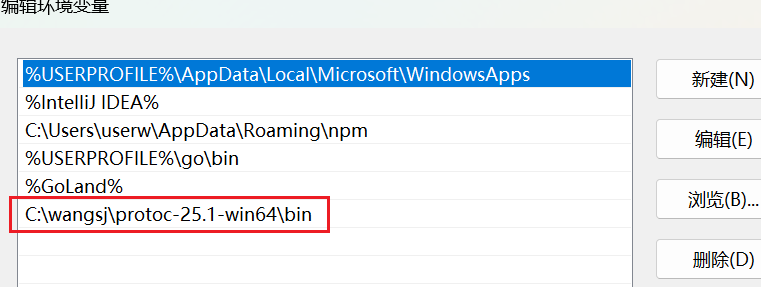

首先打开这个网站：https://github.com/protocolbuffers/protobuf/releases

在`Assets`里，可以看到所有环境的`protobuf`版本，找到本机对应的版本进行下载。例如对于`Mac M3pro`芯片版本，就下载`protoc-26.1-osx-aarch_64.zip`，对于`Windows x86`版本，就下载`protoc-26.1-linux-x86_64.zip`：


下载后解压，放在想放置的目录下，然后配置环境变量，把该文件夹下的`bin`目录配置到`Path`中，在`Windows11`系统中这样配置：



> **注意：**不要图省事把`bin`目录下的`protoc.exe`文件放置到`$GOPATH/bin`目录下，因为在使用`protoc`命令时，可能会用到`protobuf`文件夹下面的`include\google\protobuf`里的文件，如果移动了`protoc.exe`，它将无法找到文件。

然后去终端查看版本，测试是否配置成功：

```sh
protoc --version
```


之后我们需要下载`protoc-gen-go`和`protoc-gen-go-grpc`两个可执行文件，使用如下命令：

```sh
go install google.golang.org/protobuf/cmd/protoc-gen-go@latest
go install google.golang.org/grpc/cmd/protoc-gen-go-grpc@latest
```

如果使用`Windows`环境，先使用`go env`看看是否`GOOS='windows'`，否则不会有`exe`文件生成。

执行后可以在`$GOPATH/bin`目录看到这两个可执行文件（ `Mac`环境同理）：


执行后，查看它们的版本信息：

```sh
protoc-gen-go --version
protoc-gen-go-grpc --version
```


上面无需额外的配置即可直接使用，因为`$GOPATH/bin`目录之前已经被配置到环境变量中了：


