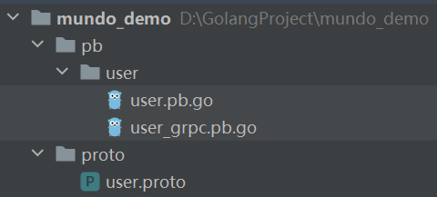

第一个文件安装了`protoc.exe` 、 `protoc-gen-go.exe`和`protoc-gen-go-grpc.exe`这三个可执行文件，这里讲一下这三个可执行文件分别都是干什么的。

我们一般都是在项目中去写一个`proto`文件，包括`message`和`service` ，写完这个`proto`文件后，就要使用`protoc.exe`把`proto`文件的消息和服务的定义，转换成特定编程语言的代码。那么，怎么指定这个特定的编程语言呢？就要使用`protoc-gen-go.exe`和`protoc-gen-go-grpc.exe`了，通过它们，最终就能生成可用的`Go`语言代码了。

整个过程中，首先运行`protoc.exe`，将`.proto`文件编译成一个中间表示，然后再运行`protoc-gen-go.exe`和`protoc-gen-go-grpc.exe`，将这个中间表示转化为最终的`Go`语言代码文件。

我们在名为`proto`的目录下写一个文件`user.proto`，如下所示：

```protobuf
syntax = "proto3";

package proto;

option go_package = "../pb/user";

message GetUsersRequest {
  int32  user_id = 1;
  string username = 2;
}

message GetUsersResponse {
  User user = 1;
}

message User {
  int32  id = 1;
  string username = 2;
  string email = 3;
}

service UserService {
  rpc GetUsers (GetUsersRequest) returns (GetUsersResponse);
}
```

我们先在终端切换到`proto`文件所在的目录，然后使用以下命令：

```shell
protoc --go_out=. --go-grpc_out=. user.proto
```

`--go_out` 参数负责生成`pb.go`文件，`--go-grpc_out` 参数负责生成`grpc.pb.go`文件，也就是说`protoc-gen-go.exe`生成`pb.go`文件，`protoc-gen-go-grpc.exe`生成`grpc.pb.go`文件。

在这里，它们都被指定为在当前目录下生成，也就是`proto`文件中`go_package`选项指定的目录下。

执行上方命令后，我们就可以看到有`pb.go`和`grpc.pb.go`文件输出出来了，目录的层级关系是这样的：



这里，`pb.go`和`grpc.pb.go`文件可能会有爆红，如果爆红，使用`go mod tidy`进行处理。

如果修改了`proto`文件，无需手动删除`pb.go`和`grpc.pb.go`文件，直接重新执行命令，会重新生成代码文件对之前的文件进行覆盖。