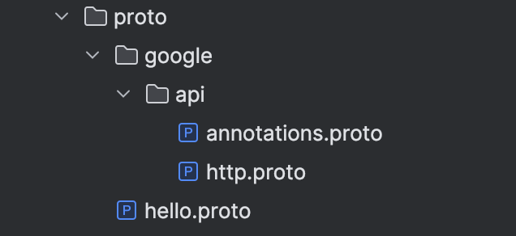
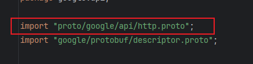

在前面的章节中，我们详细介绍了如何安装`protoc-gen-go`和`protoc-gen-go-grpc`插件，使用指令生成`pb.go`和`grpc.pb.go`文件，以及编写对应的`gRPC`接口并进行调用。本节将作为扩展，介绍`grpc-gateway`相关的内容。

首先，需要了解的是，`grpc-gateway`也是一个插件，与前面提到的两个插件类似，它以可执行文件的形式存在于`$GOPATH/bin`目录中。我们可以通过以下命令进行下载：

```sh
go install github.com/grpc-ecosystem/grpc-gateway/v2/protoc-gen-grpc-gateway@latest
go install github.com/grpc-ecosystem/grpc-gateway/v2/protoc-gen-openapiv2@latest
```

`grpc-gateway`的主要用途是将`gRPC`服务转换为`RESTful`的`HTTP API`。具体来说，它是一个反向代理服务器，能够将`HTTP API`请求转化为`gRPC`请求，并将`gRPC`响应转化为`HTTP`响应。这样，基于`gRPC`的服务能够更容易地与传统的`HTTP`客户端进行通信，如网页浏览器和移动应用程序。通过这种方式，外部的`HTTP`请求可以直接访问`gRPC`接口。

下面定义一个使用`grpc-gateway`的接口示例，文件放在`proto`目录下，命名为`hello.proto`：

```protobuf
syntax = "proto3";

package proto;

import "proto/google/api/annotations.proto";

option go_package = "./pb/hello";

message HelloRequest {
  string name = 1;
}

message HelloResponse {
  string msg = 1;
}

service Greeter {
  rpc SayHello (HelloRequest) returns (HelloResponse) {
    option (google.api.http) = {
      post: "/v1/mundo/hello"
      body: "*"
    };
  }
}
```

这个`proto`文件引入了另一个文件`google/api/annotations.proto`，可以从`api-common-protos`仓库中获取：

```sh
git clone https://github.com/googleapis/api-common-protos.git
```

把`clone`下来的仓库中`annotations.proto`、`http.proto`两个文件复制到`proto/google/api`目录下。文件目录结构如下所示：



需要更改`annotations.proto`文件中`import`的路径位置。具体来说，是更改下面这一条引用：



如果出现`import`的爆红，参照“`Goland`设置调整”一节来解决。

在传统的`proto`文件中，定义`service`块时，我们只需指定方法名及其输入和输出参数。然而，集成`grpc-gateway`后，在定义方法时需要配置额外的参数。通过使用`option`关键字和`google.api.http`选项（`annotations.proto`的`package`名称为`google.api`），可以配置相关参数，从而实现`gRPC`方法与`HTTP`路径的映射。

在上述`proto`文件中，`option`块的具体内容如下：

- `post: "/v1/mundo/hello"`：定义了一个`HTTP POST`请求路径`/v1/mundo/hello`。当客户端向该路径发送`POST`请求时，将触发对`SayHello`方法的调用。接口支持`GET`、`POST`、`PUT`、`DELETE`等`RESTful API`操作。请求路径可以包含路径参数占位符，例如`/v1/mundo/hello/{name}`，其中占位符`{name}`在实际请求`URL`中被替换为具体值。路径参数的名称必须与接口在`proto`文件中定义的`HelloRequest`中的字段名精确匹配。
- `body: "*"`：指定`HTTP`请求体中的所有字段都会映射到`HelloRequest`消息中，这意味着整个请求体的内容将作为`SayHello`方法的输入参数。如果只需要映射请求体中的某些特定字段，可以通过字段名进行精确指定。例如，`body: "fieldName1,fieldName2"`表示仅`fieldName1`和`fieldName2`字段会映射到`gRPC`请求，其他字段将被忽略。


除了上面定义的两个参数外，还有一个可供使用的参数`additional_bindings`，它允许在一个`option`块中定义额外的`HTTP`请求映射，以支持不同的`HTTP`方法或路径。这使得一个`gRPC`方法可以灵活地处理不同类型的`HTTP`请求：

```protobuf
option (google.api.http) = {
  post: "/v1/hello"
  body: "*"
  additional_bindings {
    get: "/v1/hello/{name}"
  }
};
```

