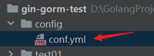
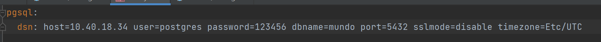
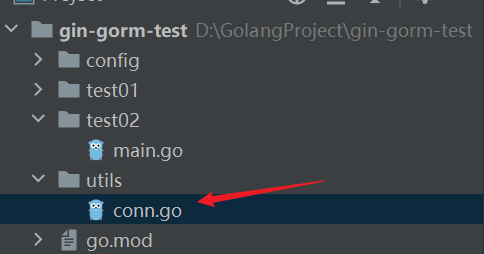
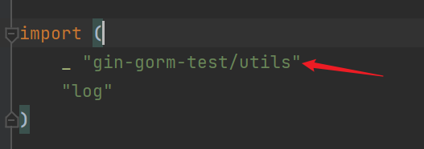

上一节的内容，简单讲了`Gorm`框架如何连接数据库，并向数据库发送`SQL`语句，得到返回结果的过程。

先把上节的代码拿过来，分析一下存在的问题：

```go
func main() {
	dsn := "host=10.40.18.34 user=postgres password=123456 dbname=mundo port=5432 sslmode=disable timezone=Etc/UTC"
	db, err := gorm.Open(postgres.Open(dsn), &gorm.Config{})
	if err != nil {
		log.Fatal(err)
	}
	var version string
	result := db.Raw("SELECT version()").Scan(&version)
	if result.Error != nil {
		log.Fatal(result.Error)
	}
	log.Println("PostgreSQL Version:", version)
}
```

我们能看出有两个问题：

1. `dsn`被写死在了代码里，正常应该写在配置文件，动态读取。
2. `db`对象被创建到了`main`里，这样外部的方法无法使用这个`db`对象。

先解决第一个问题，在`config`目录下，创建一个`yml`配置文件，放置`dsn`字符串的内容：





上面文件创建好后，再创建一个`utils`目录，里面放置连接对应`dsn`的数据库连接对象，如下：



我们要使用`github.com/spf13/viper`这个包去读取配置文件，首先下载这个包：

```bash
go get github.com/spf13/viper
```
读取配置文件的函数这样写：
```go
func initConfig() {
	viper.SetConfigFile("config/conf.yml")
	err := viper.ReadInConfig()
	if err != nil {
		log.Fatal("error: " + err.Error())
	}
}
```

这几句代码，设置了搜索的文件路径为`config/conf.yml`（`Go`语言项目的相对路径，为相对于距离该文件最近的`GoModules`管理的目录的相对路径，路径开头没有斜杠），并尝试从配置文件中读取配置，放到`viper`对象上。

在`utils`目录下创建一个全局变量：

```go
var (
	DB *gorm.DB
)
```

再写一个初始化`PostgreSQL`的数据库连接对象`db`对象的函数：

```go
func initPgsql() {
	db, err := gorm.Open(postgres.Open(viper.GetString("pgsql.dsn")), &gorm.Config{})
	if err != nil {
		log.Fatal("error: " + err.Error())
	}
	DB = db
}
```

这里我们想让它打印`SQL`语句的日志出来，需要在`&gorm.Config`对象里添加一个设置，如下：

```go
func initPgsql() {
	newLogger := logger.New(
		log.New(os.Stdout, "\r\n", log.LstdFlags),
		logger.Config{
			SlowThreshold: time.Second, //慢SQL阈值
			LogLevel:      logger.Info, //级别
			Colorful:      true,        //彩色
		},
	)
	db, err := gorm.Open(postgres.Open(viper.GetString("pgsql.dsn")), &gorm.Config{
		Logger: newLogger,
	})
	if err != nil {
		log.Fatal("error: " + err.Error())
	}
	DB = db
}
```

或者也可以直接用它的默认设置，如下所示：

```go
db, err := gorm.Open(mysql.Open(dsn), &gorm.Config{
	Logger: logger.Default.LogMode(logger.Info),
})
```

把上面两个初始化函数写在`utils`目录下`init`函数里：

```go
func init() {
	initConfig()
	initPgsql()
}
```

回到`main`函数，通过`utils.DB`获取`db`对象，并调用对应的`API`：

```go
func main() {
	var version string
	result := utils.DB.Raw("SELECT version()").Scan(&version)
	if result.Error != nil {
		log.Fatal(result.Error)
	}
	log.Println("PostgreSQL Version:", version)
}
```

在`main`函数所在的文件中，即使没有直接使用到`db`对象，仍然需要导入`gin-gorm-test/utils`包。可以使用`_`来忽略对该包的显式使用，确保其`init`函数执行，从而初始化`utils.DB`对象。示例如下：



这样写，在项目中的每个地方，想用到这个`db`对象时，都可以用过`utils.DB`获取它。

在这个`utils`包中，未来可以添加例如`Redis`等其他连接。这样可以集中管理各种连接，提高代码的可维护性和可扩展性。