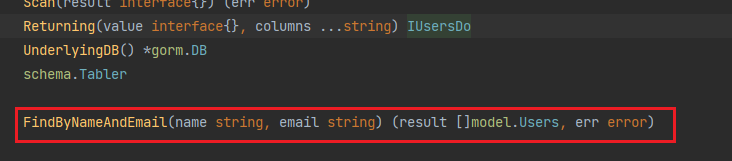

上一节我们讲过，如果我们只需要简单的增删改查接口，使用`g.ApplyBasic`进行生成即可，但是如果想生成自定义的、复杂的增删改查接口，就要使用到`g.ApplyInterface`搭配接口和注释去生成。

举个简单的例子，如果我想给`users`表增加一个根据`name`和`email`进行联合查询的方法，首先这样定义一个接口：

```go
type UsersQuerier interface {
	// select * from @@table where name = @username and email = @email
	FindByNameAndEmail(name, email string) ([]gen.T, error)
}
```

我们在接口中定义一个方法，并在此方法上面加上格式为`SQL`语言的注释。

然后在`main`函数中，使用`ApplyInterface`方法把这个接口与接口内的方法，和对应的数据库表进行关联：

```go
g.ApplyInterface(
	func(querier UsersQuerier){},
	g.GenerateModel("users"),
)
```

运行`main.go`，观察到在`query`目录下的`users.gen.go`文件中，定义增删改查接口的部分生成了我们定义的方法：



定位到方法实现的位置，我们看到实现代码是这样的：

```go
// select * from @@table where name = @name and email = @email
func (u usersDo) FindByNameAndEmail(name string, email string) (result []model.Users, err error) {
	var params []interface{}

	var generateSQL strings.Builder
	params = append(params, name)
	params = append(params, email)
	generateSQL.WriteString("select * from users where name = ? and email = ? ")

	var executeSQL *gorm.DB
	executeSQL = u.UnderlyingDB().Raw(generateSQL.String(), params...).Find(&result) // ignore_security_alert
	err = executeSQL.Error

	return
}
```

实际上，它所执行的也就是把我们定义的`SQL`语句进行填充，然后使用`UnderlyingDB`方法获取`db`对象执行这句`SQL`。

上面是一个简单的示例，那么下面讲一下这个接口方法以及动态`SQL`语句的定义语法与规则。首先我们看动态`SQL`的部分，它支持完整的`SQL`或者`SQL`代码片段，而且不止支持查询方法，也支持增删改的方法。上面定义的就是一句完整的`SQL`的查询语句，下面我再定义完整的增删改查四个方法：

```go
type UsersQuerier interface {
	// select * from @@table where name = @name and email = @email
	FindByNameAndEmail(name, email string) ([]gen.T, error)
	// insert into @@table (name, email) values (@name, @email)
    InsertUsers(name, email string) error
    // update @@table set name = @name, email = @email where id = @id
    UpdateUsers(id, name, email string) error
    // delete from @@table where name = @name and email = @email
    DeleteUsers(name, email string) error
}
```

`SQL`代码片段通常与`DAO`接口一同使用，如果使用代码片段，查询接口可以使用如下写法：

```go
// where("name = @name and email = @email")
FindByNameAndEmail(name, email string) (gen.T, error)
```

> **注意：**`gen`并不会检查动态`SQL`的语法，它只负责填充字段并执行，所以我们要着重检查`SQL`语句语法的正确性。

上面是动态`SQL`的示例，那么下面我来讲讲动态`SQL`的语法。首先就是模板的占位符，`@@table`指定表名，`@name`指定表的列值对应的参数名，`@@name`指定表的列名名对应的参数名。前两个我们上面都有用到过，第三个的用法如下：

```go
// select * from @@table where @@name = @value
FindByAny(name, value string) ([]gen.T, error)
```

例如我们要查邮箱为`userwsj@126.com`的数据，填充`name`参数为`email`，`value`参数为`userwsj@126.com`即可。

`gen`支持模板表达式，做动态`SQL`语句的构建，目前支持`if else`、`where`、`set`、`for`这几种，下面举一个`if else`例子：

```go
// select * from @@table where
//	{{if name != ""}}
//		name = @name
//	{{end}}
//	and 1=1
FindByName(name string) (gen.T, error)
```

这里我们发现总要在最后加一个`and 1=1`来避免`if`语句未通过时，`SQL`可能发生的语法错误。为了改良，就要使用到`where`关键字：

```go
// select * from @@table
//	{{where}}
//		{{if name != ""}}
//			name = @name
//		{{end}}
//	{{end}}
FindByName(name string) (gen.T, error)
```

`set`关键字用于在`update`语句中动态生成`set`语句，会自动修剪不必要的`,`符号；`for`表达式用于遍历切片类型参数生成`SQL`语句。这两个关键字的使用，由于篇幅原因不做展示，用到的时候自行查阅与试验。

接下来讲一下自定义接口函数的返回值设置。`gen`允许配置以下四种返回类型：

| 返回类型           | 描述                                      |
| ------------------ | ----------------------------------------- |
| `gen.T`            | 返回一个结构体（`struct`）                |
| `gen.M`            | 返回一个映射（`map`）                     |
| `gen.RowsAffected` | 返回数据库操作影响的行数（类型：`int64`） |
| `error`            | 如果有错误，返回错误信息                  |

`gen.T`、`gen.M`通常用于查询语句，前者返回查询到的数据对应的实体类对象，后者返回查询到的数据对应的`name-value`这样由字段名、字段值组成的`map[string]interface{}`，如果返回数据有多条，可以采用切片格式，如`[]gen.T`、`[]gen.M`。

`gen.RowsAffected`通常用于增删改语句，返回该操作增加/删除/修改了几条数据。