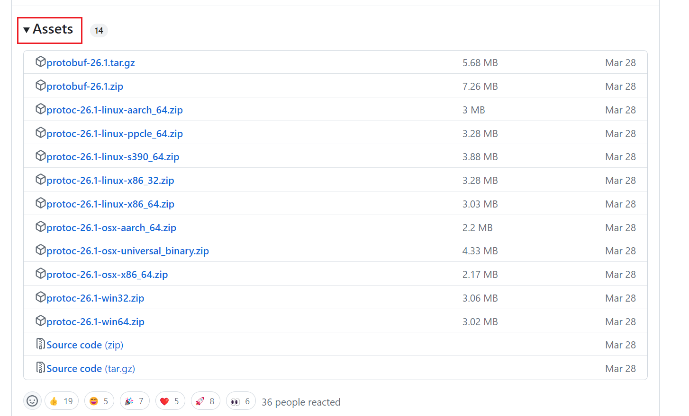
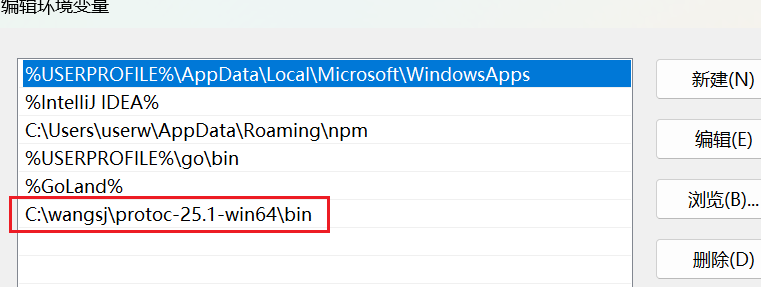
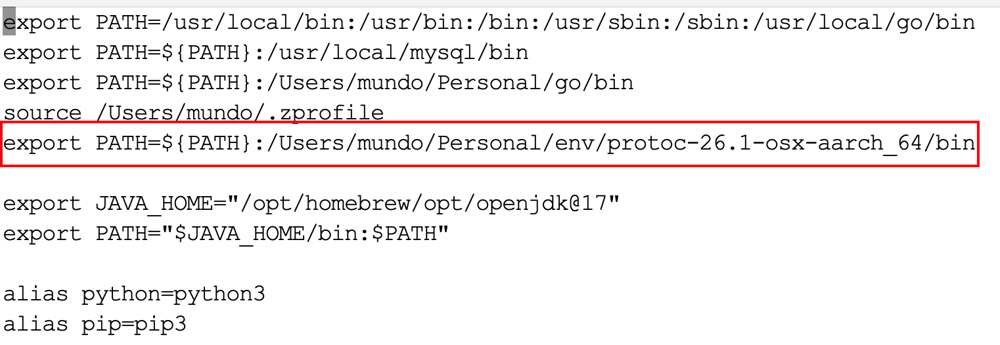
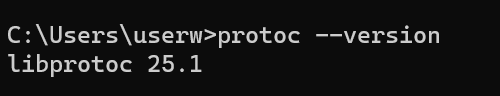
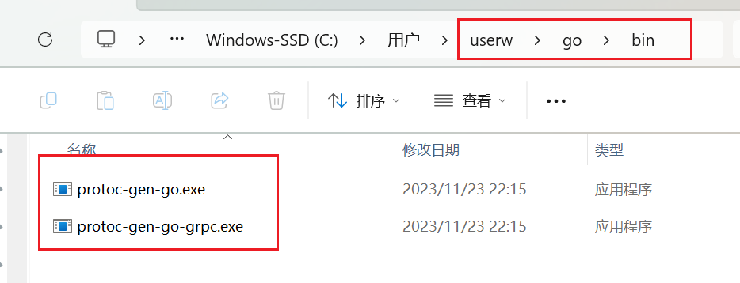
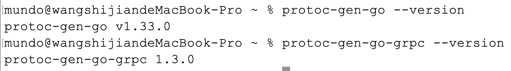
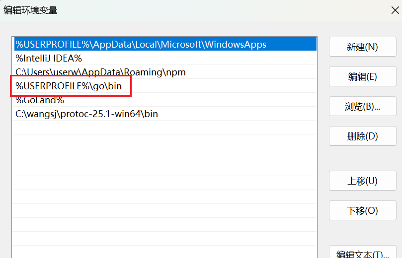

首先打开这个网站：https://github.com/protocolbuffers/protobuf/releases。

在`Assets`中可以查看适用于所有环境的`protobuf`版本，选择与本机系统架构对应的版本进行下载。例如，若使用的是`Mac`的`M`系列芯片，应下载`protoc-26.1-osx-aarch_64.zip`；若使用的是`Windows x86_64`版本，则应下载`protoc-26.1-win64.zip`：



下载并解压后，可将其放置在任意目录。接着需要配置环境变量，将解压后目录下的`bin`路径添加到系统的`Path`中。

在`Windows11`系统中，配置方式如下：



在`Mac`环境中，需要在`~/.zshrc`文件中添加下面这条配置信息：



> **注意：**不要图省事把`bin`目录下的`protoc.exe`文件放置到`$GOPATH/bin`目录下，因为在使用`protoc`命令时，可能会用到`protobuf`文件夹下面的`include\google\protobuf`里的文件，如果移动了`protoc.exe`，它将无法找到文件。

然后去终端查看版本，测试是否配置成功：

```sh
protoc --version
```



之后我们需要下载`protoc-gen-go`和`protoc-gen-go-grpc`两个可执行文件，使用如下命令：

```sh
go install google.golang.org/protobuf/cmd/protoc-gen-go@latest
go install google.golang.org/grpc/cmd/protoc-gen-go-grpc@latest
```

如果使用`Windows`环境，先使用`go env GOOS`命令，确认输出内容为`windows`，否则不会有`exe`文件生成。

执行后可以在`$GOPATH/bin`目录看到这两个可执行文件（`Mac`环境同理）：



执行后，查看它们的版本信息：

```sh
protoc-gen-go --version
protoc-gen-go-grpc --version
```



上述配置完成后即可直接使用，无需额外操作，因为`$GOPATH/bin`目录此前已添加至环境变量中：



