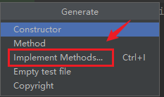
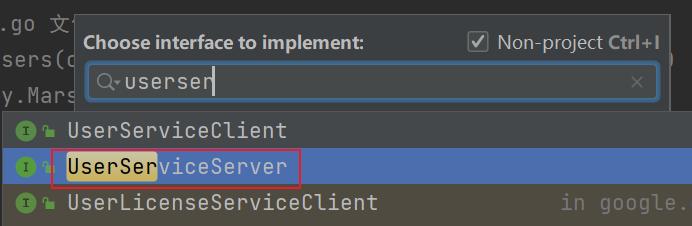
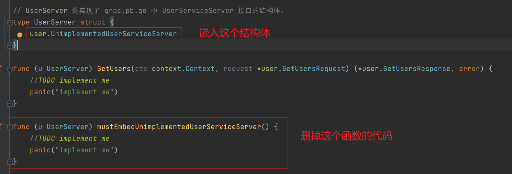

首先我们需要下载下面这个库：

```sh
go get google.golang.org/grpc
```

还是以上文提到的那个简单的`user.proto`为例，我们把它的`Server`代码写到与`proto`目录同级的`server`目录下：

```go
package main

import (
	"context"
	"beta/pb/user" // 对应具体的pb/user目录，替换之
	"github.com/mundo-wang/wtool/wlog"
	"google.golang.org/grpc"
    "google.golang.org/grpc/codes"
    "google.golang.org/grpc/status"
	"net"
	"os"
	"os/signal"
	"syscall"
)

// UserServer是实现了grpc.pb.go中UserServiceServer接口的结构体。
type UserServer struct {
	user.UnimplementedUserServiceServer
}

// GetUsers是user_grpc.pb.go文件中UserServiceServer接口定义方法的具体实现。
// 如果项目采用三层分层结构，也可以分为handler、service、dao三层。
func (u *UserServer) GetUsers(ctx context.Context, req *user.GetUsersRequest) (*user.GetUsersResponse, error) {
    if req.UserId == 0 {
		return nil, status.Error(codes.InvalidArgument, "用户ID不能为空")
	}
	response := &user.GetUsersResponse{
		User: &user.User{
			Id:       req.UserId,
			Username: req.Username,
			Email:    "mundo@example.com",
		},
	}
	return response, nil
}

func main() {
	listen, err := net.Listen("tcp", ":50051")
	if err != nil {
		wlog.Fatal("server call net.Listen error").Err(err).Log()
	}
	defer listen.Close()
	// 创建gRPC服务器
	server := grpc.NewServer()
	sig := make(chan os.Signal) // 也可以为有缓冲管道
	signal.Notify(sig, os.Interrupt, syscall.SIGTERM)
	go func() {
		<-sig
		wlog.Info("shutdown").Log()
		server.GracefulStop()
	}()
	// 注册UserServer结构体为gRPC服务的实现（第二个参数必须使用对象引用）
	user.RegisterUserServiceServer(server, &UserServer{})
	wlog.Infof("Server listening on %s", listen.Addr().String()).Log()
	// 启动gRPC服务器，程序在这里阻塞
	err = server.Serve(listen)
	if err != nil {
		wlog.Fatal("server call server.Serve error").Err(err).Log()
	}
}
```

这段代码中，有一些重点内容需要讲解一下：

在当前版本的`gRPC`中，`UserServer`必须嵌入`UnimplementedUserServiceServer`结构体，即使`UserServer`实现了`UserServiceServer`接口的所有方法，只有嵌入该结构体才能被视为实现了接口。`UnimplementedUserServiceServer`是`gRPC`编译器生成的一个空实现，它包含了`UserServiceServer`接口的所有方法，但这些方法默认返回错误，表示尚未具体实现。

这种做法确保了服务的向后兼容性。即使`gRPC`服务接口在未来版本中新增方法，当前的服务实现也不会受到影响，当前结构体可以选择不对这些新增的方法进行实现。

这里有个快捷的方式可以实现上面结构体的所有方法，首先，先不嵌入`UnimplementedUserServiceServer`（这一步很重要，不然我们找不到`UserInfoServiceServer`接口），然后光标放到结构体上面，按`alt+insert`（`Windows`），选择下面一项：



然后输入你想实现的接口，就可以选择并实现了。这里我们就实现`grpc.pb.go`的`UserServiceServer`接口。



按照下面步骤操作即可：



这样，我们就快捷地实现了接口的所有方法。

在接口的实现方法中，当出现错误时，如果希望客户端能够明确识别错误类型并据此作出相应处理，应该使用`status`进行包装。这种做法会将错误转换为符合`gRPC`协议定义的标准错误响应，客户端可通过`status.FromError(err)`解析错误，并根据其类型执行相应的逻辑处理或提示用户。

对于一些框架或底层发生的意外错误，例如网络异常、`IO`失败、数据库异常等，通常认为调用方难以处理，因此可以直接返回原始的`error`。但推荐的做法是：即便是这类底层错误，也尽量包装成`gRPC`标准错误，以提升客户端的可控性和可观测性。

对于`net.Listen`这个函数，根据源码中的注释，第一个参数必须是`tcp`、`tcp4`、`tcp6`、`unix`或`unixpacket`之一。对于`tcp`网络，如果地址参数主机`host`部分为空，例如上文中的`:50051`，就相当于`0.0.0.0:50051`，`0.0.0.0`代表所有可用的`IP`地址，`net.Listen`会监听本机的所有可用单播（`Unicast`）和任播（`Anycast`）的`IP`地址，也就包括所有`ipv4`和`ipv6`地址。如果只想监听`ipv4`地址，那么第一个参数应该设置为`tcp4`。

在微服务环境中，建议不填写地址参数的主机地址。因为微服务架构中，服务以容器化的形式运行，并且可能会动态分配`IP`地址，容器编排工具`K8s`会与注册中心（例如`Nacos`）管理服务的注册过程，把`serviceName`与`IP:Port`进行对应，注册到`Nacos`。即使服务所在的`IP`发生变化，也会自动更新注册信息，确保根据服务名可以从注册中心获取到当前服务具体地址信息。

这里使用`signal.Notify`接收`os.Interrupt`（`Ctrl+C`中断信号）和 `syscall.SIGTERM`（系统发送的终止信号），传递给通道`sig`，在`goroutine`中获取到这个信号后，启动`server.GracefulStop()`优雅关闭服务器。

在代码中，使用`user.RegisterUserServiceServer`函数将`gRPC`服务器、`gRPC`接口和接口实现结构体进行绑定。假如有另一个结构体`UserServerTemp`也实现了`UserServiceServer`接口，也和同一个`gRPC`服务器进行注册：

```go
user.RegisterUserServiceServer(server, &UserServer{})
user.RegisterUserServiceServer(server, &UserServerTemp{})
```

虽然编译不会报错，但在运行时会出现如下错误：

```sh
FATAL: [core] grpc: Server.RegisterService found duplicate service registration for "proto.UserService"
```

这是为了避免重复注册导致的服务实现冲突，确保每个`gRPC`接口在同一个`gRPC`服务器上只有一个唯一的实现。

在代码中，使用`server.Serve`方法将`gRPC`服务器绑定到具体的`IP:Port`上。如果需要注册多个接口的实现，可以创建多个`gRPC`服务器实例，分别将接口实现结构体绑定到不同的服务器实例上，并将这些服务器绑定到不同的`IP:Port`上。
