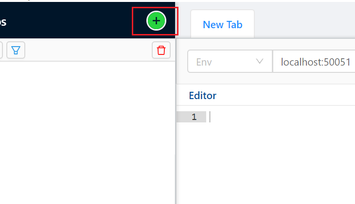
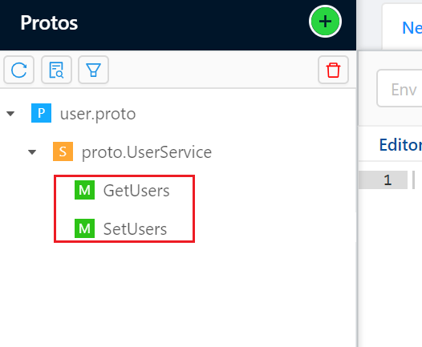
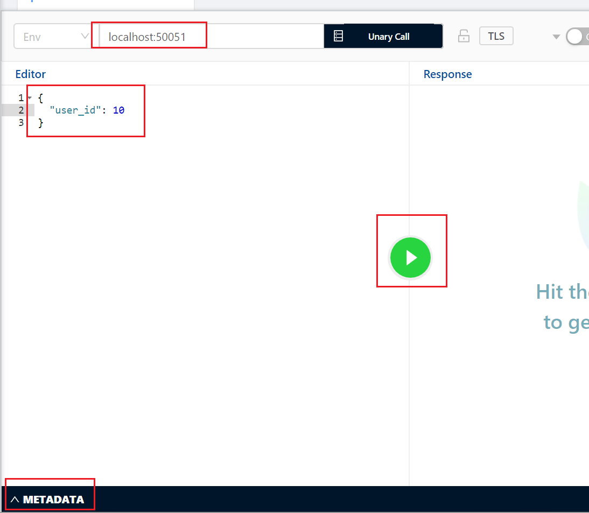
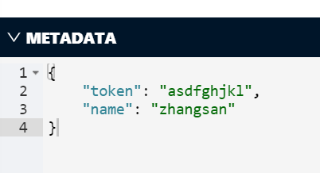
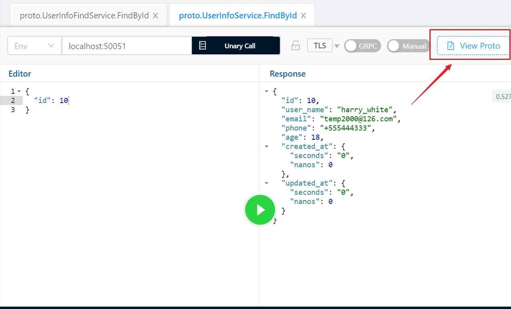
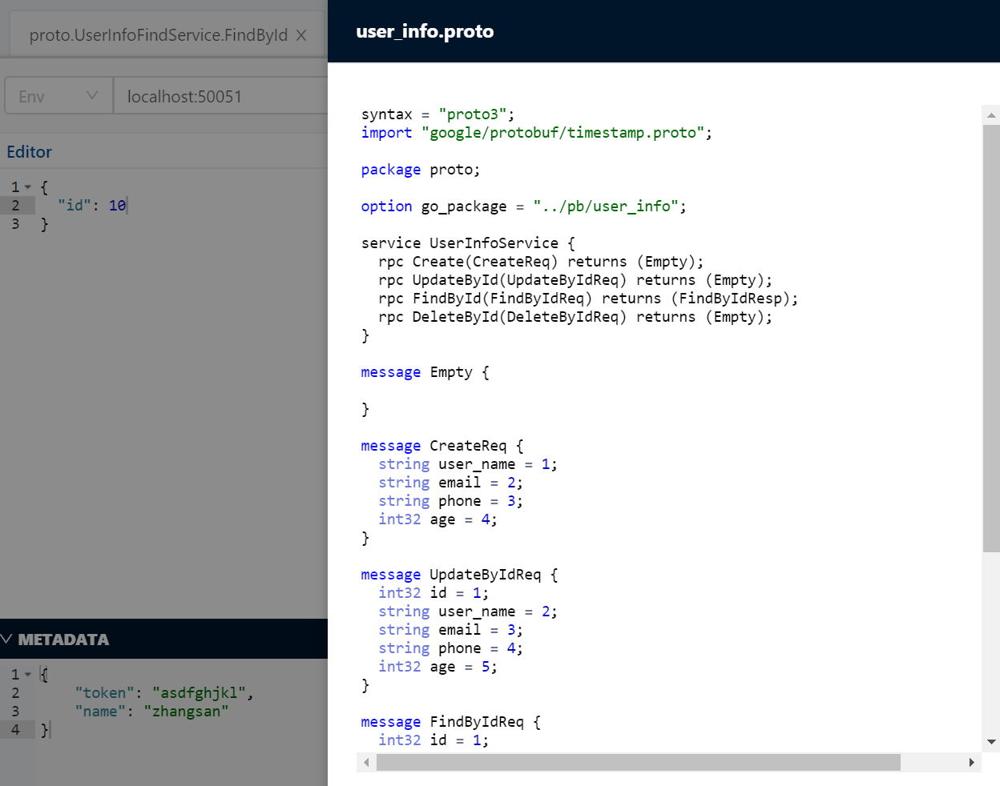

除了编写`Client`代码，我们也可以使用一个好用的`gRPC`接口调试工具：`BloomRPC`，完成`gRPC`接口调用。

首先点击这个加号，把`proto`文件引入进来：

引入`proto`文件后，可以看到这个文件定义的所有`Service`和方法：

我们点击其中一个方法：

这里我们指定`gRPC`服务的`IP:Port`，并定义好请求参数。如果需要传递`metadata`，确保`metadata`的格式为`JSON`字符串，例如：

然后按绿色的运行按钮，即可完成接口调用。

点击`View Proto`，还可以查看这个`proto`文件的原始代码：

直接可以展示`proto`文件的原始内容：

这个软件非常简单易用，界面没有`Postman`好看，但不限制功能，不像`Postman`一样需要付费解锁功能。