我们首先可以先创建一个` APIs`，然后把`proto`文件导入进来：

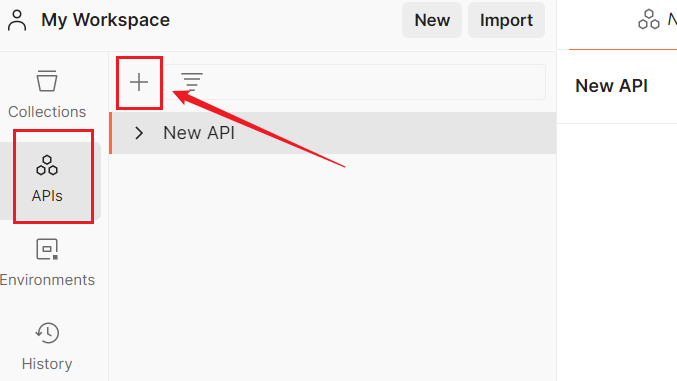

点击上方加号，即可创建`APIs`，`Postman`规定最多创建`3`个，我们也可以使用默认的这个`New API`。

点击这个地方可以给它改名：

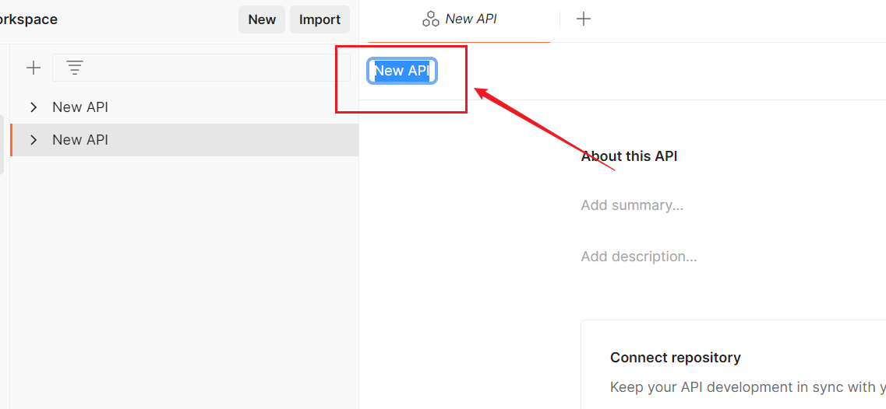

点击`import`：

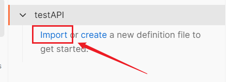

点击`files`或者`folders`，这里我点击`files`，引入一个`proto`文件：

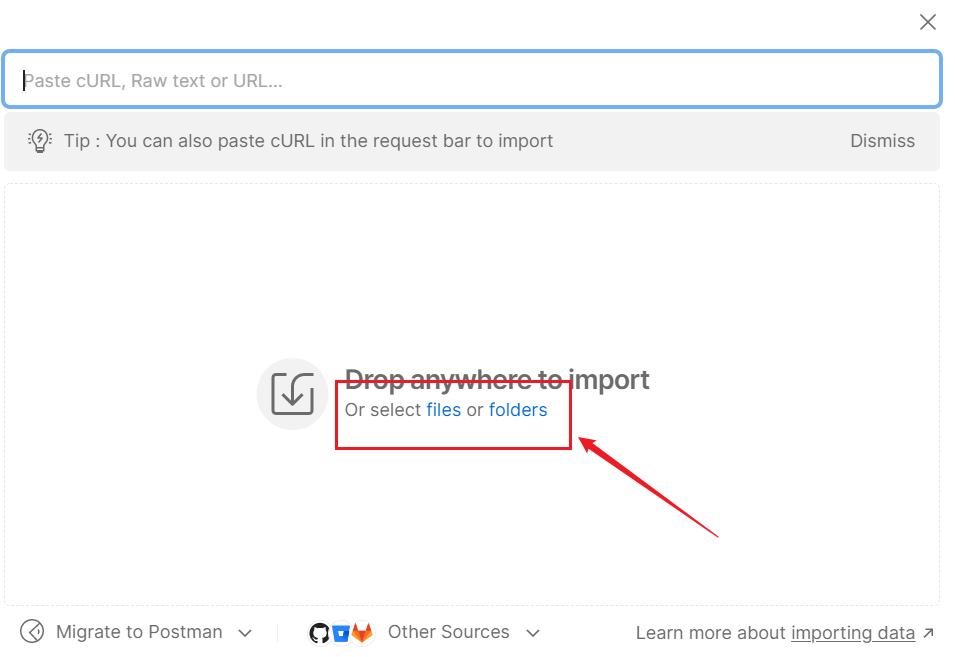

这里我们就把这个`proto`文件引入进来了，右边还能看到它的原始代码：

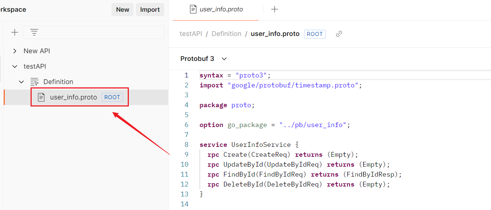

这里有个问题需要解决，就是我们发现这个`APIs`只能包含三个`API`，每个`API`只能导入一个`proto`文件，想要再新建就得自己复制`proto`文件代码进去了：

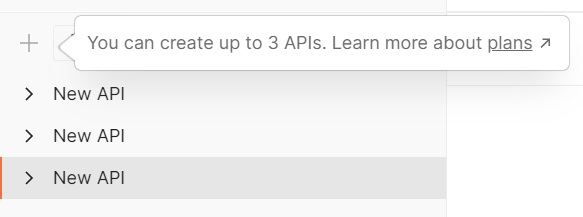

我们点击下划线`plans`，发现原来是需要花钱了，哈哈哈！

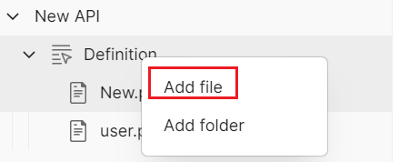

继续上面步骤，点击这个新建按钮，也可以使用快捷键`Ctrl + N`（`Windows`）：

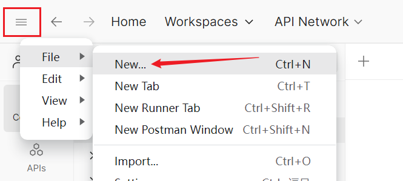

选择`gRPC`：

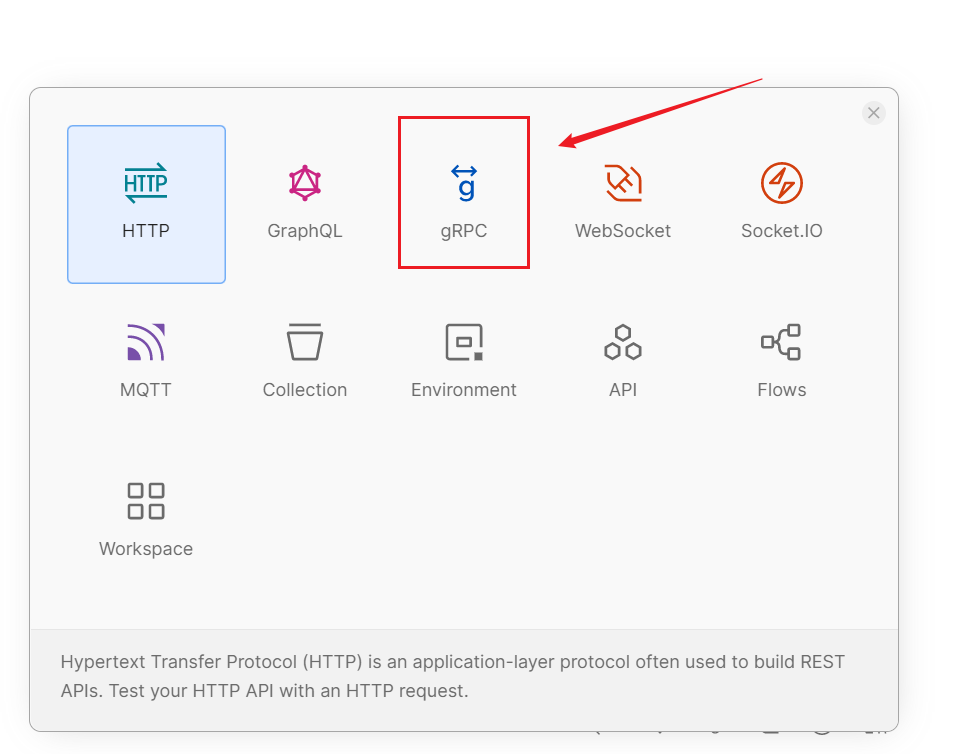

选中这个我们刚创建的`APIs`：

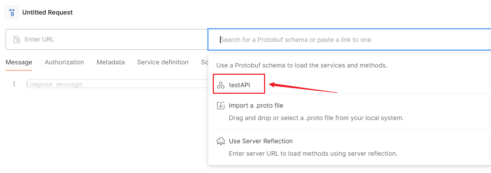

它的方法都展示出来了：

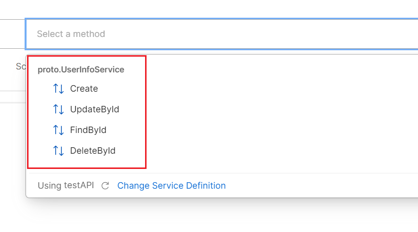

选中一个方法，输入访问地址信息，生成请求示例：

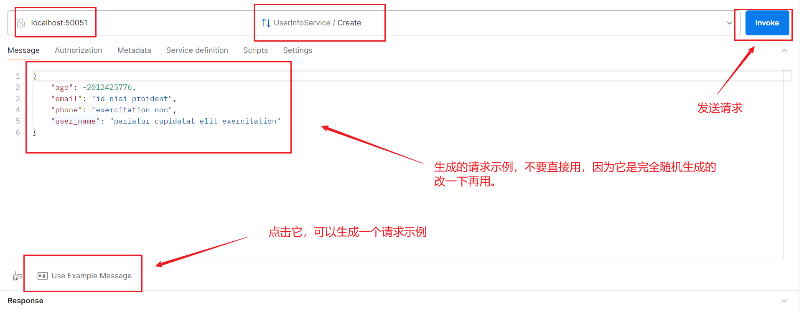

例如我们再访问个查询接口：

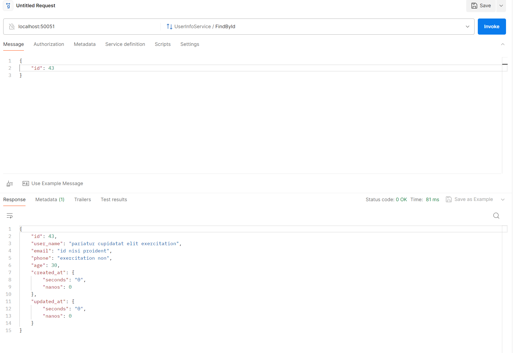

如果我们请求接口需要放置`metadata`，要在这里放置：

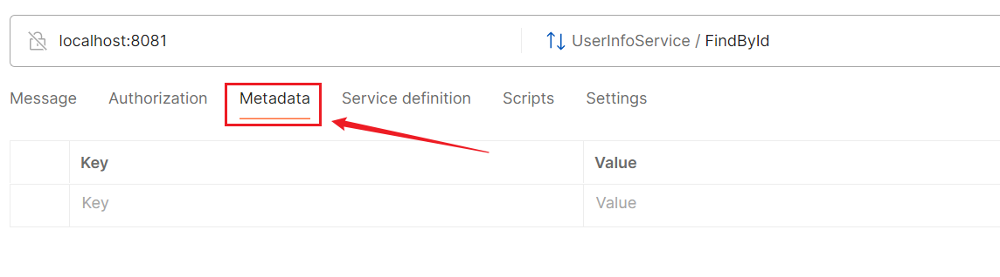

它不同于`BloomRPC`需要通过`JSON`格式传递，我们直接放置`Key`和`Value`即可，例如这样：

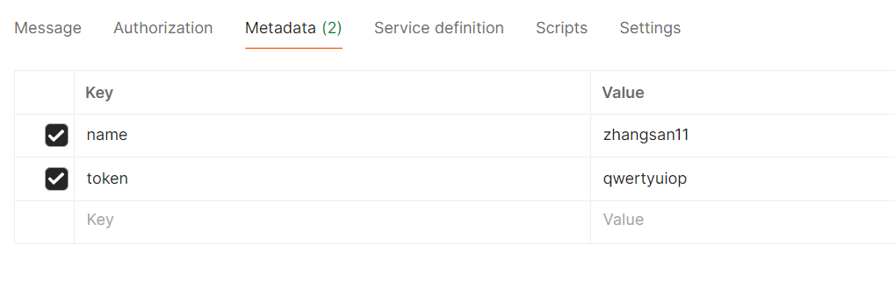

使用`Postman`调用`gRPC`接口，除了免费版会限制功能外，整体比`BloomRPC`好一些。