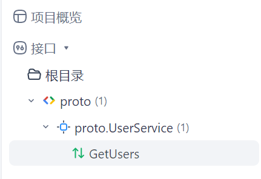
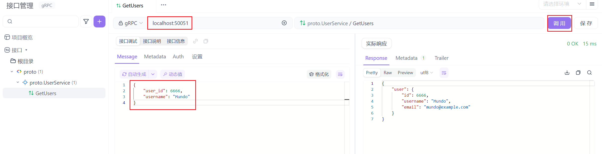

> `Apifox`帮助文档：https://docs.apifox.com/help

首先，我们需要在指定团队中新建一个`gRPC`项目，自定义项目名称：

它会让我们添加`.proto`文件，并可以添加其依赖关系目录：

依赖关系目录是指定搜索`import`的目录。可以多次指定；目录将按顺序搜索。如果没有给出，将使用根`proto`文件所属的目录。

添加`.proto`文件完成后，可以在侧边栏看到这个`proto`文件，它内部定义的`RPC`服务，以及每个服务中的`RPC`方法：

点击`proto`后，可以看到其名称来源于所导入的`.proto`文件中的`package`字段。此处不仅展示了该`.proto`文件的导入信息，还可以查看其具体代码内容：

点击指定的`service`，也可以看到它的具体信息：

点击具体的`RPC`方法，输入`IP`和端口信息，填充入参`JSON`，点击“调用”按钮：

这样就可以完成`gRPC`调用了。

如果想传递`Metadata`，直接以键值对的形式写在这里就可以：

为了更方便地管理`.proto`文件，我们可以新建子目录，并指定其父级目录：

例如我们可以把刚才导入的`.proto`文件放置到新建的子目录下方：

目前用起来没有发现有什么限制，整体来看比`BloomRPC`和`Postman`都要好。