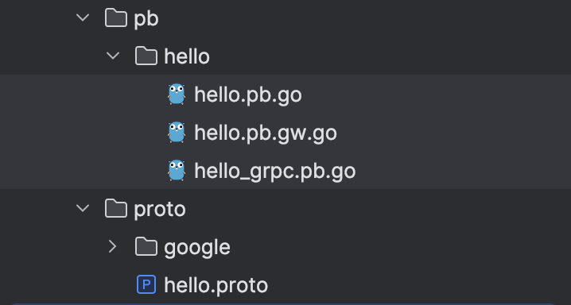

上一节中，我们介绍了如何下载`gRPC`网关插件，并讲解了相关`proto`文件的语法。编写完`proto`文件后，仍然需要使用`protoc`命令生成代码文件。不过，这里的`protoc`命令与之前略有不同。对于上一节的`proto`文件，在项目根目录下，执行以下命令：

```sh
protoc -I ./ --go_out=. --go-grpc_out=. --grpc-gateway_out=. proto/hello.proto
```

生成代码文件后，文件目录结构如下所示：



该命令中的`-I`参数是`--proto_path`的缩写，用于指定`Protocol Buffers`编译器查找`.proto`文件的搜索路径。在使用`protoc`命令生成代码文件时，通常在`proto`文件所在的目录下执行该命令。然而，如果`proto`文件引用了其他文件，例如：

```protobuf
import "proto/google/api/annotations.proto";
```

此时建议从项目根目录执行`protoc`命令，而不是在`proto`文件所在目录执行。这是因为引用的相对路径是从项目根目录解析的。如果在`proto`文件所在目录执行命令，`protoc`可能无法找到被引用的文件。因此，为了确保所有依赖文件都能被正确找到，最好在项目根目录下执行`protoc`命令。

生成代码文件后，需要使用`go mod tidy`来下载文件中标记为红色的`import`依赖。如果`go mod tidy`命令出现`ambiguous import: found package xxx in multiple modules`的错误，这通常是因为某些包在多个模块中存在，导致导入路径出现歧义。此时，我们可以首先尝试重启`GoLand`，然后使用`go get`命令来更新并引入那些依然显示红色的包，以解决这些依赖问题。

在上一节的`proto`文件中，我们定义了一个名为`Greeter`的`service`，并在这个`service`中定义了一个方法，名为`SayHello`。

我们可以注意到，生成的文件相比之前新增了一个后缀为`pb.gw.go`的文件。打开这个文件，可以看到其中包含六个函数，其中四个是对外暴露的。下面是对这四个函数的函数签名，以及对它们的讲解：

```go
func RegisterGreeterHandlerServer(ctx context.Context, mux *runtime.ServeMux, server GreeterServer) error
func RegisterGreeterHandlerFromEndpoint(ctx context.Context, mux *runtime.ServeMux, endpoint string, opts []grpc.DialOption) (err error)
func RegisterGreeterHandler(ctx context.Context, mux *runtime.ServeMux, conn *grpc.ClientConn) error
func RegisterGreeterHandlerClient(ctx context.Context, mux *runtime.ServeMux, client GreeterClient) error
```

- `RegisterGreeterHandlerServer`：将`GreeterServer`的`HTTP`处理程序注册到指定的`ServeMux`。具体步骤如下：
  1. 为`POST`请求和路径`/v1/mundo/hello`注册一个处理程序。
  2. 该处理程序将`HTTP`请求转换为`gRPC`请求。
  3. 调用本地`GreeterServer`实例的`SayHello`方法处理`gRPC`请求。
  4. 将`gRPC`响应转换回`HTTP`响应，并返回给客户端。
- `RegisterGreeterHandlerFromEndpoint`：从指定的`gRPC`服务端点（即提供`gRPC`服务的服务器的网络地址和端口，例如`localhost:50051`）注册`GreeterServer`的`HTTP`处理程序。具体步骤如下：
  1. 创建到指定`gRPC`服务端点的客户端连接`conn`。
  2. 调用`RegisterGreeterHandler`函数，传入创建的`gRPC`客户端连接，进行处理程序的注册。
- `RegisterGreeterHandler`：使用指定的`gRPC`客户端连接，注册`GreeterClient`的`HTTP`处理程序。具体步骤如下：
  1. 使用`NewGreeterClient`函数，通过指定的`gRPC`客户端连接创建一个`GreeterClient`实例。
  2. 调用`RegisterGreeterHandlerClient`函数，传入创建的`GreeterClient`实例，进行处理程序的注册。
- `RegisterGreeterHandlerClient`：将`GreeterClient`的`HTTP`处理程序注册到指定的`ServeMux`。具体步骤如下：
  1. 为`POST`请求和路径`/v1/mundo/hello`注册一个处理程序。
  2. 该处理程序将`HTTP`请求转换为`gRPC`请求。
  3. 调用`GreeterClient`实例的`SayHello`方法处理`gRPC`请求。
  4. 将`gRPC`响应转换回`HTTP`响应，并返回给客户端。

这些函数通过将`HTTP`请求与`gRPC`服务对接，使`gRPC`服务能够以`RESTful API`的形式对外提供服务。函数注释中提到，使用`RegisterGreeterHandlerServer`可能会导致部分`gRPC`库的功能失效，因此建议使用`RegisterGreeterHandlerFromEndpoint`替代，以确保功能的完整性。所哟我们实际需要使用的函数只有`RegisterGreeterHandlerFromEndpoint`。

这四个函数都需要传递一个参数`mux *runtime.ServeMux`。`ServeMux`是`grpc-gateway`库中的一个结构体，作为`HTTP`请求的多路复用器（`multiplexer`），它负责将`HTTP`请求的路径和方法映射到相应的`gRPC`处理程序，并将`gRPC`的响应转换回`HTTP`响应返回给客户端。关于`mux`参数的具体细节，将在下一章中进行更详细的讲解。