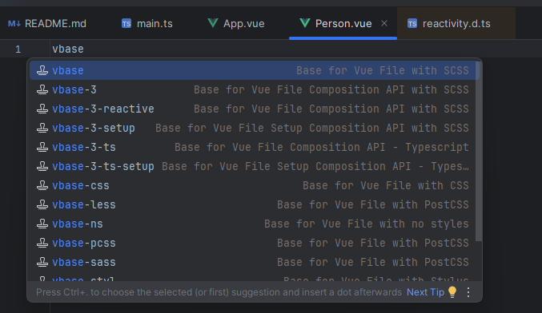
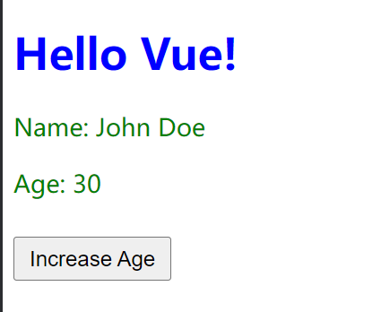

在前一节中，我们介绍了`src`目录下的两个关键文件：`main.ts`和`App.vue`。其中，`App.vue`是项目的根组件，被称为项目的“根”，既然有“根”，自然也会有“枝叶”。本节我们将讨论如何编写“枝叶”组件，以及如何将这些组件插入到根组件中。

在`src`目录下，有一个`components`文件夹，专门用于存放各个“枝叶”组件。接下来，我们在该目录下新建一个名为`Person.vue`的文件。创建后会发现该文件是空的，我们可以使用`vbase`快捷键快速生成文件的基本框架：



这里看到有很多个快捷键可供选择，我们这里可以先选用`vbase-3`，它生成的框架结构是这样的：

```vue
<template>
  <div>

  </div>
</template>

<script>
export default {
  setup() {
    

    return {}
  }
}
</script>

<style lang="scss" scoped>

</style>
```

该框架直接生成了`setup`函数，符合官方推荐的组合式`API`编程范式。在`style`标签中，使用的语言是`SCSS`，它是`CSS`的超集。这意味着`SCSS`不仅包含了`CSS`的所有功能，还在此基础上扩展了更多强大的特性。换句话说，任何合法的`CSS`代码在`SCSS`中同样有效。

但是，如果要使用`SASS`，需要额外安装`sass-embedded`与`sass`。我们在终端执行下面的命令进行安装：

```sh
npm install -D sass-embedded
npm install -D sass
```

在`Person.vue`组件中，我们展示`name`和`age`元素，并通过一个按钮来控制`age`的递增。每次点击按钮，年龄都会加一：

```vue
<template>
  <div class="person">
    <p>Name: {{ name }}</p>
    <p>Age: {{ age }}</p>
    <button @click="increaseAge">Increase Age</button>
  </div>
</template>

<script lang="ts">
import { ref } from 'vue';

export default {
  name: 'Person',
  setup() {
    let name = 'John Doe';
    const age = ref(30);

    const increaseAge = () => {
      age.value++;
    };

    return {
      name, age, increaseAge
    };
  }
}
</script>

<style lang="scss" scoped>
  .person {
    color: green;
    font-size: 18px;
  }
  
  button {
    margin-top: 10px;
    padding: 5px 10px;
    font-size: 16px;
    cursor: pointer;
  }
</style>
```

`export default`的作用是将一个对象、函数或变量作为模块的默认导出，以便其他文件可以通过`import`语句导入并使用。在上述代码示例中，它将当前模块中的`Vue`组件配置对象作为默认导出，其他文件可以直接引入该组件进行使用。

枝叶组件已完成，接下来需要将其插入到根组件`App.vue`中。在`template`部分，需要使用`<Person />`来引入`Person`组件：

```vue
<template>
  <div class="hello">
    <h1>{{ message }}</h1>
    <Person />  <!-- 引入Person组件到该div中 -->
  </div>
</template>
```

在`<script>`部分，首先要将`Person`组件从相应路径`import`进来，然后在`components`选项中注册`Person`组件：

```vue
<script lang="ts">
import Person from './components/Person.vue'; // 导入Person组件

export default {
  name: 'App',
  components: {
    Person  // 注册Person组件
  },
  setup() {
    let message = 'Hello Vue!';

    return {
      message
    };
  }
}
</script>
```

上述写法结合了组合式`API`和选项式`API`，因为它同时使用了`setup`函数和`components`选项。如果想使用纯组合式`API`，代码如下：

```vue
<template>
  <div class="hello">
    <h1>{{ message }}</h1>
    <component :is="Person" />  <!-- 使用动态组件渲染 -->
  </div>
</template>

<script lang="ts">
import { defineComponent } from 'vue';
import Person from './components/Person.vue'; // 导入Person组件

export default defineComponent({
  name: 'App',
  setup() {
    let message = 'Hello Vue!';

    return {
      message,
      Person  // 将Person组件在setup中返回
    };
  }
});
</script>

<style scoped>
  .hello {
    color: blue;
  }
</style>
```

`defineComponent`用于定义`App`组件，提供了一种组织和返回组件数据的方式，在`setup`函数中将`Person`组件返回，以便在模板中通过`:is`动态绑定来渲染`Person`组件。

使用`npm run dev`启动项目，页面成功展示如下图所示结果，按钮功能正常：


