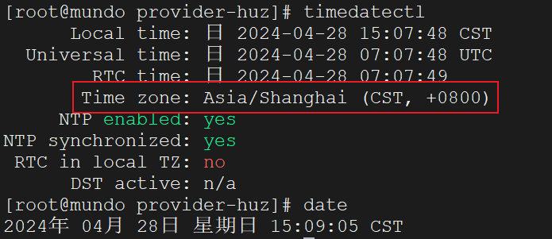
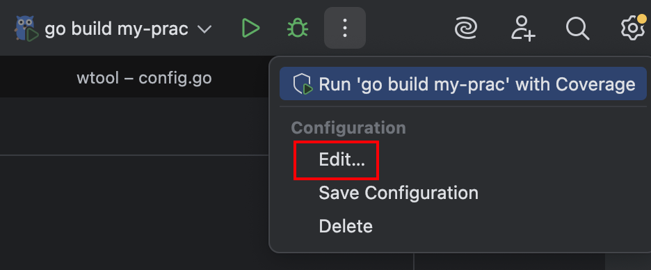
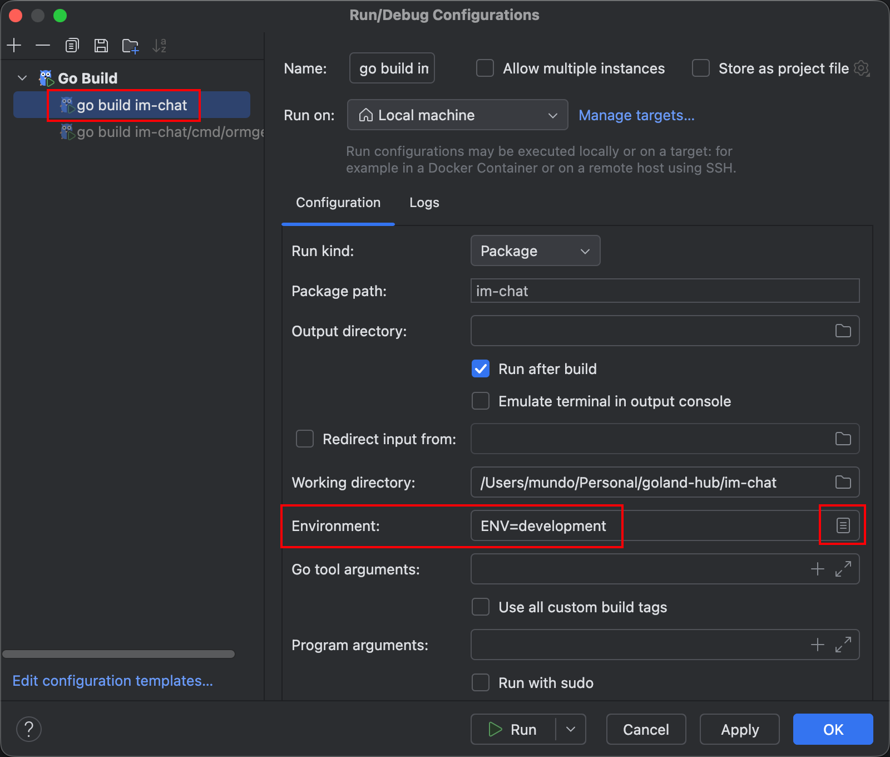
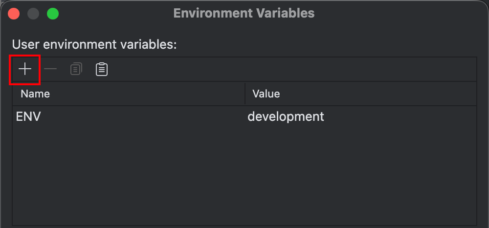
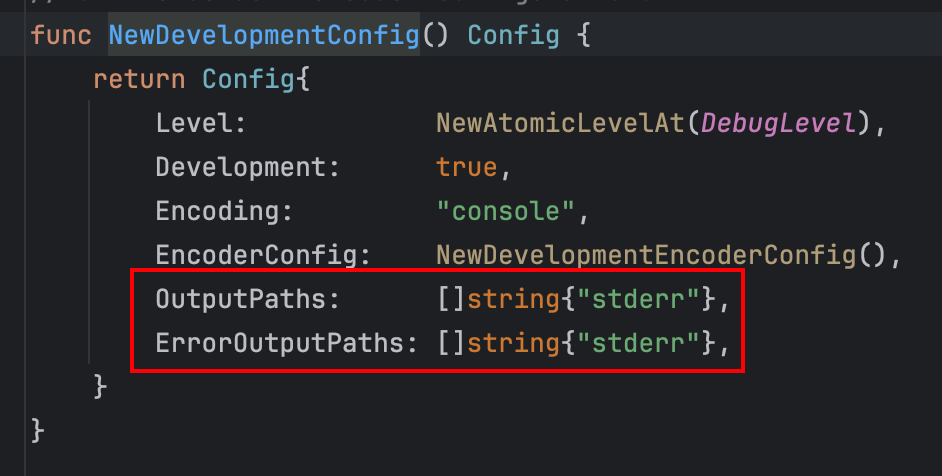
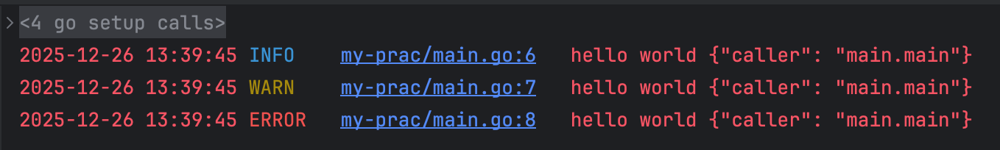
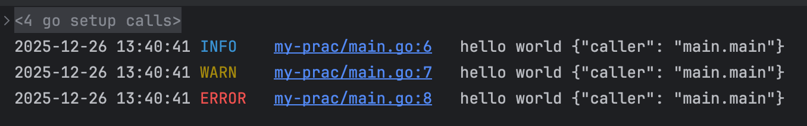
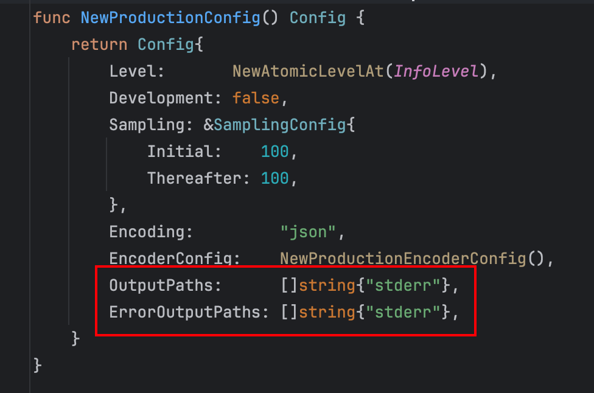

这是基于`zap`实现的一个支持链路追踪的结构化日志工具。首先我们下载`zap`包：

```sh
go get go.uber.org/zap
```

新建目录`wlog`，里面新建文件`config.go`、`entry.go`。最终目录结构如下：

```scss
wlog
├── config.go
└── entry.go
```

其中`config.go`代码如下：

```go
package wlog

import (
	"log"
	"os"
	"time"

	"go.uber.org/zap"
	"go.uber.org/zap/zapcore"
)

var (
	logger      *zap.Logger
	shanghaiLoc *time.Location
)

func init() {
	var err error
	shanghaiLoc, err = time.LoadLocation("Asia/Shanghai") // 使用CST时间
	if err != nil {
		shanghaiLoc = time.UTC // 如果加载时区出错，则使用UTC时间
		err = nil
	}
	zapConfig := loadZapConfig()
	logger, err = zapConfig.Build()
	if err != nil {
		log.Fatalf("failed to initialize logger, err: %v", err)
	}
}

func isDevEnv() bool {
	switch os.Getenv("ENV") {
	case "dev", "development", "local":
		return true
	default:
		return false
	}
}

func loadZapConfig() zap.Config {
	zapConfig := zap.Config{}
	// 仅当明确是开发环境时，才使用Development配置，其余环境（测试、预发、生产等）统一使用结构化日志
	if isDevEnv() {
		zapConfig = zap.NewDevelopmentConfig()
		zapConfig.EncoderConfig.EncodeLevel = zapcore.CapitalColorLevelEncoder
		zapConfig.OutputPaths = []string{"stdout"}
	} else {
		zapConfig = zap.NewProductionConfig()
		zapConfig.EncoderConfig.TimeKey = "time"
		zapConfig.EncoderConfig.MessageKey = "message"
		zapConfig.EncoderConfig.CallerKey = "line"
		zapConfig.EncoderConfig.EncodeLevel = zapcore.CapitalLevelEncoder
	}
	zapConfig.EncoderConfig.EncodeTime = customTimeEncoder
	zapConfig.EncoderConfig.EncodeCaller = zapcore.ShortCallerEncoder
	zapConfig.DisableStacktrace = true
	return zapConfig
}

func customTimeEncoder(t time.Time, enc zapcore.PrimitiveArrayEncoder) {
	t = t.In(shanghaiLoc)
	enc.AppendString(t.Format(time.DateTime))
}
```

`entry.go`代码如下：

```go
package wlog

import (
	"context"
	"fmt"
	"path"
	"runtime"

	"go.uber.org/zap"
	"go.uber.org/zap/zapcore"
)

const defaultCallerSkip = 2

type traceIdKeyType struct{}

var traceIdKey = traceIdKeyType{}

func WithTraceId(ctx context.Context, traceID string) context.Context {
	return context.WithValue(ctx, traceIdKey, traceID)
}

// 如果没有使用WithTraceId设置traceId，这里会返回空字符串
func GetTraceId(ctx context.Context) string {
	v, _ := ctx.Value(traceIdKey).(string)
	return v
}

type LoggerEntry interface {
	Ctx(ctx context.Context) LoggerEntry
	Field(key string, value interface{}) LoggerEntry
	Err(err error) LoggerEntry
	Skip(skip int) LoggerEntry

	LevelDebug()
	LevelInfo()
	LevelWarn()
	LevelError()
	LevelFatal()
	LevelPanic()
}

type loggerEntry struct {
	logger     *zap.Logger
	message    string
	callerSkip int
}

func Msg(message string) LoggerEntry {
	return &loggerEntry{
		logger:  logger,
		message: message,
		// 默认跳过2层调用者，write占1层，日志等级方法（如Error()）占1层
		callerSkip: defaultCallerSkip,
	}
}

func Msgf(format string, args ...interface{}) LoggerEntry {
	return Msg(fmt.Sprintf(format, args...))
}

func (l *loggerEntry) Ctx(ctx context.Context) LoggerEntry {
	if ctx != nil {
		traceId, ok := ctx.Value(traceIdKey).(string)
		if ok && traceId != "" {
			l.logger = l.logger.With(zap.String("trace_id", traceId))
		}
	}
	return l
}

func (l *loggerEntry) Field(key string, value interface{}) LoggerEntry {
	// zap.Logger的With方法不会修改原来的对象，而是返回一个新的*zap.Logger实例
    // 这保证全局变量logger可以被多个Goroutine并发使用
	l.logger = l.logger.With(zap.Any(key, value))
	return l
}

func (l *loggerEntry) Err(err error) LoggerEntry {
	l.logger = l.logger.With(zap.Error(err))
	return l
}

// 表示在用户调用位置的基础上，额外向上跳过的调用栈层数，用于控制日志中显示的调用位置
// 实际生效的callerSkip值为：skip + defaultCallerSkip，其中defaultCallerSkip用于屏蔽日志框架自身的调用层级
// 调用链示例：A -> B -> C -> 日志方法
// 不调用Skip，日志显示函数C打印日志的位置
// 设置Skip(1)，日志显示函数B调用函数C的位置
// 设置Skip(2)，日志显示函数A调用函数B的位置
func (l *loggerEntry) Skip(skip int) LoggerEntry {
	l.callerSkip = skip + defaultCallerSkip
	return l
}

// 获取调用日志的函数或方法全名的最后一部分，一般来说是最后一个斜杠后的部分
// 对于函数，其全名为module/paths/pkg.FuncName(其中paths是从模块根目录到包的相对路径)，处理后返回的是pkg.FuncName
// 对于方法，其全名同理于函数，处理后返回的是pkg.(*Type).MethodName或者pkg.Type.MethodName
func callerName(callerSkip int) string {
	pc, _, _, ok := runtime.Caller(callerSkip + 1) // 这里需要+1，是因为要先跳转到调用callerName的write方法
	if ok {
		fullName := runtime.FuncForPC(pc).Name()
		baseName := path.Base(fullName)
		return baseName
	} else {
		return "unknown"
	}
}

func (l *loggerEntry) write(level zapcore.Level) {
	ce := l.logger.
		With(zap.String("caller", callerName(l.callerSkip))).
		WithOptions(zap.AddCallerSkip(l.callerSkip)).
		Check(level, l.message)
	if ce != nil {
		ce.Write()
	}
}

func (l *loggerEntry) LevelDebug() {
	l.write(zapcore.DebugLevel)
}

func (l *loggerEntry) LevelInfo() {
	l.write(zapcore.InfoLevel)
}

func (l *loggerEntry) LevelWarn() {
	l.write(zapcore.WarnLevel)
}

func (l *loggerEntry) LevelError() {
	l.write(zapcore.ErrorLevel)
}

func (l *loggerEntry) LevelFatal() {
	l.write(zapcore.FatalLevel)
}

func (l *loggerEntry) LevelPanic() {
	l.write(zapcore.PanicLevel)
}
```

在本地运行项目时，时间显示正常，但在服务器上时间显示比本地早`8`小时，这是因为`zap`默认使用`time.Time`自身携带的时区信息进行时间编码，而在很多`Linux`服务器环境中，系统默认时区为`UTC`。

为解决这一问题，我们先在`Linux`服务器上使用`date`或者`timedatectl`命令，查看当前所用时区：



如果不是`Asia/Shanghai`或者`CST`，我们在`Linux`终端，使用下面命令更改时区：

```sh
sudo timedatectl set-timezone Asia/Shanghai
```

`config.go`中的`customTimeEncoder`函数强制`zap`库使用`Asia/Shanghai`来处理时间，并将时间格式化为指定格式。在配置`zap`日志系统时，将自定义的时间编码器应用到`zap.Config`的`EncoderConfig.EncodeTime`中，以确保日志输出的时间格式正确。

在代码中，我们设置在开发环境时，使用`Development`配置，这需要在本地`IDE`中进行相应配置。首先我们打开`Edit`：



在弹出的页面中，选择对应的项目，在`Environment`中输入`ENV=development`这个环境变量：



若有多个环境变量，中间使用`;`间隔，也可以点击右边对应的图标，在下面的页面进行添加：



如果是通过终端命令启动，可以按如下方式添加对应的环境变量：

```sh
ENV=development go run main.go
```

在使用`Development`配置时，`Debug`级别日志会被正常输出；而在使用`Production`配置时，`Debug`级别日志默认不会输出。

在`config.go`代码中，我们给`Development`环境设置了`OutputPaths`属性。该属性的默认值为标准错误`stderr`：



我们设置为标准输出`stdout`。如果不做此设置，日志信息在`IDE`的控制台上都按标准错误打印，展示的颜色为红色。

更改标准输出前，日志是这样的：



更改标准输出后，打印任何级别的日志，日志的颜色都是正常的白色了：



无论是`Go`标准库中的`log`、`slog`，还是第三方库如`zap`，在生产环境中，日志都会输出到`stderr`：



这是因为在`Unix/Linux`系统的约定中，`stdout`用于承载程序的正常输出结果，而`stderr`则用于输出错误信息和诊断信息。日志本质上属于程序的诊断数据，主要用于调试、监控以及问题排查，而不应被视为业务层面的正常输出。将日志输出到`stderr`符合系统设计规范和长期实践经验，其核心目的在于将正常输出与诊断信息进行有效分离，从而更便于重定向处理、日志收集以及监控分析。

需要纠正的一点是，在`zap`中，需要明确区分两件事：

1. 日志级别：`Debug`、`Info`、`Warn`、`Error`、`Fatal`、`Panic`。
2. 输出通道：`OutputPaths`、`ErrorOutputPaths`。

`OutputPaths`和`ErrorOutputPaths`分别用于控制日志的正常输出和内部错误输出去向。任意级别的业务日志都会按照`OutputPaths`指定的输出位置进行写入，而`ErrorOutputPaths`仅用于输出`zap`在运行过程中产生的内部错误信息。

如果我们希望在`Production`环境中，由代码直接指定日志的具体输出位置，而不是在运行编译后的可执行文件时通过重定向`stderr`来实现，也可以显式为`OutputPaths`与`ErrorOutputPaths`赋值，如下所示：

```go
zapConfig.OutputPaths = []string{"/var/log/app/app.log"}
zapConfig.ErrorOutputPaths = []string{"/var/log/app/error.log"}
```

通常，这里的日志文件路径应当通过从配置文件中读取来实现。这里的文件模式默认是追加而不是覆盖。也就是说，每次`logger`初始化时，如果指定的文件已经存在，新的日志内容会被追加到原有内容之后，而不会清空或覆盖原有日志。

我们在`entry.go`的代码中编写了一个名为`callerName`的函数，用于获取调用日志的函数或方法的名称。对于函数，其返回格式为`pkgName.FuncName`，对于方法，其返回格式为`pkgName.(*Type).MethodName`或`pkgName.Type.MethodName`。

首先，通过`fullName`获取完整的函数或方法名称，`fullName`包括`GoModules`名和路径名。然后，使用`path.Base`提取名称中的最后一个斜杠后的内容。如果需要获取完整的模块路径信息，可以直接返回`fullName`。

该工具的日志调用链的结构如下所示：

```go
wlog.Msg("Failed to xxx").Err(err).Field("xxx", "xxx").LevelError()
```

在这里，我们将日志级别方法放在调用链的最后,这样在视觉和使用习惯上可以更直观地引导开发人员完整编写调用链，从而降低被忽略的风险，避免因遗漏而导致日志未打印的问题。

该日志打印在控制台的结果如下所示：

```json
2026-01-09 23:22:14	ERROR	my-prac/main.go:21	Failed to xxx	{"error": "this is an error", "xxx": "xxx", "caller": "main.main"}
```

在`GoLand`点一下`my-prac/main.go:21`，即可直接跳转到代码中打印这条日志的地方，也可以复制这个代码位置信息全文查找。

如果是测试或生产环境，打印的日志如下所示，这是一份标准的`JSON`格式数据：

```json
{"level":"ERROR","time":"2026-01-09 23:22:14","line":"my-prac/main.go:21","message":"Failed to xxx","error":"this is an error","xxx":"xxx","caller":"main.main"}
```

在`entry.go`中，我们引入了链路追踪`Id`，用于在接口调用失败时，通过`traceId`快速定位相关日志。

工程上的做法是，后端接口应为每个请求生成一个唯一的`traceId`，无论请求成功还是失败，都将该`traceId`返回给客户端，例如设置响应头`X-Trace-Id: xxx`，或者在响应体中返回：

```json
{
  "code": 50001,
  "message": "内部错误",
  "trace_id": "xxx"
}
```

这样，当调用端发现接口报错时，可以通过`traceId`将问题反馈给接口开发人员，开发人员则可借助该`traceId`快速定位到对应日志，从而高效地分析和解决问题。

在业务接口中，可以通过调用`WithTraceId`将`traceId`写入`ctx`对象，这一步通常应在`Gin`中间件中完成：

```go
func TraceMiddleware(c *gin.Context) {
	ctx := c.Request.Context()
    node, _ := snowflake.NewNode(1)
	traceId := node.Generate() // 生成雪花算法ID
	ctx = wlog.WithTraceId(ctx, traceId)
	c.Request = c.Request.WithContext(ctx) // 把写入了traceId的新ctx写回c.Request中
    c.Next()
}
```

加入`ctx`对象后，日志的调用链就变成下面这样：

```go
wlog.Msg("Failed to xxx").Ctx(ctx).Err(err).Field("xxx", "xxx").LevelError()
```

这样，打印的结构化日志内容如下所示：

```json
{"level":"ERROR","time":"2026-01-09 23:22:14","line":"my-prac/main.go:21","message":"Failed to xxx","trace_id":"7415407145912410112","error":"this is an error","xxx":"xxx","caller":"main.main"}
```

后续在`Gin`接口返回时，可以调用`GetTraceId`函数获取之前写入的`traceId`值，从而方便将其返回给调用端。

在日志字段处理方面，我也对`Field`方法的实现进行了分析。该方法内部是通过`zap.Any`添加字段的，因此我进一步查看了`zap.Any`的实现，发现其内部主要通过类型判断和类型转换完成字段编码，整体处理复杂度为`O(1)`。

同时，我也进行了实际测试，对比了使用`zap.Any`与使用具体类型方法（例如`zap.String`）在大量日志场景下的耗时表现，结果显示二者性能差异非常小。因此，在当前场景下，继续替换为具体类型方法并不能带来明显收益，最终保留`zap.Any`的实现方式。

在这里简要说明，为什么在生产环境中需要打印结构化的`JSON`格式日志。虽然从人类直接阅读的角度来看，结构化日志不如扁平日志直观，但结构化的`JSON`格式日志更适合被日志管理平台采集、整理和分析，能够显著提升检索、聚合以及问题定位的效率。

生产环境通常采用多实例、多服务并行运行的架构，每秒可能产生成百上千条日志。如果仍然依赖人工逐行阅读，不仅成本极高，而且几乎不可行。因此，生产环境中的日志通常会被统一采集到日志管理平台，例如基于`ELK`或类似方案的系统。这类平台更擅长处理结构化数据，而不是依赖字符串正则解析去猜测日志的含义。

当日志以`JSON`格式输出后，每个字段都具备明确语义，例如`level`、`time`、`error`、`trace_id`等，日志平台可以直接基于字段进行过滤、聚合、排序和统计，无需复杂且不可靠的正则解析。基于结构化日志，可以轻松实现「按`trace_id`查询完整调用链日志」、「统计某个接口的错误率」、「分析某类错误在指定时间段内的分布」等能力。

此外，结构化日志还可以直接作为监控和告警的数据来源。例如，当`level`为`ERROR`的日志在短时间内显著增多时，系统可以自动触发告警，而无需人工持续关注日志变化。

如果项目不依赖日志组件，而是直接将日志写入文件，并通过`tail`命令进行查看，那么在生产环境中就没有必要输出结构化日志，而是采用更加适合阅读的普通文本格式。因此，可以将`loadZapConfig`方法调整为如下形式：

```go
func loadZapConfig() zap.Config {
	zapConfig := zap.NewDevelopmentConfig()
	zapConfig.EncoderConfig.EncodeTime = customTimeEncoder
	zapConfig.EncoderConfig.EncodeCaller = zapcore.ShortCallerEncoder
	zapConfig.DisableStacktrace = true
	if isDevEnv() {
		zapConfig.EncoderConfig.EncodeLevel = zapcore.CapitalColorLevelEncoder
		zapConfig.OutputPaths = []string{"stdout"}
	} else {
        zapConfig.EncoderConfig.EncodeLevel = zapcore.CapitalLevelEncoder
		zapConfig.Level = zap.NewAtomicLevelAt(zapcore.InfoLevel)
	}
	return zapConfig
}
```

这里仍然需要判断是否为开发环境，目的是为不同环境配置不同行为，例如是否启用日志级别颜色、最小打印级别等。

`zapcore.CapitalLevelEncoder`与`zapcore.CapitalColorLevelEncoder`的核心区别在于是否输出颜色控制字符。前者仅输出大写形式的日志级别名称，不包含任何颜色信息，适合写入纯文本日志文件，或供日志采集系统解析。后者则会在日志级别前后插入`ANSI`颜色控制字符，例如`\x1b[31m`，使其在终端中以不同颜色展示大写级别名称，更适合用于支持`ANSI`颜色的交互式终端环境。
