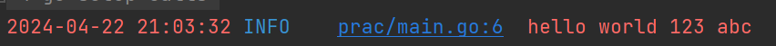
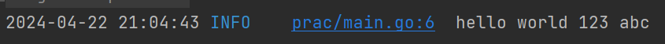

这是在`zap`日志库基础上，写的一个关于日志输出的小工具。首先我们下载`zap`包：

```sh
go get go.uber.org/zap
```

新建目录`wlog`，里面新建文件`config.go`、`entry.go`、`level.go`，其中`config.go`内容如下：

```go
package wlog

import (
	"go.uber.org/zap"
	"go.uber.org/zap/zapcore"
	"log"
	"os"
	"time"
)

var logger *zap.Logger

func init() {
	config := loadConfig()
	var err error
	logger, err = config.Build()
	if err != nil {
		log.Fatalf("failed to initialize logger, err: %v", err)
	}
}

func loadConfig() zap.Config {
	config := zap.Config{}
	// 根据具体的环境变量进行调整
	if os.Getenv("env") == "production" {
		config = zap.NewProductionConfig()
		config.EncoderConfig.TimeKey = "time"
		config.EncoderConfig.MessageKey = "message"
		config.EncoderConfig.CallerKey = "line"
		config.EncoderConfig.EncodeLevel = zapcore.CapitalLevelEncoder
	} else {
		config = zap.NewDevelopmentConfig()
		config.EncoderConfig.EncodeLevel = zapcore.CapitalColorLevelEncoder
	}
	config.OutputPaths = []string{"stdout"}
	config.ErrorOutputPaths = []string{"stderr"}
	config.EncoderConfig.EncodeTime = customTimeEncoder
	config.EncoderConfig.EncodeCaller = zapcore.ShortCallerEncoder
	config.DisableStacktrace = true
	return config
}

func customTimeEncoder(t time.Time, enc zapcore.PrimitiveArrayEncoder) {
	loc, err := time.LoadLocation("Asia/Shanghai") // 使用CST时间
	if err != nil {
		loc = time.UTC // 如果加载时区出错，则使用UTC时间
	}
	t = t.In(loc)
	enc.AppendString(t.Format("2006-01-02 15:04:05"))
}
```

在本地运行项目时，时间显示正常，但在服务器上时间显示比本地早`8`小时，这是因为日志库`zap`默认使用`UTC`来处理时间。为解决这一问题，我们先在`Linux`服务器上使用`date`或者`timedatectl`命令，查看当前所用时区：


如果不是`Asia/Shanghai`或者`CST`，我们在`Linux`终端，使用下面命令更改时区：

```sh
sudo timedatectl set-timezone Asia/Shanghai
```

接着我们编写`customTimeEncoder`函数，强制`zap`库使用`Asia/Shanghai`来处理时间，并将时间格式化为指定格式。在配置`zap`日志系统时，将自定义的时间编码器应用到`zap.Config{}`的`EncoderConfig.EncodeTime`中，以确保日志输出的时间格式正确。

这里还设置了`OutputPaths`和`ErrorOutputPaths`两个属性，即标准输出和标准错误。如果不设置标准输出，无论什么级别的日志，在控制台上都按标准错误去打印，导致日志的颜色为红色。更改标准输出前，日志是这样的：



更改标准输出后，打印任何级别的日志，日志的颜色都是正常的白色了：



`entry.go`的代码如下所示：

```go
package wlog

import (
	"go.uber.org/zap"
	"go.uber.org/zap/zapcore"
	"path"
	"runtime"
)

type LoggerEntry interface {
	Field(key string, value interface{}) LoggerEntry
	Err(err error) LoggerEntry
	Skip(skip int) LoggerEntry
	Log()
}

type loggerEntry struct {
	level   zapcore.Level
	logger  *zap.Logger
	message string
	skip    int
}

func NewLoggerEntry(level zapcore.Level, message string) LoggerEntry {
	return &loggerEntry{
		level:   level,
		logger:  logger,
		message: message,
		skip:    1, // 默认跳过1层调用者
	}
}

// 获取调用日志的函数或方法全名的最后一部分，一般来说是最后一个斜杠后的部分
// 对于函数，其全名为module/paths/pkg.FuncName(其中paths是从模块根目录到包的相对路径)，处理后返回的是pkg.FuncName
// 对于方法，其全名同理于函数，处理后返回的是pkg.(*Type).MethodName或者pkg.Type.MethodName
func CallerName(skip int) string {
	pc, _, _, ok := runtime.Caller(skip + 1) // 这里需要+1，是因为要先跳转到调用CallerName的Log方法
	if ok {
		fullName := runtime.FuncForPC(pc).Name()
		baseName := path.Base(fullName)
		return baseName
	} else {
		return "unknown"
	}
}

func (l *loggerEntry) Field(key string, value interface{}) LoggerEntry {
	l.logger = l.logger.With(zap.Any(key, value))
	return l
}

func (l *loggerEntry) Err(err error) LoggerEntry {
	l.logger = l.logger.With(zap.Error(err))
	return l
}

func (l *loggerEntry) Skip(skip int) LoggerEntry {
	l.skip = skip
	return l
}

func (l *loggerEntry) Log() {
	l.logger.With(zap.String("caller", CallerName(l.skip))).
		WithOptions(zap.AddCallerSkip(l.skip)).Check(l.level, l.message).Write()
}
```

我们编写了一个名为`CallerName`的函数，用于获取调用日志的函数或方法的名称。对于函数，其返回格式为`pkgName.FuncName`，对于方法，其返回格式为`pkgName.(*Type).MethodName`或`pkgName.Type.MethodName`。

首先，通过`fullName`获取完整的函数或方法名称，`fullName`包括`GoModules`名和路径名。然后，使用`path.Base`提取名称中的最后一个斜杠后的内容。如果需要获取完整的模块路径信息，可以直接返回`fullName`。

`level.go`文件的代码如下所示：

```go
package wlog

import (
	"fmt"
	"go.uber.org/zap/zapcore"
)

func Debug(message string) LoggerEntry {
	return NewLoggerEntry(zapcore.DebugLevel, message)
}

func Info(message string) LoggerEntry {
	return NewLoggerEntry(zapcore.InfoLevel, message)
}

func Warn(message string) LoggerEntry {
	return NewLoggerEntry(zapcore.WarnLevel, message)
}

func Error(message string) LoggerEntry {
	return NewLoggerEntry(zapcore.ErrorLevel, message)
}

func Fatal(message string) LoggerEntry {
	return NewLoggerEntry(zapcore.FatalLevel, message)
}

func Panic(message string) LoggerEntry {
	return NewLoggerEntry(zapcore.PanicLevel, message)
}

func Debugf(format string, args ...interface{}) LoggerEntry {
	message := fmt.Sprintf(format, args...)
	return NewLoggerEntry(zapcore.DebugLevel, message)
}

func Infof(format string, args ...interface{}) LoggerEntry {
	message := fmt.Sprintf(format, args...)
	return NewLoggerEntry(zapcore.InfoLevel, message)
}

func Warnf(format string, args ...interface{}) LoggerEntry {
	message := fmt.Sprintf(format, args...)
	return NewLoggerEntry(zapcore.WarnLevel, message)
}

func Errorf(format string, args ...interface{}) LoggerEntry {
	message := fmt.Sprintf(format, args...)
	return NewLoggerEntry(zapcore.ErrorLevel, message)
}

func Fatalf(format string, args ...interface{}) LoggerEntry {
	message := fmt.Sprintf(format, args...)
	return NewLoggerEntry(zapcore.FatalLevel, message)
}

func Panicf(format string, args ...interface{}) LoggerEntry {
	message := fmt.Sprintf(format, args...)
	return NewLoggerEntry(zapcore.PanicLevel, message)
}
```

首先在需要的模块中导入`wlog`包，代码中通过链式调用来实现日志记录。代码示例如下：

```go
wlog.Warnf("Warning number is: %s", "001").Field("name", "zhangsan").Field("age", 30).Log()
```

打印在控制台的结果如下所示：

```sh
2024-04-22 15:47:03	WARN	prac/main.go:17	Warning number is: 001	{"name": "zhangsan", "age": 30, "caller": "common.Hello"}
```

在`Goland`点一下`prac/main.go:17`的部分，可以直接跳转到代码中打印这条日志的地方，也可以复制这个代码位置信息全文查找。

如果是生产环境，打印的日志是这个样子的，这是一份标准的`JSON`格式数据：

```json
{"level":"WARN","time":"2024-04-22 15:46:22","line":"prac/main.go:17","message":"Warning number is: 001","name":"zhangsan","age":30,"caller":"common.Hello"}
```

在这里，我们通过`os.Getenv("env")`来判断当前环境是否为生产环境。若使用`Docker`启动容器，只需添加`-e env=production`参数即可使日志进入生产环境模式。若通过执行可执行文件运行项目，在执行命令前运行`export env=production`即可启用生产环境模式。

如果需要在日志中打印`error`，代码示例如下：

```go
err := errors.New("some errors")
wlog.Error("call xxx failed").Err(err).Field("name", "lisi").Log()
```

打印出的生产环境`JSON`格式日志如下所示：

```json
{"level":"ERROR","time":"2024-12-16 09:43:08","line":"test06/main.go:46","message":"call xxx failed","error":"some errors","name":"lisi","caller":"main.CallSome"}
```

