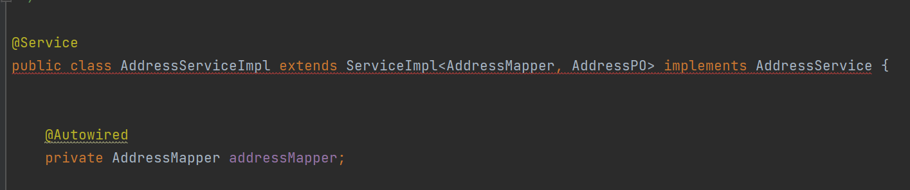
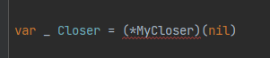
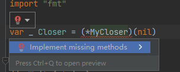

首先我们都明确的一件事情是：`Go`语言的接口是隐式实现的，它并不是像`Java`那样通过`implements`关键字把接口和类强绑定在一起，如果类没有实现接口的全部方法，会有编译错误。



例如上图，它会有一条红色波浪线。

但是在`Go`语言中，就没有这样的机制。`Go`语言只是默认了一条规则：如果一个结构体的方法集包含了接口中定义的所有方法，那么该结构体被视为实现了该接口。也就是说如果结构体漏实现了接口的某个方法，也仅仅是被认为没有实现该接口，并没有任何编译上的报错，程序也可以正常启动。但如果我们想在编译时就检测结构体有没有实现接口，可以通过下面这条命令：

```go
var _ InterfaceType = (*ConcreteType)(nil)
```

其中`InterfaceType`是接口类型，`ConcreteType`是具体实现类型，也就是结构体类型。这种语句的目的是确保`ConcreteType`类型实现了`InterfaceType`接口。这样的语句通常放在代码的开头或者包的初始化部分，用于在编译时检查接口的正确实现。如果有错误，编译器会报错。如果一切正常，这行代码在运行时不会有任何影响。

这句代码的语法中，`(*ConcreteType)(nil)`创建了一个`ConcreteType`类型的空指针，并传递给`InterfaceType`接口类型对象。这个`_`表示我们不关心该对象的值，使用空白标识符来避免编译器报错。这样，如果结构体没有实现接口的全部方法，这句代码会有编译错误，例如在下面的代码中：

```go
var _ Closer = (*MyCloser)(nil)

type Closer interface {
	Write(string)
	Close()
}

type MyCloser struct{}

func (m MyCloser) Write(data string) {
	fmt.Println("Writing:", data)
}
```

结构体`MyCloser`没有实现方法`Close`，所以那句代码会爆红：



我们可以将光标定位到报红的位置，然后使用快捷键`Alt+Insert`（`Windows`）快速生成缺失的方法。或者，也可以按照下图所示的方式点击对应选项，再选择“实现缺失的方法”进行补全：



这样就可以避免结构体漏实现接口的方法，以及接口或实现方法更改了入参出参，但另一方没有更新的情况。同样，如果在接口中新增了一个方法，就可以直接快速生成这个方法的实现结构，完成具体逻辑的实现了。使用这个接口实现检查，如果接口和结构体不在同一包中，要注意避免出现循环依赖的问题。

当然这句用来做实现校验的代码的可读性较差，在很多情况下，如果外部需要获取结构体对象，可以暴露一个`New`函数出去，如下：

```go
var instance *ConcreteType

func NewConcreteType() InterfaceType {
	if instance == nil {
		instance = &ConcreteType{}
	}
	return instance
}
```

其中`InterfaceType`为接口类型，`ConcreteType`为实现结构体类型，`instance`为结构体的一个实例。在这种情况下，如果结构体没有实现接口的全部方法，就无法将结构体的实例以接口类型进行返回，会出现编译错误。