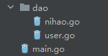
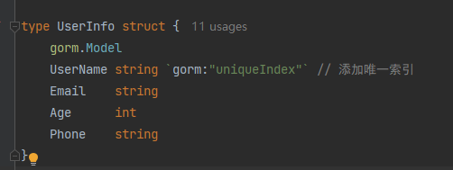
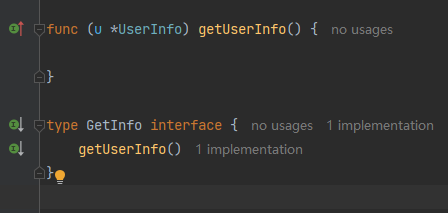
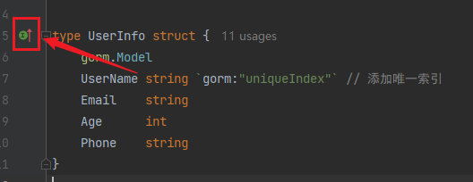
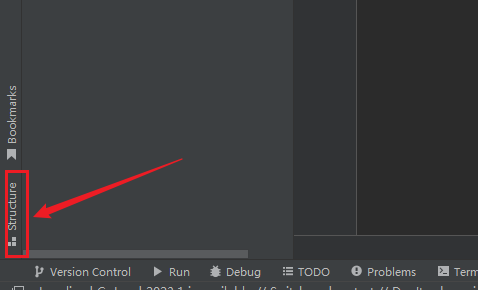
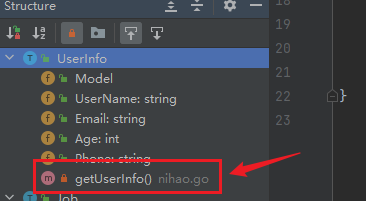
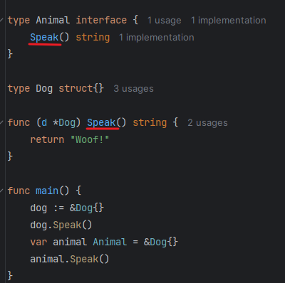
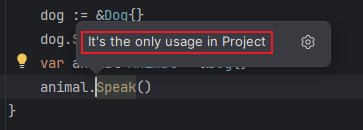
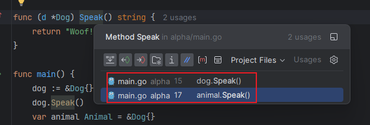

在`Go`语言中，方法不是定义在结构体内部，而是通过方法接收者将其关联到特定的结构体类型。这种设计使得方法的定义可以分散在同一包内的不同文件中。此外，`Go`对接口的实现采用隐式机制，无需显式声明某个类型实现了接口。

例如在同一个目录下有如下两个文件：

我们在`user.go`里定义了结构体`UserInfo`：

它有一个方法，定义在和`user.go`同目录下的文件`nihao.go`里，名字叫`getUserInfo()`：

我们定义了一个接口`GetInfo`，其中仅包含一个方法`getUserInfo()`。由于结构体`UserInfo`实现了该方法，因此可以认为`UserInfo`已经隐式实现了接口`GetInfo`。如何查看结构体`UserInfo`都实现了哪些接口呢？可以点击结构体左侧的绿色箭头：

如果结构体仅实现了一个接口，点击绿色箭头会直接跳转。若实现了多个接口，则会弹出接口列表，可选择任意一个进行跳转。

要查看结构体的所有方法，可以进入结构体所在的文件，点击下方的`Structure`按钮：

点击后，可以看到该结构体包含的所有字段和方法，并且可以查看每个方法所在的文件位置：

在下面的代码中，结构体`Dog`实现了接口`Animal`。我们分别创建`Dog`和`Animal`类型的实例，并调用了`Speak`方法。此时，如果按住`Ctrl`（或`Command`）点击接口定义中的`Speak`方法与结构体实现的`Speak`方法，会得到不同的跳转结果：

点击接口定义的`Speak`方法时，它只会跳转到接口类型对象`animal`调用的`Speak`方法：

点击结构体实现的`Speak`方法时，它会同时显示出结构体类型对象`dog`和接口类型对象`animal`调用`Speak`方法的内容：

也就是说，如果仅使用结构体类型对象调用方法，那么无法通过接口方法定位到具体的调用情况信息。