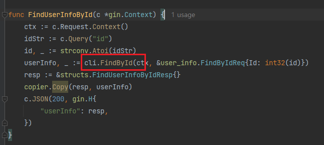
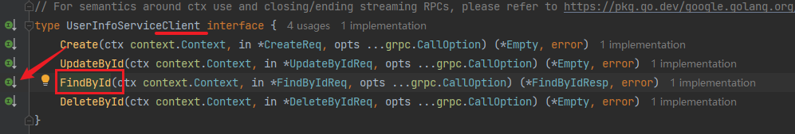
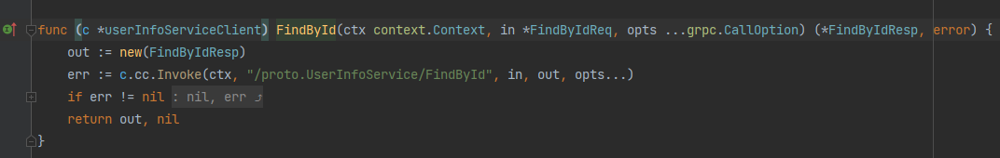
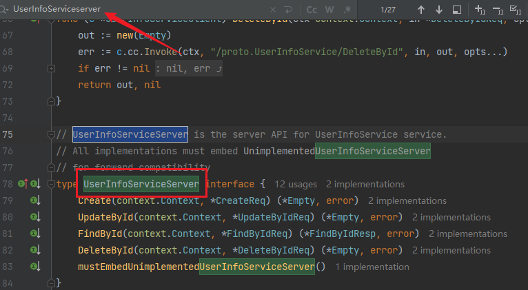
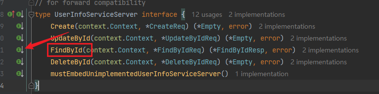
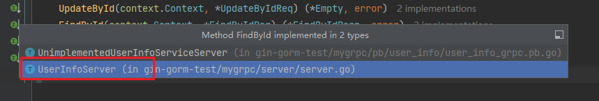
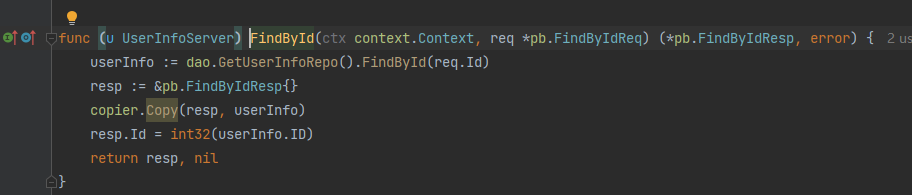

我们使用`gRPC`框架，用`Server`实现接口方法，并用`Client`把接口暴露给外部（如`Gin`框架接口）使用。但是项目代码一多，`gRPC`的`Server`实现方法就不好找了，这里记录一下快速定位的方法。

例如这样的一个`Gin`接口实现，调取了`gRPC`的`FindById`方法：

我们点进去，跳转到了`grpc.pb.go`文件里，到了这个位置：

我们点击左边的小箭头，跳转到了如下图位置：

这显然还是框架生成代码的内容，那我们改如何找到这个方法的具体实现呢？

我们注意到，点进去后跳转到的接口是`Client`，而不是`Server`，所以自然无法跳转到对应实现。我们复制上图接口名，使用文件的全局搜索，把接口名中`Client`改为`Server`（如果接口少，直接翻下去找也可以）：

定位到以后，我们找到对应方法，例如上面的是`FindById`方法，点击左边小箭头：

选择我们的具体实现结构体：

这样就直接跳转到我们对应的接口实现了：

