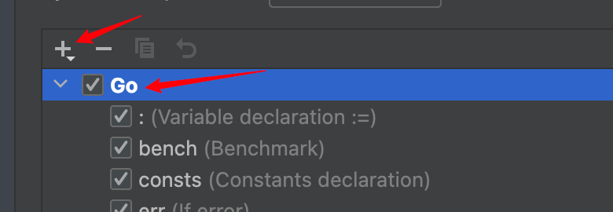

我们在写`Go`语言代码时，会发现经常出现的一句代码是什么？没错，就是对`err`的判断。我们正常都是怎么写判断代码的？

```go
if err != nil {
	// 进行一些日志输出操作
	return nil, err
}
```

大致就是这样。我们每次都要手写这段代码，写多了就会非常麻烦，有没有快捷的方法呢？

我们可以在`Goland`中设置快捷模板，点击进入`Settings`，选择下面这一项：


点击`Go`，再点击新建：



选择第一项：


按照下面的要求进行设置：


模板代码如下所示：

```go
if err != nil {
    wlog.Error("call $VALUE1$ failed").Err(err)$VALUE2$.Log()
	return $VALUE3$ err
}$END$
```

由于我们的日志框架可以打印出函数名或者方法接收器+方法名的信息，所以在`$VALUE1$`部分只需写明是调用哪个函数发生的`error`即可。返回值可能只返回一个`err`，也可能返回`nil, err`或者`"", err`，所以这里写的尽可能通用。

然后再按照下面步骤操作：


最后，在这里选择`Enter`：


全部设置完毕后，点击确定即可。

这样，在代码中直接输入`ife`，即可调用出快捷模板：


展示效果如下所示：


这里我们可以直接接着光标输出对应的日志信息了，类似做填空题。

我们还可以设置下面这样一个打印`INFO`级别日志的快捷键：


模板代码如下所示：

```go
wlog.Info("$VALUE1$").Field($VALUE2$)$VALUE3$.Log()
```

展示效果如下所示：

