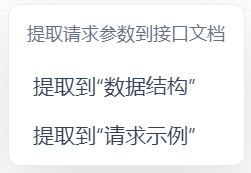
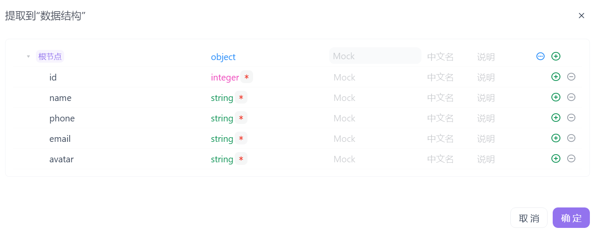
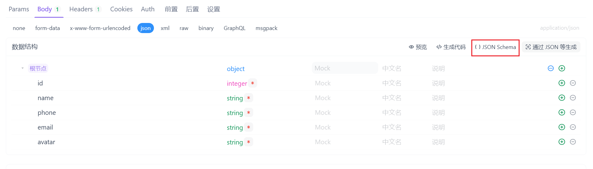
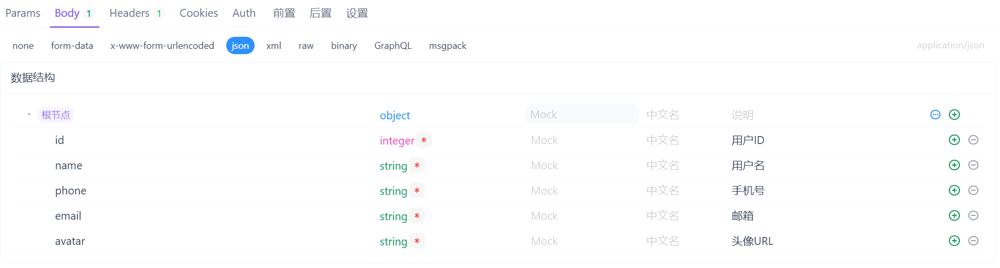
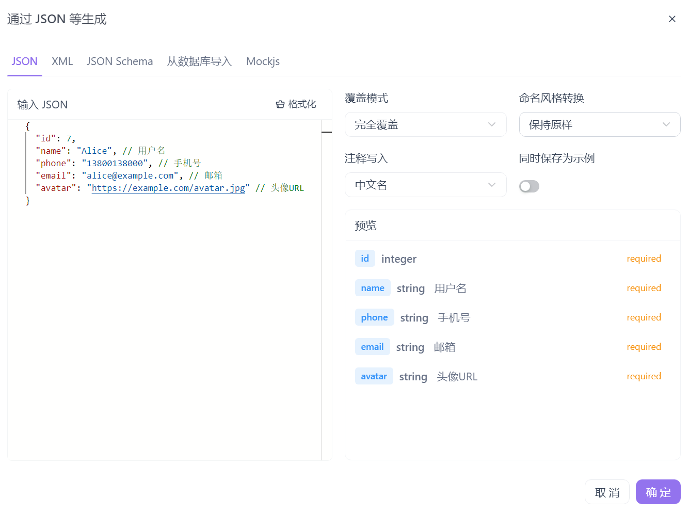

我们在使用`Apifox`时，一般的开发流程如下：

首先在代码中编写接口，然后在`Apifox`中新增对应的接口信息，填写接口名称、请求方法和请求路径并保存。随后，在运行模块中输入请求参数，执行接口调用，获取响应结果。如果请求参数和响应结果都是`JSON`格式，可以点击“提取”按钮，自动将请求参数和响应参数的结构与示例提取到接口文档中。如下所示：



但这种方式存在一个问题：需要为每个字段手动添加注释（如中文名称或说明），否则前端可能难以理解字段的具体含义：



显然，当字段数量较多时，逐一手动在`Apifox`中为每个字段添加注释的效率非常低，且容易出错。

我们可以先不填写中文名或说明，先将数据提取到数据结构中。随后，点击`JSON Schema`按钮进入结构编辑界面：



可以查看到如下的`JSON`内容：

```json
{
    "type": "object",
    "properties": {
        "id": {
            "type": "integer"
        },
        "name": {
            "type": "string"
        },
        "phone": {
            "type": "string"
        },
        "email": {
            "type": "string"
        },
        "avatar": {
            "type": "string"
        }
    },
    "required": [
        "id",
        "name",
        "phone",
        "email",
        "avatar"
    ],
    "x-apifox-orders": [
        "id",
        "name",
        "phone",
        "email",
        "avatar"
    ]
}
```

在编写`Go`代码时，我们通常会在结构体定义中直接为关键字段添加注释，用于描述字段的业务含义或数据含义，如下所示：

```go
type UpdateUserReq struct {
	ID     int    `json:"id"`
	Name   string `json:"name"`   // 用户名
	Phone  string `json:"phone"`  // 手机号
	Email  string `json:"email"`  // 邮箱
	Avatar string `json:"avatar"` // 头像URL
}
```

接下来，我们复制这段`JSON Schema`以及上方带有注释的结构体，并将它们一并发送给`AI`对话平台，附上一段提示语：

> 请将结构体中的注释补充到`JSON Schema`对应字段的`title`（中文名）或`description`（说明）中。

然后回到`Apifox`界面，将`AI`生成的`JSON Schema`替换原有内容，即可完成字段注释的补充：



除此之外，也可以将实际的入参`JSON`和带注释的结构体提供给`AI`，让其生成带注释的`JSONC`格式数据。然后，在“通过`JSON`等生成”功能中使用该`JSONC`，即可自动填充字段注释：


