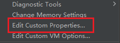

我们在使用`Goland`做`debug`调试的时候，有时会出现这样的问题：

```sh
WARNING: undefined behavior - version of Delve is too old for Go version 1.21.2 (maximum supported version 1.18)
```

这个表示我的`Delve`调试器版本过低，无法支持`Go`语言的`1.21.2`版本。

如何解决这个问题呢？首先我们更新`Delve`的可执行文件，执行下面命令：

```sh
go install github.com/go-delve/delve/cmd/dlv@latest
```

然后就有一个`Delve`的可执行文件（例如`windows`里为`.exe`文件）被放到`$GOPATH/bin`目录下。

我们使用下面命令查看一下现在`Delve`的版本：

```sh
dlv version
```

会显示诸如下面内容的结果：

```sh
Delve Debugger
Version: 1.22.1
Build: $Id: 0c3470054da6feac5f6dcf3e3e5144a64f7a9a48 $
```

接下来我们需要新增`Goland`的一个配置。点击菜单栏中的`Help`，然后选择`Edit Custom Properties`：



添加这样一行代码：

```sh
dlv.path=<本机GOPATH目录>/bin/dlv.exe
```

`GOPATH`的路径可以通过执行命令`go env GOPATH`进行查看。在`Windows`环境中，需要将`GOPATH`目录中的反斜杠（`\`）替换为正斜杠（`/`），例如：`C:/Users/userw/go/bin/dlv.exe`。在`macOS`环境中，则需将路径末尾的`.exe`后缀去掉。

添加完成后，重启一下`Goland`，就可以正常`debug`了。