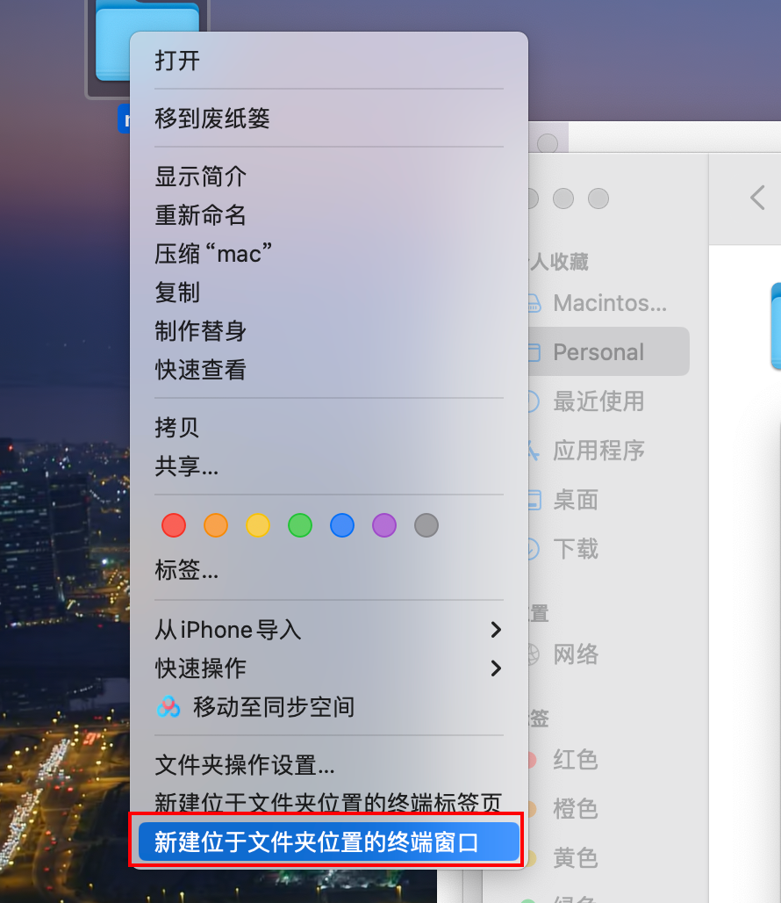
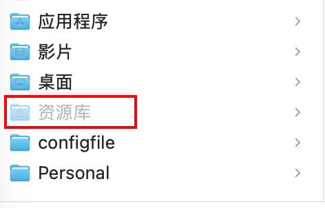
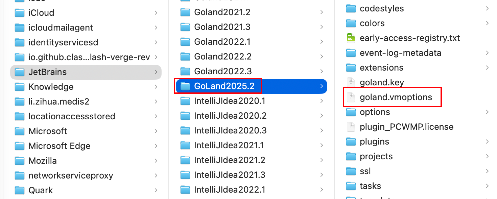
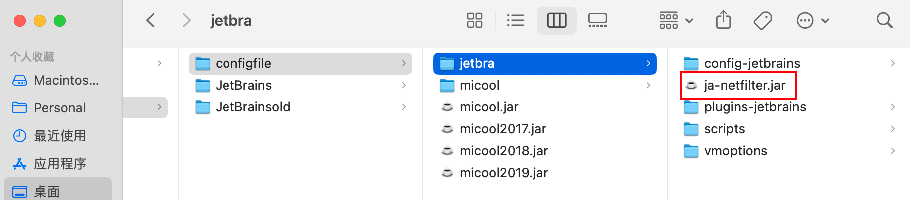
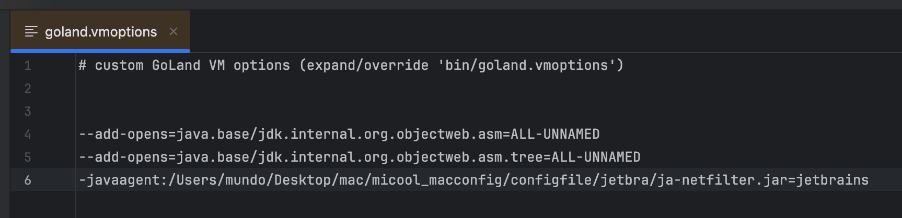

> 下载各环境、各版本`GoLand`的官方网站：https://www.jetbrains.com/go/download/other.html。

淘宝买了一个`Jetbrains`全家桶的激活教程，所有环境（`Mac`、`win`）所有开发软件的激活码都有。

> 安装步骤文档：
> https://laq8aq5ywv.feishu.cn/docx/MwjvdNVP6odfn4xz0b2cB5xJnzb（旧）
> https://www.yuque.com/mengchuaiquezinatiaohaotui-cbutn/wczyq9/bkbm7ze54u8m9bca?singleDoc#（新）

文档随时可能失效，我先下载好软件，把具体步骤总结在下面。我把`Mac/win/Linux`以及一些旧版本的激活软件都下载下来，放到了`MacBook`电脑的`~/Personal/software/JetBrains激活包`里面。

激活的前提，是`GoLand`软件上不能登录`JB`的账号，下载的激活软件文件夹需要放到桌面上，且一直保持在桌面上（文件夹路径不能包含中文）。如果之前使用过其他激活工具进行过激活，需要将之前的激活工具卸载干净再继续以下操作。

把激活软件文件夹放到桌面后，打开这个文件夹目录的终端窗口：



输入并执行下面两行激活命令（一台电脑上只需要执行一次）：

```bash
chmod +x mac.sh
./mac.sh
```

终端页面出现“`JB`全家桶激活”，表示执行成功。

接着复制对应软件的激活码，粘贴到`GoLand`进行激活。激活码在桌面的激活软件文件夹的`Activation_Code`目录下。

如果`Mac`环境输入激活码后出现：`Key is invalid`，使用下面方式解决：

> 解决手册文档：
> https://laq8aq5ywv.feishu.cn/docx/LCfHdLh5do6XM2xgLaUcn6D4nVe（暂不可用）
> https://docs.qq.com/doc/DSGFyS0FSSWx4eFRP（暂不可用）

打开`GoLand`，参考上面文档使用临时激活码或临时账号先激活软件。如果均不可用，可以访问下面的本机目录：

```sh
/Users/mundo/Library/Application Support/JetBrains
```

其中`Library`的中文名为“资源库”，它默认是隐藏的目录：



在该目录下可找到对应语言及对应版本的子目录，我们可以看到`goland.vmoptions`文件：



如果不存在该文件，可手动创建。该文件名会根据`IDE`对应的编程语言而变化，例如`goland.vmoptions`、`pycharm.vmoptions`、`idea.vmoptions`、`datagrip.vmoptions`等，对应创建即可。

接着打开桌面的`Mac`文件夹，在`micool_macconfig/configfile/jetbra`目录下找到`ja-netfilter.jar`文件，把这个文件拖入终端，即可查看这个文件的路径信息。将其保存下来：



在我的`MacBook`里，`ja-netfilter.jar`文件的路径是：

```sh
/Users/mundo/Desktop/mac/micool_macconfig/configfile/jetbra/ja-netfilter.jar
```

使用该路径替换下文中`<ja-netfilter.jar-path>`部分的内容，并复制粘贴到`goland.vmoptions`文件中：

```sh
--add-opens=java.base/jdk.internal.org.objectweb.asm=ALL-UNNAMED
--add-opens=java.base/jdk.internal.org.objectweb.asm.tree=ALL-UNNAMED
-javaagent:<ja-netfilter.jar-path>=jetbrains
```

保存文件后，打开`Goland`并使用对应的激活码，通常可以成功激活。若配置完成后输入激活码仍提示`Key is invalid`，将下面这一行内容复制并粘贴到`goland.vmoptions`文件的首行。

```sh
# custom GoLand VM options (expand/override 'bin/goland.vmoptions')
```

这表示，这个文件里的内容会在启动时被加载，并且会在逻辑上扩展或覆盖`bin/goland.vmoptions`里的默认配置。

激活成功后，在`GoLand`的上方栏选择`Help`，再选择`Edit Custom VM Options..`，即可看到配置信息：



其他`JetBrains`相关软件的激活方式以及出现`Key is invalid`的处理方案同上。如果遇到软件打不开，或者打开后闪退等问题，使用下面命令来手动启动，可以查看是否有错误信息输出，帮助更进一步诊断问题：

```sh
/Applications/<AppName>.app/Contents/MacOS/<executable_name>
```

`<AppName>`是应用的名称，通常首字母大写，例如`GoLand`、`PyCharm`、`IntelliJ IDEA`。`<executable_name>`是该应用对应的可执行文件名称，通常为小写，和应用名相关，例如`goland`、`pycharm`、`idea`。

如果想完全卸载`GoLand`，光是在应用程序中删掉它是不够的，还需要删掉它的配置目录：

```sh
~/Library/Application Support/JetBrains/<product><version>
~/Library/Caches/JetBrains/<product><version>
```

例如，想删掉`2024.2`版本的`GoLand`，就要删除下面这两个目录：

```
~/Library/Application Support/JetBrains/GoLand2024.2
~/Library/Caches/JetBrains/GoLand2024.2
```

