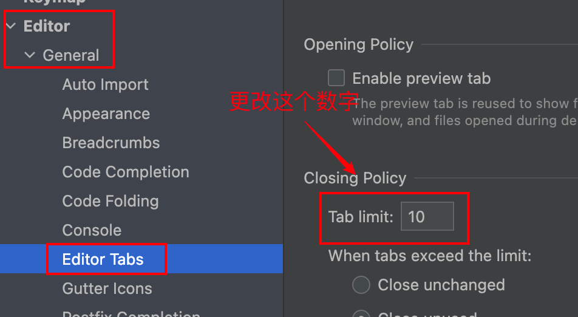
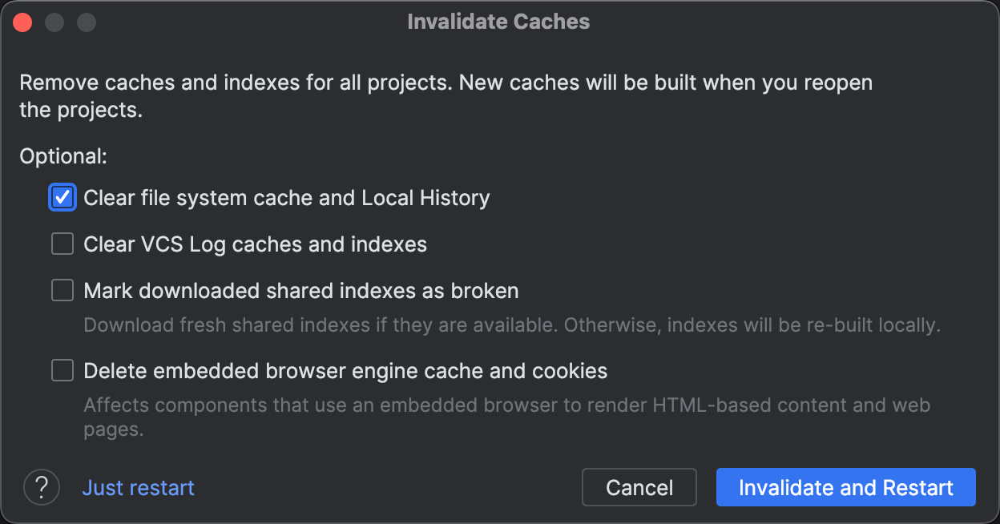

### 1. 关闭代码自动格式化

如果我们发现代码在切屏后总会格式化一下，非常不方便，可以跟着下面步骤关掉：

### 2. 关闭函数参数提示

如果我们发现代码中的函数总是有一个参数提示，例如这样：

我们按照下面的步骤关掉：

### 3. 增加窗口文件数量显示与多行显示

如果我们发现窗口的最大文件显示数量太少，按照下面步骤修改，例如可以改到`40`：

如果发现文件在窗口上方不能多行显示，按照下面步骤修改。还是上面的操作页面，往上拉，按照下图操作：

在新版本的`Goland`中，上面的选项可能如下图显示的，我们按照下图进行操作：

### 4. 关于字体设置

`Goland`中有三处关于字体设置的内容，它们的位置与功能如下图：

这里字体在`Mac`里不需要调整就很美观了，在`windows`里可以按照下面这篇文章进行调整：

https://blog.csdn.net/JAVA_SUYE/article/details/136749326

### 5. 关闭单词的自然语言校验

我们写代码时发现`Goland`会对单词做自然语言的校验，例如下面这样的下划线：

跟着以下图片的步骤走，来进行关闭：

### 6. 去除注释下方的黄色波浪线

在设置里跟着下面的步骤走，即可去掉注释下方的黄色波浪线：

> 在这里，上面的`Scheme`应该选择`Dark`选项，这样背景更加美观。

### 7. 折叠`Run`窗口的四行代码

使用`Goland`运行`main`文件后，在控制台上也许会输出这样四行代码，又无法将其折叠：

跟着下面步骤进行处理。首先点击`Help`，选择`Find Action`选项：

搜索`registry`，选择下面这个选项：

按`command + F`查找`go.run.processes.with.pty`这一项，去掉后面的对勾：

这个选项控制的是启用或禁用`Go`程序进程的伪终端，这里我们关掉伪终端。

再次运行`main`文件，查看控制台，发现这四行代码已经被隐藏了：

### 8. 解决`proto`文件`import`内容爆红问题

在项目中，当一个`proto`文件引用了同项目的其他`proto`文件时，在`Goland`里可能会出现无法找到指定导入路径的爆红错误提示。尽管这不会影响我们使用`protoc`命令对其进行编译，但看起来会有些不舒服：

我们通过下面这样一个设置，解决`proto`文件导入路径爆红的问题：

如果发现更改后没有立即生效，重启`Goland`即可。

不过上面图片的内容是旧版本`Goland`的选项，在新版本中对这个选项有了很大调整：

在当前版本中，上方的选项无需调整。下方的`Import Paths`会自动导入使用了`proto`文件的模块。如果没有自动导入，你也可以手动添加模块路径，添加的路径为项目根目录在本地机器中的位置。

如果发现在`Languages & Frameworks`下没有找到`Protocol Buffers`，需要去已下载插件里找一下是否打开了下面这两个插件：

### 9. 设置堆内存上限

我们知道`JetBrains`的软件都是`Java`写的，而`Java`的程序运行在`JVM`上，会消耗大量内存，导致软件占用内存过高。但是我们可以通过一个设置来降低其内存占用，就是设置`JVM`堆内存上限。

点击最上方的`Help`：

选择`Change Memory Settings`：

在这里可以设置最大堆内存的大小，我们设置为`1024`：

点击`Save and Restart`进行保存与重启，这样`Goland`就不会占用过大的内存了。

> 根据官方推荐和社区经验，建议将`GoLand`的最大堆内存（`-Xmx`）设置为至少`2GB`或更高，所以这里我们设置为`2048`。

### 10. 管理工具视图栏

工具视图栏指的就是`Goland`底部的侧边栏，一般有终端、运行、`Git`、`TODO`等内容，如下所示：

如果我们想隐藏某个工具视图，右键后点击`Hide`即可。我们也可以上下拖动来调整视图的位置：

如果想将某个工具窗口显示在工具栏底部，在顶部菜单选择`View`，然后点击`Tool Windows`，从中选择想要显示的工具窗口：

### 11. 快捷键管理

我们可以通过以下方法查看功能对应的快捷键或快捷键对应的功能：

例如我们想搜索全文查询对应的快捷键，搜索方式如下：

右键可以给该功能添加一个新的快捷键：

在下面这个界面，直接键盘操作快捷键，完成录入：

我们再试一下通过快捷键指令查询其对应的功能：

### 12. 项目可运行但代码爆红处理

在使用`Goland`时，偶尔会发现代码中会出现引用的变量爆红的情况：

在报错栏显示该引用变量未在包中定义：

但是我们发现，代码的编译和运行是毫无问题的，也就是说，这并不是代码错了，而是`Goland`卡住了。

我们点击上方的`File`：

选择`Invalidate Caches`选项：

接下来在弹窗中，选择第一个选项，点击`Invalidate and Restart`：

> 这里实践发现，即使没有选择其中任何一个选项，也可以有效地消除爆红现象。

等待重启后，`Goland`会重新加载引用的变量，爆红就能消失了：

这个也是`Goland`一个比较奇怪的`bug`，目前暂时还没找到导致这个`bug`的原因。

### 13. 关闭项目时卡住问题解决

我们在关掉`Goland`或者其他的`JetBrains`软件时，有时会出现下面这种情况，会卡很久：

解决方案是，在上方菜单栏选择`Help`，然后选择`Find Action`：

在搜索框输入`Registry`，点击它：

按`Command/Ctrl + F`搜索`ide.await.scope.completion`，取消它的对勾即可：

