> `Apifox`官方帮助文档：https://docs.apifox.com/help

### 1. 目录级别全局参数设置

在`Apifox`项目中，对于所有接口统一携带的请求头（如认证所需的`Authorization`等），应统一设置在全局参数的`Header`中：


如果想为接口根目录下的某个子目录中的所有接口统一添加请求头，需要先打开该目录对应的页面：


可以看到在上方的操作栏中，最右侧有一个`Auth`选项，点击该选项：


它的默认鉴权方式选择是“无需鉴权”或“继承”，我们选择“鉴权组件”选项：


系统会提示我们创建一个新的鉴权组件。此时可以直接点击“新建鉴权组件”按钮进行创建，也可以前往“组件库”中新建鉴权组件：


在此页面中，可以看到多种鉴权组件方式。我们选择`API Key`方式进行配置：


点击后，可以为鉴权组件设置名称，并自定义其在请求头中使用的参数名：


保存完成后，即可在`Auth`中选择刚创建的鉴权组件，并在其中输入该请求头对应的值：


此处建议将该值设置为“全局变量”，以便在不同接口中统一管理和复用：


这样即可通过双括号语法使用全局变量，修改时只需更新全局变量即可：


鉴权组件还可以设置接口统一的`Query`参数：


通过该选项，也可以随时取消该目录下接口的鉴权组件设置：


### 2. 快速添加字段注释

我们在使用`Apifox`时，一般的开发流程如下：

首先在代码中编写接口，然后在`Apifox`中新增对应的接口信息，填写接口名称、请求方法和请求路径并保存。随后，在运行模块中输入请求参数，执行接口调用，获取响应结果。如果请求参数和响应结果都是`JSON`格式，可以点击“提取”按钮，自动将请求参数和响应参数的结构与示例提取到接口文档中。如下所示：


但这种方式存在一个问题：需要为每个字段手动添加注释（如中文名称或说明），否则前端可能难以理解字段的具体含义：

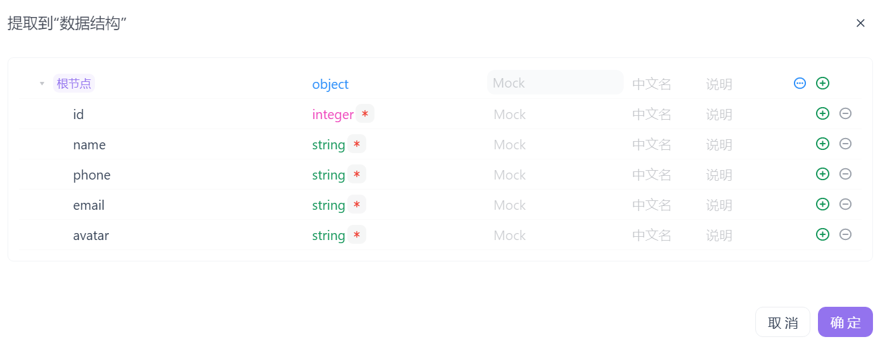

显然，当字段数量较多时，逐一手动在`Apifox`中为每个字段添加注释的效率非常低，且容易出错。

我们可以先不填写中文名或说明，先将数据提取到数据结构中。随后，点击`JSON Schema`按钮进入结构编辑界面：

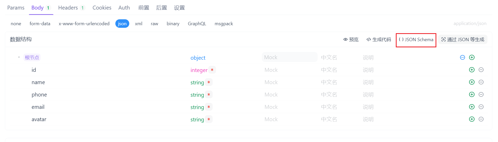

可以查看到如下的`JSON`内容：

```json
{
    "type": "object",
    "properties": {
        "id": {
            "type": "integer"
        },
        "name": {
            "type": "string"
        },
        "phone": {
            "type": "string"
        },
        "email": {
            "type": "string"
        },
        "avatar": {
            "type": "string"
        }
    },
    "required": [
        "id",
        "name",
        "phone",
        "email",
        "avatar"
    ],
    "x-apifox-orders": [
        "id",
        "name",
        "phone",
        "email",
        "avatar"
    ]
}
```

在编写`Go`代码时，我们通常会在结构体定义中直接为关键字段添加注释，用于描述字段的业务含义或数据含义，如下所示：

```go
type UpdateUserReq struct {
	ID     int    `json:"id"`
	Name   string `json:"name"`   // 用户名
	Phone  string `json:"phone"`  // 手机号
	Email  string `json:"email"`  // 邮箱
	Avatar string `json:"avatar"` // 头像URL
}
```

接下来，我们复制这段`JSON Schema`以及上方带有注释的结构体，并将它们一并发送给`AI`对话平台，附上一段提示语：

> 请将该结构体中的注释补充到`JSON Schema`对应字段的`title`（中文名）或`description`（说明）参数中。

这样，对应的字段就可以携带`title`参数或`description`参数作为注释，如下所示：

```json
"name": {
	"type": "string",
	"title": "用户名",
    "description": "用户名"
},
```

然后回到`Apifox`界面，将`AI`生成的`JSON Schema`替换原有内容，即可完成字段注释的补充：

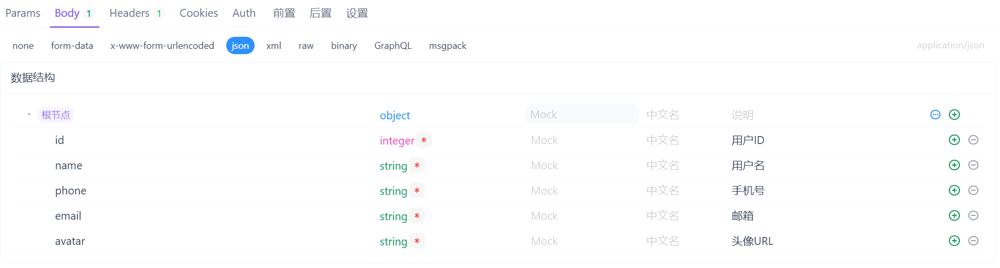

除此之外，也可以将实际的入参`JSON`和带注释的结构体提供给`AI`，让其生成带注释的`JSONC`格式数据。然后，在“通过`JSON`等生成”功能中使用该`JSONC`，即可自动填充字段注释：

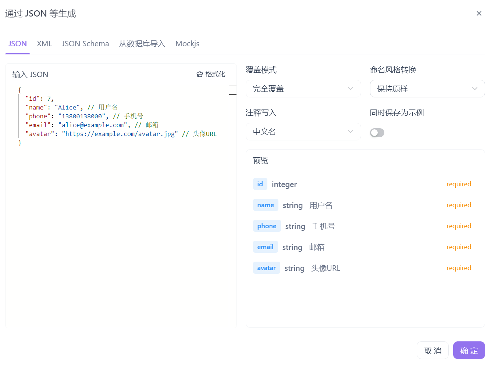

### 3. 多模块前缀`URL`管理

在创建项目后，系统会自动生成一个默认模块，创建的接口默认归属于该模块下：

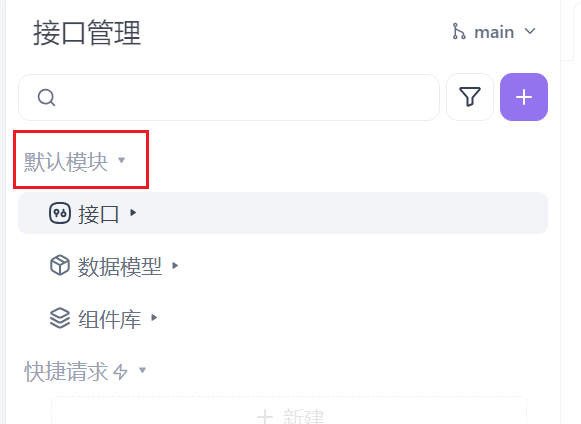

对于单体项目而言，所有接口通常具有统一的`URL`前缀，可直接在全局环境中进行统一配置：

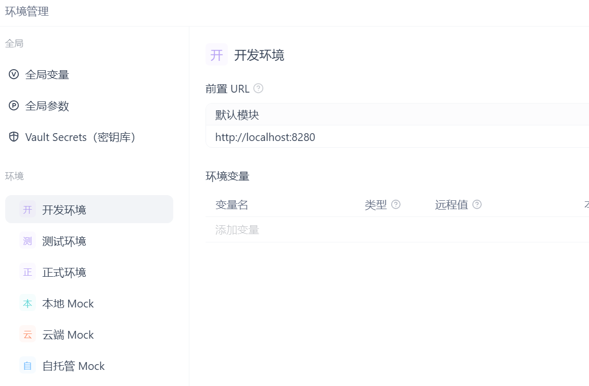

但在微服务项目中，由于不同的服务模块通常拥有各自独立的`IP`地址和端口号，因此不能在每个环境中仅配置一个统一地址。我们应在`Apifox`中为不同的服务模块分别创建对应的模块，点击“新建模块”进行创建：

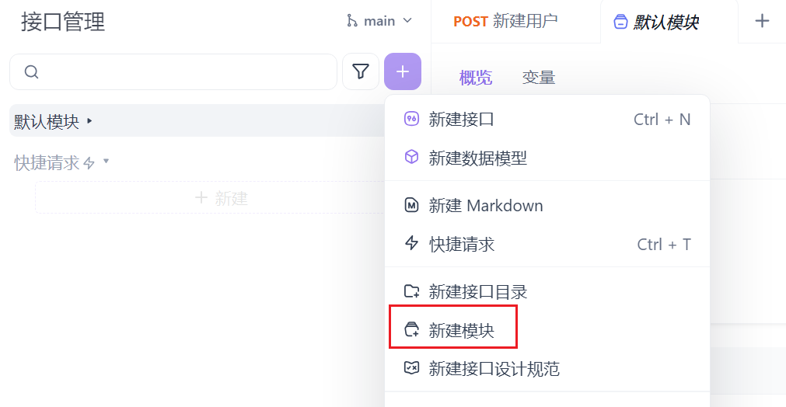

我们创建了新的模块，命名为“服务模块`B`”，并给默认模块重命名为“服务模块`A`”：

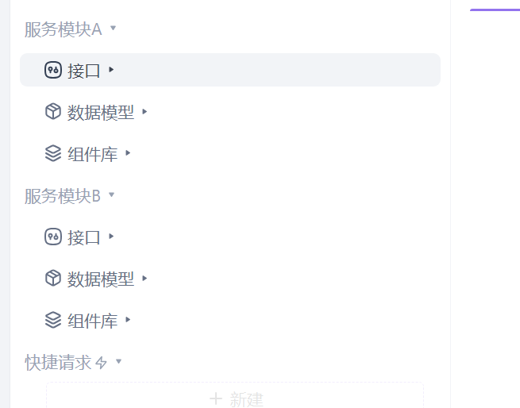

我们可以看到，每个模块都有单独的接口、数据模型以及组件库。

回到全局环境管理页面后，可以看到系统支持为每个环境中的不同模块分别配置各自的前置`URL`：

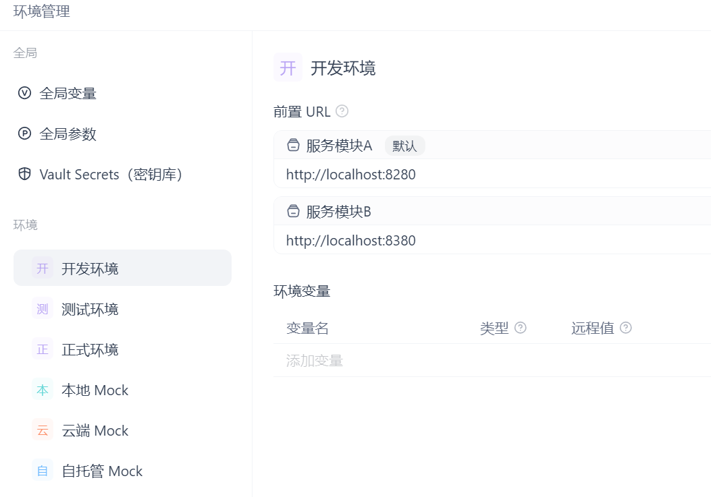

这样一来，当调用模块`A`的接口时，系统会自动使用对应服务模块`A`所配置的前置`URL`。

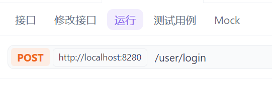

调用模块`B`的接口同理，系统会自动使用对应服务模块`B`所配置的前置`URL`：

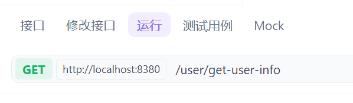
