> `Apifox`官方帮助文档：https://docs.apifox.com/help

### 目录级别全局参数设置

在`Apifox`项目中，对于所有接口统一携带的请求头（如认证所需的`Authorization`等），应统一设置在全局参数的`Header`中：

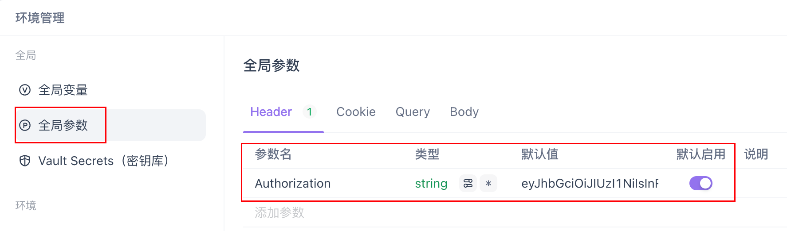

如果想为接口根目录下的某个子目录中的所有接口统一添加请求头，需要先打开该目录对应的页面：

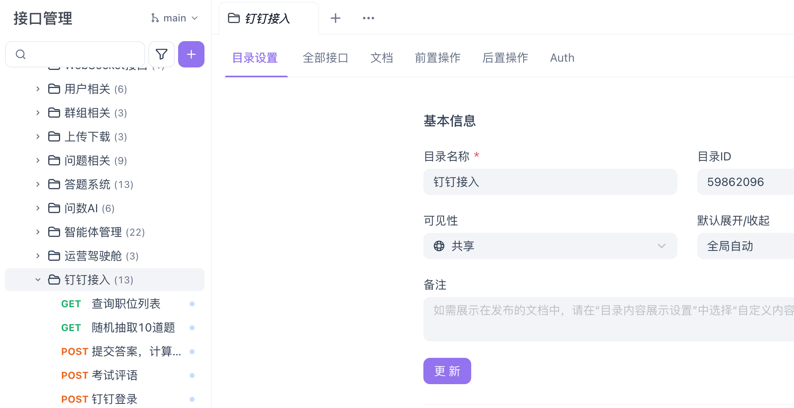

可以看到在上方的操作栏中，最右侧有一个`Auth`选项，点击该选项：

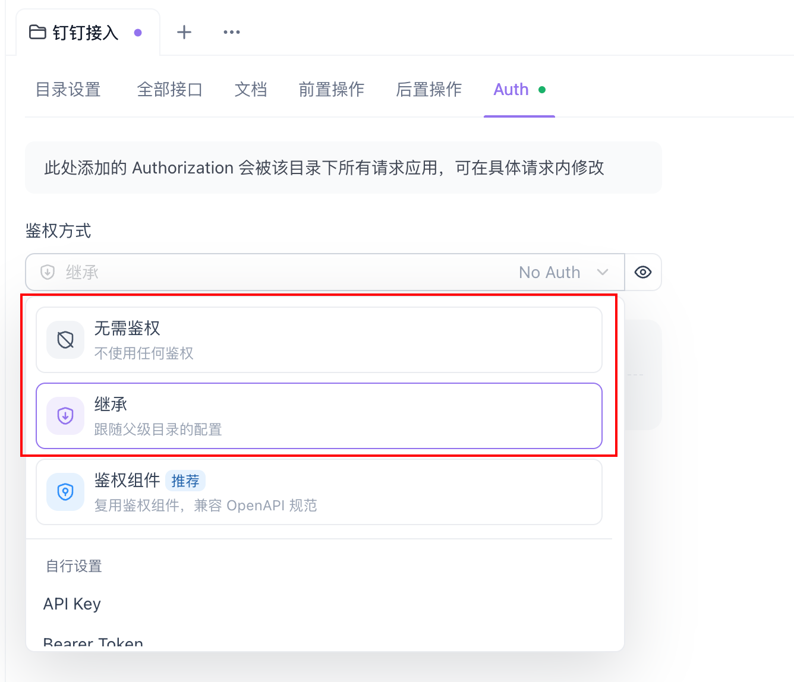

它的默认鉴权方式选择是“无需鉴权”或“继承”，我们选择“鉴权组件”选项：

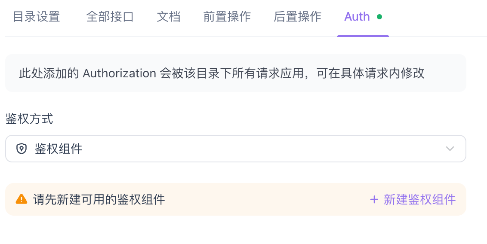

系统会提示我们创建一个新的鉴权组件。此时可以直接点击“新建鉴权组件”按钮进行创建，也可以前往“组件库”中新建鉴权组件：

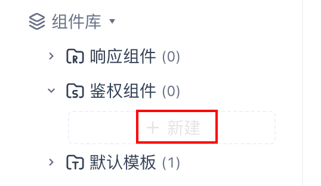

在此页面中，可以看到多种鉴权组件方式。我们选择`API Key`方式进行配置：

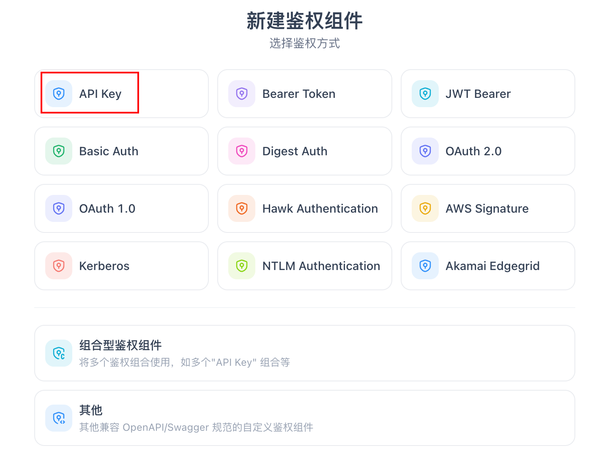

点击后，可以为鉴权组件设置名称，并自定义其在请求头中使用的参数名：

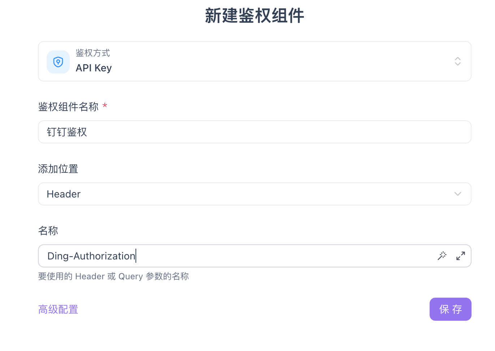

保存完成后，即可在`Auth`中选择刚创建的鉴权组件，并在其中输入该请求头对应的值：

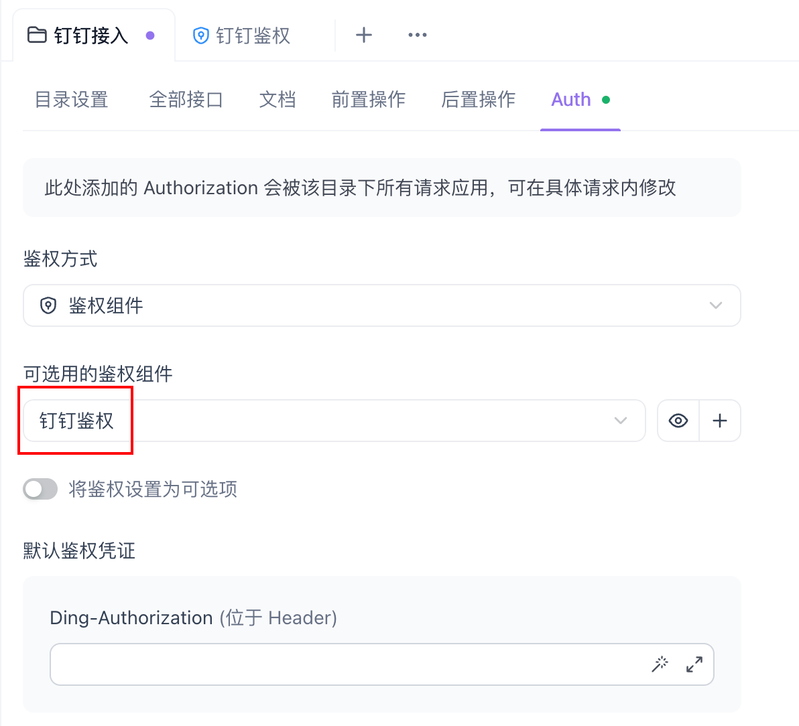

此处建议将该值设置为“全局变量”，以便在不同接口中统一管理和复用：

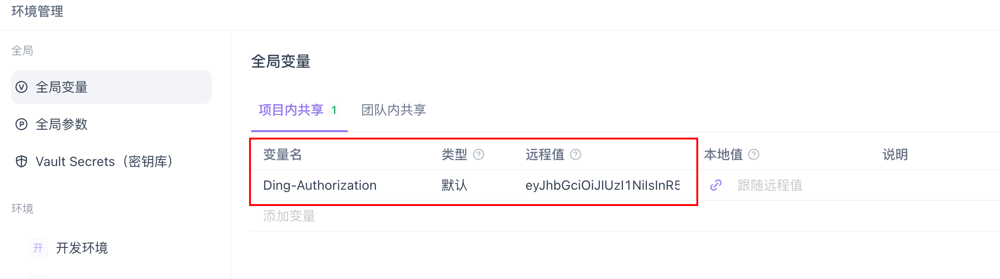

这样即可通过双括号语法使用全局变量，修改时只需更新全局变量即可：

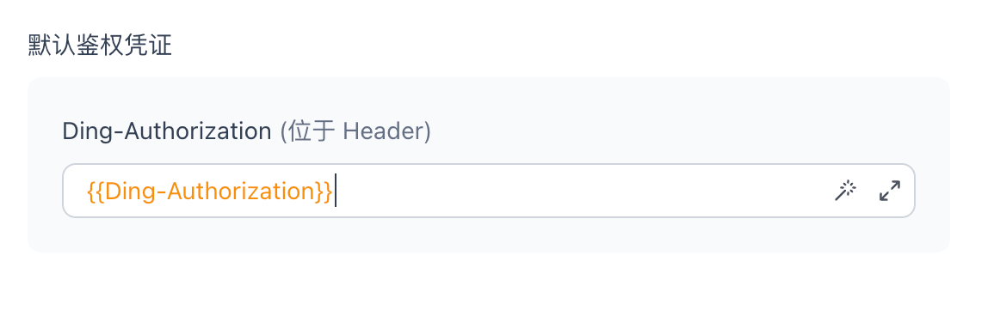

鉴权组件还可以设置接口统一的`Query`参数：

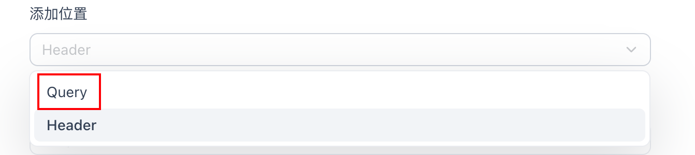

通过该选项，也可以随时取消该目录下接口的鉴权组件设置：

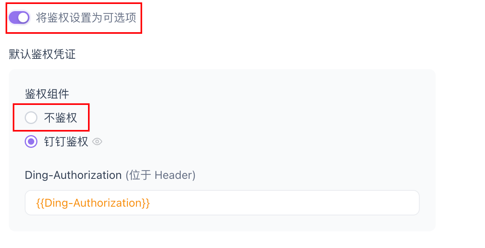
